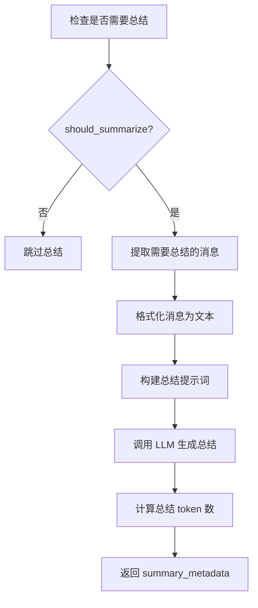

# Agent 上下文优化详解

## 概述

Agent 在调用 LLM 时会进行上下文优化，以减少 token 使用并提高效率。本文档详细说明优化后的聊天记录组成、历史总结机制和保存逻辑。

---

## 1. 优化后的聊天记录组成

### 结构

优化后的消息列表由三部分组成：

```
[System Prompt] + [历史总结 (可选)] + [最近对话]
```

### 详细说明

#### 1.1 System Prompt
- **内容**：包含 Agent 的角色定义、能力描述、当前时间等
- **形式**：`SystemMessage`
- **位置**：第 1 条消息
- **来源**：由 `build_system_prompt()` 函数动态生成
- **Token 占用**：通常 1000-3000 tokens

**示例**：
```python
SystemMessage(content="""
你是一个智能助手，当前时间: 2026-01-20 10:00:00

你的能力:
- 日程/待办/提醒管理（统一接口）
- 记忆管理: 保存用户个人信息、偏好、工作流规则
...
""")
```

---

#### 1.2 历史总结（已启用）

**【更新于 2026-01-20】历史总结功能已完整实现并启用**

##### 触发机制
- **上限阈值（upper_threshold）**：默认 50000 tokens
- **下限阈值（lower_threshold）**：默认 30000 tokens
- **触发条件**：当消息 token 总数超过上限阈值时触发
- **总结目标**：总结后，剩余消息 + 总结 < 下限阈值

##### 持久化存储
总结保存在 `AgentSession` 模型中：
```python
class AgentSession(models.Model):
    # 历史总结相关字段
    summary_text = models.TextField()        # 总结内容
    summary_until_index = models.IntegerField()  # 总结覆盖的消息索引
    summary_tokens = models.IntegerField()   # 总结 token 数
    summary_created_at = models.DateTimeField()  # 创建时间
    is_summarizing = models.BooleanField()   # 是否正在总结
```

##### 形式
- **类型**：`SystemMessage`
- **位置**：第 2 条消息（在 System Prompt 之后）
- **格式**：
```python
SystemMessage(content="""
【对话历史总结】
用户在过去的对话中讨论了以下内容：
1. 2026-01-15 创建了 5 个工作会议日程
2. 2026-01-16 设置了每日提醒事项
3. 用户偏好简洁的回复风格
...
---
""")
```

##### 何时触发

**理论触发条件**（在 `ConversationSummarizer.should_summarize()` 中定义）：

1. **首次总结**：
   - 消息数量 ≥ `min_messages`（默认 20 条）
   
2. **增量总结**：
   - 新增消息数量 ≥ 10 条
   - 且 `(新增消息 tokens) / (历史总结 tokens) > trigger_ratio`（默认 0.5）

**实际情况**：
```python
# 在 agent_graph.py 第 479 行
optimized_messages = build_optimized_context(
    ...
    summary_metadata=None,  # ❌ 暂不使用持久化总结
    ...
)
```

**为什么未启用**：
- 历史总结需要额外的 LLM 调用来生成总结
- 需要持久化存储总结元数据
- 当前实现选择直接截取最近对话，更简单高效

##### 总结的生成流程（如果启用）



##### summary_metadata 结构

```python
{
    "summary": "总结文本内容",
    "summarized_until": 50,  # 已总结到第 50 条消息
    "summary_tokens": 1500,  # 总结占用的 token 数
    "created_at": "2026-01-20T10:00:00",
    "message_count": 50,
    "original_tokens": 12000,  # 原始消息的 token 数
    "compression_rate": 0.875  # 压缩率 87.5%
}
```

##### 是否保存

**当前状态：不保存**

原因：
1. `summary_metadata=None` 传入，不会生成总结
2. 即使生成，也没有持久化到数据库的逻辑
3. 每次调用 `agent_node` 都会重新优化，不依赖之前的总结

**如果要启用总结并保存**，需要：
1. 创建数据库表存储 `summary_metadata`
2. 在 `agent_node` 中读取上次的 `summary_metadata`
3. 在总结更新后保存到数据库

---

#### 1.3 最近对话

##### 选择策略
**从后往前选择**，直到达到 token 预算 (`recent_token_budget`)

##### 关键特性：保持工具调用链完整性

**工具调用链**：
```
AIMessage (with tool_calls)
  └─> ToolMessage (工具结果 1)
  └─> ToolMessage (工具结果 2)
  └─> ...
```

**规则**：
- ToolMessage 必须有对应的 AIMessage
- AIMessage 的所有 tool_calls 必须有对应的 ToolMessage
- 如果预算不足以包含整个链，跳过该链

##### 工具消息压缩

**触发条件**：ToolMessage 的内容超过 200 tokens

**压缩策略**：
1. 解析 JSON 格式的工具结果
2. 保留关键信息（成功/失败、数量、首尾项）
3. 截断过长的字符串

**示例**：

原始工具结果（250 tokens）：
```json
{
  "success": true,
  "items": [
    {"id": 1, "title": "会议 A", "start_time": "2026-01-20T10:00:00", ...},
    {"id": 2, "title": "会议 B", "start_time": "2026-01-20T14:00:00", ...},
    ... (共 20 项)
  ],
  "total": 20
}
```

压缩后（100 tokens）：
```json
{
  "success": true,
  "total": 20,
  "items_preview": [
    {"id": 1, "title": "会议 A"},
    {"id": 2, "title": "会议 B"},
    "... (省略 16 项)",
    {"id": 19, "title": "会议 S"},
    {"id": 20, "title": "会议 T"}
  ],
  "compressed": true
}
```

---

## 2. Token 预算分配

### 计算公式

```python
context_window = 128000  # 模型上下文窗口
target_ratio = 0.6       # 目标使用率 60%
max_tokens = context_window * target_ratio  # 76800

system_tokens = calculate(system_prompt)  # ~2000
available_tokens = max_tokens - system_tokens  # ~74800

# 预算分配
summary_budget = available_tokens * 0.26  # 26% 给历史总结 (~19448)
recent_budget = available_tokens * 0.65   # 65% 给最近对话 (~48620)
# 剩余 9% 作为缓冲
```

### 配置来源

通过 `get_optimization_config(user)` 获取：

```python
{
    'token_calculation_method': 'estimate',  # tiktoken 或 estimate
    'target_usage_ratio': 0.6,               # 目标上下文使用率
    'summary_token_ratio': 0.26,             # 历史总结比例
    'recent_token_ratio': 0.65,              # 最近对话比例
    'compress_tool_output': True,            # 是否压缩工具输出
    'tool_output_max_tokens': 200            # 工具输出最大 token
}
```

---

## 3. 优化触发时机

### 触发条件（两个都要满足）

```python
if enable_optimization and len(messages) > 10:
    # 执行优化
```

1. **用户配置启用**：`DialogStyle.enable_context_optimization = True`（默认启用）
2. **消息数量超过 10 条**

### 触发位置

在 `agent_node` 函数中，调用 LLM **之前**：

```python
def agent_node(state: AgentState, config: RunnableConfig) -> dict:
    messages = state['messages']  # 完整消息（从 checkpoint 读取）
    
    # ... 构建 system_prompt ...
    
    # 🔥 优化触发点
    if enable_optimization and len(messages) > 10:
        optimized_messages = build_optimized_context(...)
    else:
        optimized_messages = messages
    
    # 发送给 LLM
    full_messages = [system_message] + list(optimized_messages)
    response = llm_with_tools.invoke(full_messages, config)  # ← 使用优化后的消息
    
    # 返回新消息（会被追加到完整消息列表）
    return {"messages": [response]}
```

---

## 4. 优化流程完整示意图

```
┌─────────────────────────────────────────────────────────────────┐
│                      LangGraph Checkpoint                        │
│                  (SQLite - 完整消息列表)                         │
│                                                                 │
│  [User1, AI1, Tool1, User2, AI2, Tool2, ..., User50, AI50]    │
│                     (共 50 条消息)                               │
└──────────────────────────┬──────────────────────────────────────┘
                           │
                           │ app.get_state(config)
                           ▼
┌─────────────────────────────────────────────────────────────────┐
│                       agent_node                                │
│                                                                 │
│  messages = state['messages']  # 完整 50 条                     │
│                                                                 │
│  if len(messages) > 10:  # ✅ 触发优化                          │
│                                                                 │
│    ┌────────────────────────────────────────────┐              │
│    │   build_optimized_context                  │              │
│    │                                            │              │
│    │  1. 添加 System Prompt                     │              │
│    │  2. 添加历史总结 (如果有 summary_metadata)  │ ← ❌ 当前为 None
│    │  3. 压缩工具消息 (ToolMessageCompressor)   │              │
│    │  4. 从后往前选择最近对话                    │              │
│    │     - 保持工具调用链完整                   │              │
│    │     - 不超过 recent_token_budget          │              │
│    │                                            │              │
│    │  输出: [System, 最近 15 条消息]             │              │
│    └────────────────────────────────────────────┘              │
│                           │                                     │
│                           ▼                                     │
│    optimized_messages (约 15 条)                               │
│                                                                 │
└──────────────────────────┬──────────────────────────────────────┘
                           │
                           │ llm.invoke(optimized_messages)
                           ▼
┌─────────────────────────────────────────────────────────────────┐
│                          LLM                                    │
│                                                                 │
│  接收: [System Prompt] + [最近 15 条消息]                       │
│  返回: AIMessage (新回复)                                       │
└──────────────────────────┬──────────────────────────────────────┘
                           │
                           │ return {"messages": [response]}
                           ▼
┌─────────────────────────────────────────────────────────────────┐
│                  LangGraph add_messages                         │
│                                                                 │
│  完整消息 (50条) + 新消息 (1条) → 更新后完整消息 (51条)          │
└──────────────────────────┬──────────────────────────────────────┘
                           │
                           │ checkpointer.put()
                           ▼
┌─────────────────────────────────────────────────────────────────┐
│                  LangGraph Checkpoint (更新)                    │
│                                                                 │
│  [User1, AI1, Tool1, ..., User50, AI50, AI51]  # 51 条         │
└─────────────────────────────────────────────────────────────────┘
```

---

## 5. 日志示例

### 优化触发日志

```
[Agent] 上下文优化触发:
[Agent]   - 上下文窗口: 128000, 目标使用率: 60.0%
[Agent]   - 最大可用: 76800, System占用: 2156, 剩余可用: 74644
[Agent]   - 原始消息: 50 条, 45000 tokens
[Agent]   - 总结预算: 19407, 最近对话预算: 48519
```

### 优化完成日志

```
[上下文] 构建完成: System=2156t, Summary=0t, Recent=12000t (15条/50条), Total=14156t

[Agent] 上下文优化完成:
[Agent]   - 优化后消息: 15 条, 12000 tokens
[Agent]   - 削减率: 73.3%
```

### 最终发送日志

```
[Agent] 发送给 LLM 的消息: 16 条
[Agent] 最终上下文大小: 约 14156 tokens
```

---

## 6. 配置选项

### DialogStyle 模型字段

```python
class DialogStyle(models.Model):
    enable_context_optimization = models.BooleanField(
        default=True,
        verbose_name="启用上下文优化"
    )
    # ... 其他字段
```

### 优化配置函数

```python
def get_optimization_config(user) -> dict:
    """
    获取用户的上下文优化配置
    
    可配置项:
    - token_calculation_method: 'estimate' | 'tiktoken'
    - target_usage_ratio: 0.0 ~ 1.0 (推荐 0.6)
    - summary_token_ratio: 0.0 ~ 1.0 (推荐 0.26)
    - recent_token_ratio: 0.0 ~ 1.0 (推荐 0.65)
    - compress_tool_output: True | False
    - tool_output_max_tokens: int (推荐 200)
    """
```

---

## 7. 总结

### 当前实现特点

✅ **已实现**：
- 完整消息持久化（SQLite checkpoint）
- 动态上下文优化（消息数 > 10）
- 工具消息压缩（> 200 tokens）
- 工具调用链完整性保证
- Token 预算管理
- 用户可配置开关

❌ **未启用**：
- 历史总结功能（代码已实现但传入 `None`）
- 总结持久化存储

### 性能优势

- **Token 削减率**：通常 60-80%
- **成本节省**：显著降低 API 调用费用
- **响应速度**：减少 LLM 处理时间
- **上下文完整性**：保留最相关的对话内容

---

**更新时间**: 2026-01-20  
**版本**: v1.0  
**作者**: Agent Service Team
