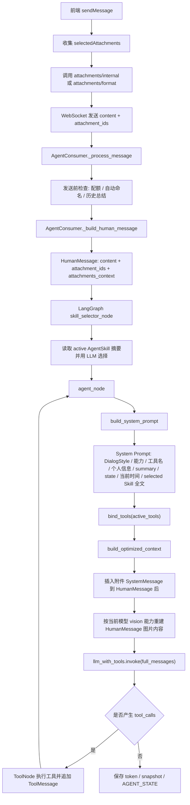
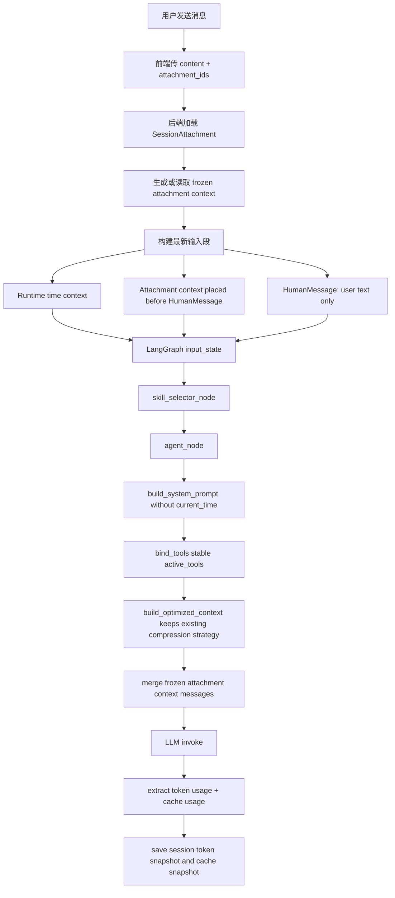
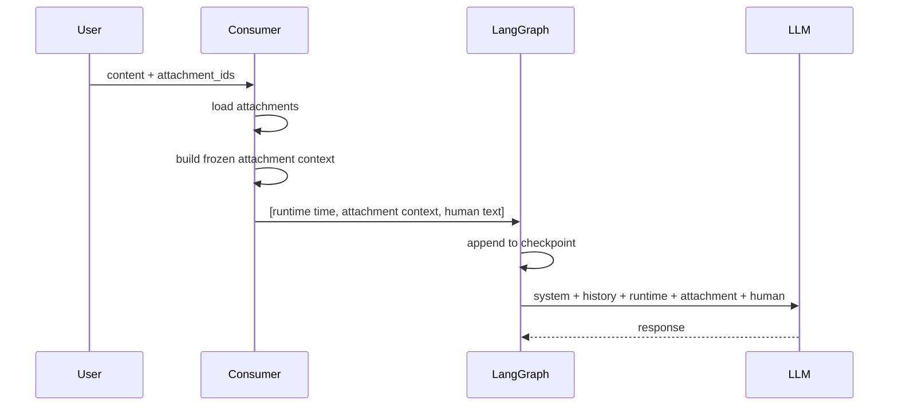
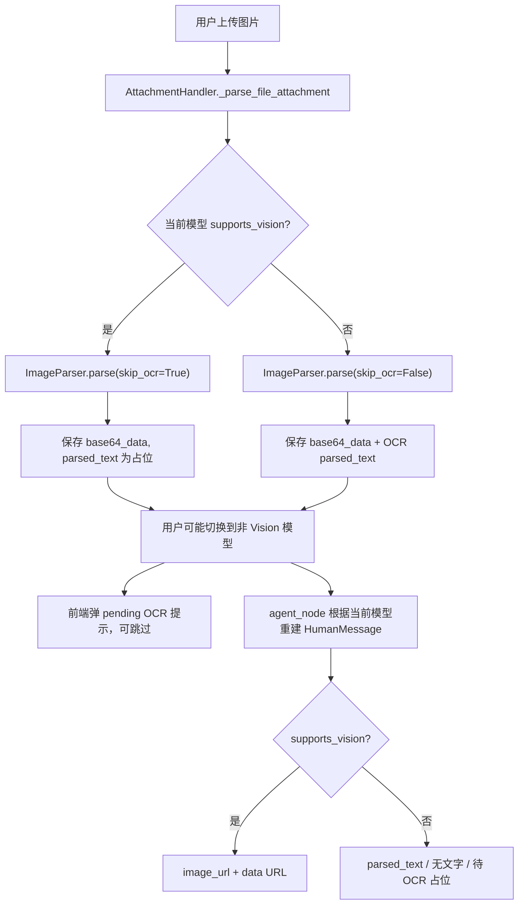
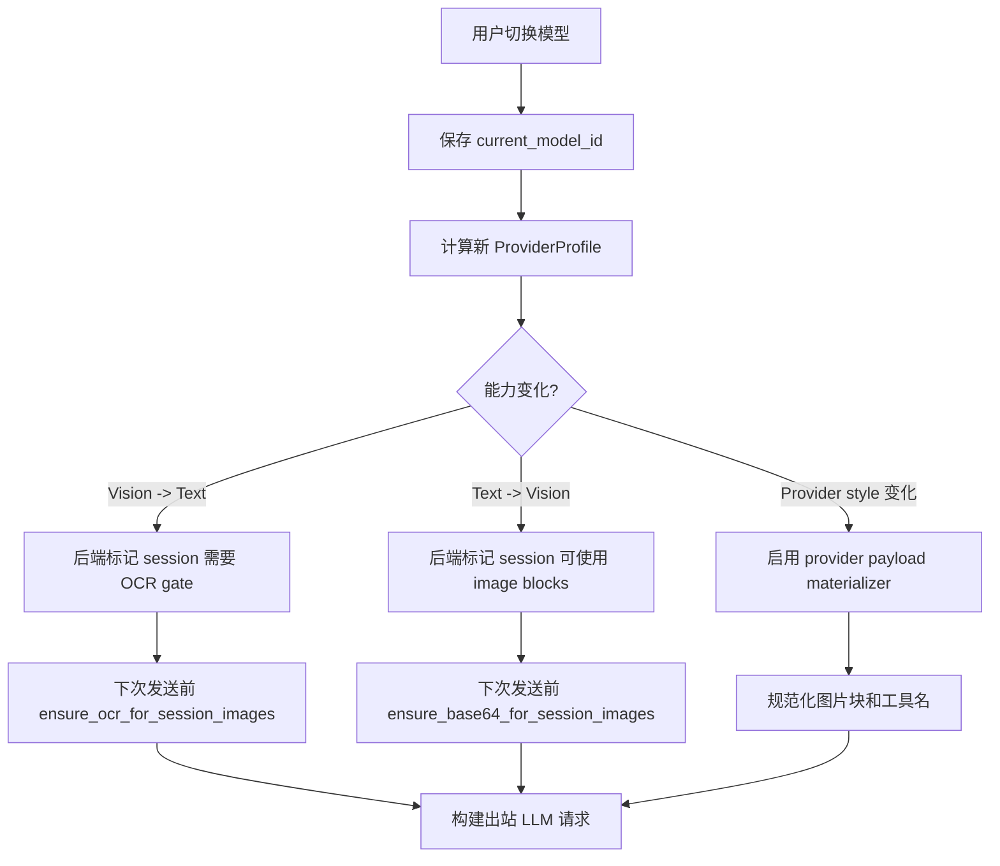
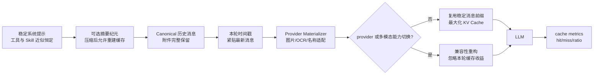

# 主 Agent 上下文构建 KV Cache 升级方案

> 适用范围：`agent_service` 主 WebSocket Agent。  
> 不适用范围：`quick_action_agent`。  
> 目标：在不大改工具、Skill、压缩策略的前提下，让长对话尽可能保持稳定前缀，提升 KV Cache 命中率，并补齐缓存命中观测字段。

---

## 1. 背景与真实使用假设

本项目主 Agent 的典型使用场景是长对话。用户进入一个会话后，通常会保持同一组工具权限、同一批启用 Skill 和同一套对话风格配置；这些内容虽然在代码上每轮动态构建，但实际运行中近似恒定。

因此，本次升级不把工具和 Skill 的动态构建视为主要问题，也不改现有压缩策略。压缩发生后丢失一段缓存是可接受成本。真正需要处理的是：

1. 秒级时间戳不应进入稳定前缀。
2. 附件应作为消息邻近上下文完整保留，不应每轮重建、截断或因模型能力切换而改变历史表示。
3. 增加缓存命中观测字段，支持 DeepSeek 与 Kimi/Moonshot 风格，未来可扩展其他 provider。

---

## 2. 当前上下文构建现状

### 2.1 当前主流程



主要代码位置：

| 环节 | 文件 |
|---|---|
| WebSocket 消息处理 | `agent_service/consumers.py::_process_message` |
| 用户消息与附件构建 | `agent_service/consumers.py::_build_human_message` |
| System Prompt 构建 | `agent_service/agent_graph.py::build_system_prompt` |
| Skill 预筛选 | `agent_service/agent_graph.py::skill_selector_node` |
| Agent 主节点 | `agent_service/agent_graph.py::agent_node` |
| 上下文摘要与工具压缩 | `agent_service/context_summarizer.py::build_optimized_context` |
| 附件格式化与重建 | `agent_service/attachment_handler.py` |

### 2.2 当前消息序列结构

在一次 LLM 调用前，主 Agent 实际发送的大致结构为：

```text
[SystemMessage]
  - DialogStyle
  - 工具能力说明
  - 当前可用工具名
  - 注意事项
  - 工作流提示
  - 任务追踪提示
  - 用户基本信息
  - 历史摘要状态
  - AGENT_STATE 状态
  - 当前时间
  - 本轮选中 Skill 全文

[SystemMessage: 对话历史总结，可选]

[历史 HumanMessage / AIMessage / ToolMessage ...]

[SystemMessage: 附件内容，插入在每条 HumanMessage 后]

[最新 HumanMessage]

[SystemMessage: 最新消息附件内容，可选]
```

其中工具 schema 不在 `SystemMessage.content` 中，而是通过 `active_llm.bind_tools(tools)` 传入模型请求。对 KV Cache 来说，它仍然属于 prompt 前缀的一部分。

---

## 3. KV Cache 视角下的判断

### 3.1 可以保持现状的部分

#### 工具提示

工具权限在真实长会话里几乎不变。虽然当前实现每轮从 `active_tools` 动态绑定工具，但只要列表内容和顺序稳定，工具 schema 可视为稳定提示词。

本次不要求改成全量工具 schema，也不要求拆分工具 profile。只需要保证：

1. `active_tools` 在同一会话中保持稳定。
2. 工具列表顺序稳定。
3. 工具 docstring / schema 不在运行时被非确定性修改。

#### Skill 提示

当前 Skill Selector 每轮动态选择 Skill，但真实场景中可用 Skill 池基本稳定。若同类长任务持续使用相同 Skill，命中仍然可接受。

本次不调整 Skill Selector 架构。只建议后续实现时尽量保证：

1. `AgentSkill.objects.filter(...).values(...)` 输出排序稳定。
2. 注入的 selected Skill 顺序稳定。
3. Skill 内容只在用户编辑 Skill 后变化。

#### 压缩策略

现有历史摘要和工具压缩保留。压缩触发会改变历史前缀并导致缓存重建，这是可接受行为。本次不改：

1. `enable_summarization`
2. `summary_trigger_ratio`
3. `min_messages_before_summary`
4. `compress_tool_output`
5. `tool_output_max_tokens`
6. `tool_compress_preserve_recent_messages`

### 3.2 必须调整的部分

#### 时间戳

当前 `build_system_prompt` 把 `当前时间: YYYY-MM-DD HH:MM:SS` 拼入 System Prompt。秒级变化会让第一条消息每轮不同，导致后续全部无法复用稳定前缀。

目标：System Prompt 不再包含当前时间。时间改为紧贴最新用户消息的 runtime context。

#### 附件上下文

当前附件信息存在 `HumanMessage.additional_kwargs['attachments_context']`，随后在 `agent_node` 中每轮遍历所有历史消息并重新插入附件 `SystemMessage`。历史文件附件在非最新消息中会被截断，图片内容还会根据当前模型 vision 能力动态重建。

这对长对话理解和缓存都不理想：

1. 历史附件表示不是冻结的。
2. 附件内容可能从完整变成截断。
3. 图片可能从 base64 变成 OCR 文本或反向变化。
4. 附件内容位于用户消息之后，不适合“围绕同一附件持续追问”的缓存场景。

目标：附件作为 session focus context 或 message-local context 完整保留，且紧挨在对应用户消息之前。

#### 缓存观测

当前 token 统计只关注 input/output/cost，缺少 cache hit/miss。升级后需要在主 Agent token 统计路径中提取缓存字段，并保存到会话快照和用户 token usage 统计里。

---

## 4. 升级后的上下文构建流程

### 4.1 新消息顺序

目标消息序列：

```text
[SystemMessage: 稳定系统提示]
  - DialogStyle
  - 工具能力说明
  - 当前可用工具名
  - 注意事项
  - 工作流提示
  - 任务追踪提示
  - 用户基本信息
  - 历史摘要状态
  - AGENT_STATE 状态
  - selected Skill 全文
  - 不包含当前时间

[SystemMessage: 对话历史总结，可选]

[历史消息序列]
  - HumanMessage 前，如果该用户消息有附件，则先放附件上下文消息
  - HumanMessage 本体
  - AIMessage
  - ToolMessage

[SystemMessage: 当前时间 / runtime context]
  - 当前时间
  - 当前模型必要运行时提示

[SystemMessage or Human-adjacent message: 最新附件上下文，可选]
  - 完整附件内容
  - 放在最新 HumanMessage 之前

[HumanMessage: 最新用户文本]
```

### 4.2 流程图



---

## 5. 附件上下文升级设计

### 5.1 设计原则

1. 附件随对应用户消息一起进入上下文。
2. 附件上下文放在用户消息前面，形成 `attachment -> question` 的稳定问答结构。
3. 附件内容一旦发送即冻结，不因“是否最新消息”而变短。
4. 历史附件完整保留，直到现有压缩策略触发。
5. 附件元数据继续保留在 `additional_kwargs` 里，供前端渲染磁贴和回滚使用。

### 5.2 推荐消息结构

对于带附件的用户消息：

```text
[SystemMessage]
【附件上下文】
message_index: 12
attachment_ids: [101, 102]
render_version: 1
content_hash: sha256:...

### 附件 1: xxx.pdf
完整解析内容...

### 附件 2: screenshot.png
OCR 或图片说明...

[HumanMessage]
请根据上面的附件，帮我整理...
```

如果是 vision 模型且决定发送图片，正常同模型长对话中应优先复用本次冻结结果；但一旦发生模型 provider 或多模态能力切换，应进入“兼容性重构模式”。兼容性重构不考虑 KV Cache，优先保证请求不会因图片格式、OCR 缺失或 provider JSON 字段不兼容而失败。

### 5.3 存储建议

可优先复用 `SessionAttachment`，新增字段可后续迁移：

| 字段 | 类型 | 说明 |
|---|---|---|
| `frozen_context` | TextField | 首次发送时生成的完整附件上下文 |
| `frozen_context_hash` | CharField | 内容 hash，用于调试和未来去重 |
| `frozen_context_format` | CharField | `text` / `markdown` / `vision_text` / `image_url` |
| `frozen_context_model_id` | CharField | 首次冻结时的模型 |
| `frozen_context_created_at` | DateTimeField | 冻结时间 |

也可以先不迁移数据库，把冻结内容写入 LangGraph 消息本体：新增一条 `SystemMessage` 并持久化在 checkpoint 中。这样实现最小，但缺点是附件库无法单独追踪冻结内容。

建议路线：

1. 第一阶段：只改消息构建，把附件上下文作为独立消息写入 LangGraph state，确保历史不再每轮重建。
2. 第二阶段：再给 `SessionAttachment` 增加冻结字段，支持调试、复用、hash 展示。

### 5.4 代码调整点

当前：

1. `_build_human_message` 返回一个带 `attachments_context` 的 `HumanMessage`。
2. `agent_node` 每轮扫描所有 `HumanMessage`，动态插入附件 `SystemMessage`。

目标：

1. `_build_human_message` 改为返回消息列表，而非单条消息：

```python
[
    SystemMessage(content=runtime_time_context),        # 仅最新消息
    SystemMessage(content=frozen_attachment_context),   # 如果有附件
    HumanMessage(content=user_text, additional_kwargs={...})
]
```

2. `_process_message` 的 `input_state["messages"]` 允许传入多条消息。
3. 移除或禁用 `agent_node` 中“遍历所有 HumanMessage 并注入附件上下文”的逻辑。
4. 移除非最新附件截断逻辑。完整保留交给现有压缩策略处理。
5. 历史多模态重建逻辑只允许处理最新消息，避免改写历史。

### 5.5 附件位置示意



---

## 6. 时间戳提示升级设计

### 6.1 当前问题

`build_system_prompt(..., current_time=...)` 把当前时间拼入首个 System Prompt。

由于时间每秒变化，这会让最前面的稳定系统提示每轮不同。

### 6.2 目标结构

移除 System Prompt 中：

```text
当前时间: 2026-05-22 15:30:01
```

改为在最新用户消息前追加：

```text
[SystemMessage]
【本轮运行时上下文】
当前时间: 2026-05-22 15:30:01
时区: Asia/Shanghai
说明: 仅用于理解用户本轮消息中的相对时间表达。
```

### 6.3 影响

1. 稳定系统提示可跨轮命中缓存。
2. “今天、明天、下周五”等相对时间解析仍然准确。
3. 历史轮次中的时间上下文作为当时的消息保留，不会被新时间覆盖。

---

## 7. 模型切换与多模态兼容升级

### 7.1 当前项目行为

当前项目已经有一套“按当前模型能力动态重建图片消息”的机制，但它更像宽松兜底，不是严格的 provider/capability 兼容层。

现有链路如下：



关键代码：

| 环节 | 当前行为 |
|---|---|
| `AttachmentHandler._parse_file_attachment` | 如果当前模型支持 vision，设置 `skip_ocr=True`，上传时跳过 OCR |
| `ImageParser.parse` | 始终生成 base64；仅 `skip_ocr=False` 时执行 OCR |
| `AttachmentHandler.get_images_without_ocr` | 查找已发送但 OCR 为空或占位的图片 |
| `core/static/js/agent-config.js::switchModel` | Vision → 纯文本时提示用户执行 OCR，但允许“暂不处理” |
| `agent_node` | 每轮按当前模型能力重建历史图片消息 |
| `AttachmentHandler.rebuild_message_content_for_model` | Vision 用 `image_url`；非 Vision 用 `parsed_text` 或占位 |

现有问题：

1. 上传时若模型支持 vision，会跳过 OCR；之后切换到非多模态模型时，图片可能没有真实 OCR 文本。
2. 前端 OCR 提示不是硬门槛，用户可以跳过。
3. 后端 Agent 请求链路没有“非多模态发送前必须 OCR”的强校验。
4. 历史图片会按当前模型能力动态重建，但重建失败时会带占位继续发送。
5. 图片消息格式固定为 OpenAI-compatible `image_url`，尚无 provider payload adapter。
6. 工具名与消息 JSON 字段未经过 provider 规范化，遇到严格 provider 时可能因名称格式失败。

### 7.2 升级原则

模型切换时，不追求缓存命中。换 provider 后 KV Cache 本来就会清零，重点是请求正确性。

硬约束：

1. 多模态模型：图片必须以 provider 认可的图片块完整发送，不能只发 OCR 文本。
2. 非多模态模型：图片必须先经过 OCR，再把 OCR 结果或明确的 OCR 失败信息发给模型；不能发送 `image_url`。
3. OCR 失败时不能静默降级成“待 OCR 处理”继续调用模型，应明确中断或生成可解释的错误上下文。
4. provider JSON 字段必须由统一 adapter 生成，不允许各处手写不同格式。
5. 工具名、tool call 名称、消息 name 字段必须符合 provider 规范，并能反向映射回内部工具名。

### 7.3 Provider Profile 设计

新增一个 provider profile 层，统一描述模型请求格式，而不是把差异散落在 `agent_graph.py`、`attachment_handler.py` 和前端。

建议结构：

```python
class ProviderProfile(TypedDict):
    provider_style: str                 # deepseek / kimi / openai-compatible / anthropic-compatible / custom
    cache_usage_style: str              # deepseek / kimi / none
    thinking_param_style: str           # deepseek / kimi-k2 / none
    message_format_style: str           # openai-chat / anthropic-messages
    image_block_style: str              # openai-image-url / anthropic-image-source / none
    tool_name_style: str                # openai-compatible / strict-alnum-underscore
    supports_vision: bool
    supports_multimodal: bool
```

读取优先级：

1. 模型配置中的显式字段。
2. `provider` 推断。
3. 兼容旧字段：`thinking_param_style`、`supports_vision`、`supports_multimodal`。

第一阶段可先实现最小字段：

```json
{
  "provider_style": "deepseek",
  "cache_usage_style": "deepseek",
  "message_format_style": "openai-chat",
  "image_block_style": "none",
  "tool_name_style": "openai-compatible"
}
```

```json
{
  "provider_style": "kimi",
  "cache_usage_style": "kimi",
  "message_format_style": "openai-chat",
  "image_block_style": "openai-image-url",
  "tool_name_style": "openai-compatible"
}
```

### 7.4 图片发送策略

#### 多模态模型

发送前必须满足：

1. `supports_vision == True`
2. `image_block_style != "none"`
3. 图片附件存在 `base64_data`

OpenAI-compatible / Kimi 风格：

```json
{
  "type": "image_url",
  "image_url": {
    "url": "data:image/jpeg;base64,...",
    "detail": "auto"
  }
}
```

如果 `base64_data` 不存在：

1. 尝试从原始文件重新生成 base64。
2. 生成失败则阻止本轮 LLM 调用，向前端返回可恢复错误。

不得把“图片 base64 不可用”作为普通文本发给多模态模型后继续执行。

#### 非多模态模型

发送前必须满足：

1. `supports_vision == False`
2. 不包含任何 `image_url` 或 provider 图片块。
3. 每张图片都已经执行过 OCR。

建议给 `SessionAttachment` 增加 OCR 状态字段，避免把“跳过 OCR”和“OCR 已执行但无文字”混在同一个 `parsed_text` 占位里：

| 字段 | 类型 | 说明 |
|---|---|---|
| `ocr_status` | CharField | `pending` / `processing` / `completed` / `failed` / `skipped` |
| `ocr_attempted_at` | DateTimeField | 最近 OCR 时间 |
| `ocr_provider` | CharField | `baidu` / `easyocr` / `tesseract` / `none` |
| `ocr_error` | TextField | OCR 失败原因 |

非多模态构建时：

1. 若 `ocr_status == completed`，发送 OCR 文本。
2. 若 `ocr_status in pending/skipped`，同步执行 OCR 或触发任务并等待结果。
3. 若 `ocr_status == failed`，阻止本轮调用，提示用户 OCR 失败，除非用户明确允许“无图片内容继续”。
4. 若 OCR 已执行但无文字，发送明确文本：`[图片 xxx 已执行 OCR，但未识别出文字内容]`。

### 7.5 出站消息 Materializer

正常同模型长对话可以保留冻结消息；模型切换时应基于 canonical state 重新 materialize 出站请求，不应直接修改 checkpoint 里的历史消息。

建议新增：

```python
class OutboundMessageMaterializer:
    def materialize(messages, provider_profile, user) -> list[BaseMessage]:
        ...
```

职责：

1. 读取历史消息中的 `attachment_ids` / `attachments_metadata`。
2. 根据 provider profile 重新生成出站 content。
3. 多模态模型生成 provider 图片块。
4. 非多模态模型强制 OCR 后生成纯文本。
5. 对 ToolMessage / AIMessage 的 name、tool_calls 做 provider-safe 转换。
6. 不把 materialized 结果写回 checkpoint，除非执行显式迁移。

这样可以同时满足两种目标：

1. 同模型长对话：稳定、缓存友好。
2. 模型切换：请求格式正确、图片语义不丢。

### 7.6 Provider JSON 名称字段规范化

当前工具名来自 LangChain 工具、MCP 工具和手写工具。多数 OpenAI-compatible provider 支持 `[a-zA-Z0-9_-]`，但不同供应商的兼容层严格程度不一。MCP 工具名还可能带服务名前缀、短横线或较长名称。

建议引入双向工具名映射：

```python
class ProviderNameMapper:
    def to_provider_tool_name(internal_name: str, profile: ProviderProfile) -> str:
        ...

    def to_internal_tool_name(provider_name: str) -> str:
        ...
```

规范：

1. provider tool name 只由安全字符组成。
2. 超过 provider 长度限制时截断并追加 hash。
3. 名称不能以不被 provider 接受的字符开头。
4. 所有 `tool_calls[].name` 在进入 ToolNode 前反向映射为内部工具名。
5. 所有 `ToolMessage.name` 使用 provider-safe name 或按 provider 要求省略。

示例：

```text
内部名: mcp_12306-mcp_query-tickets
Provider 名: mcp_12306_mcp_query_tickets
映射表: {"mcp_12306_mcp_query_tickets": "mcp_12306-mcp_query-tickets"}
```

第一阶段可以只对不符合正则或超长的工具名做映射，避免影响现有稳定工具名。

### 7.7 模型切换升级流程



建议把前端 OCR 弹窗保留为体验优化，但后端必须有最终 gate。前端提示不能作为正确性的唯一保障。

### 7.8 代码层面准备清单

新增模块建议：

| 文件 | 职责 |
|---|---|
| `agent_service/provider_profiles.py` | 从模型配置生成 ProviderProfile |
| `agent_service/message_materializer.py` | 出站消息 materialize，处理图片/OCR/provider 格式 |
| `agent_service/tool_name_mapper.py` | 工具名 provider-safe 映射 |
| `agent_service/usage_extractor.py` | token/cache/reasoning usage 提取 |

改造点：

| 文件 | 改造 |
|---|---|
| `agent_service/models.py` | 为 `SessionAttachment` 增加 OCR 状态字段 |
| `agent_service/attachment_handler.py` | 增加 `ensure_base64`、`ensure_ocr`、`materialize_for_profile` |
| `agent_service/agent_graph.py` | LLM invoke 前调用 materializer；bind_tools 前应用工具名映射 |
| `agent_service/consumers.py` | `_build_human_message` 改为 `_build_input_messages`；支持多条输入消息 |
| `agent_service/views_config_api.py` | 模型切换后可写入 session capability-change 标记 |
| `core/static/js/agent-config.js` | 保留 OCR 提示，但提示用户“后端发送前也会强制处理” |

---

## 8. 缓存命中观测字段设计

### 8.1 Provider style 合并建议

当前模型配置已有：

```json
"thinking_param_style": "deepseek" | "kimi-k2" | "none"
```

建议升级为更通用的 provider style：

```json
"provider_style": "deepseek" | "kimi" | "openai-compatible" | "none"
```

兼容策略：

1. 如果配置了 `provider_style`，优先使用。
2. 如果未配置，回退 `thinking_param_style`。
3. 如果二者都没有，根据 `provider` 推断。

示例：

```json
{
  "provider": "deepseek",
  "provider_style": "deepseek",
  "thinking_param_style": "deepseek",
  "cache_usage_style": "deepseek"
}
```

为了低风险，也可以保留更细的字段：

```json
"cache_usage_style": "deepseek" | "kimi" | "none"
```

推荐实际实现顺序：

1. 先新增 `cache_usage_style`，不破坏现有 thinking 逻辑。
2. 后续再引入 `provider_style`，逐步合并 thinking/cache 分支。

### 8.2 Kimi/Moonshot 返回格式

用户提供示例：

```json
{
  "usage": {
    "prompt_tokens": 19,
    "completion_tokens": 21,
    "total_tokens": 40,
    "cached_tokens": 10
  }
}
```

提取规则：

| 字段 | 路径 |
|---|---|
| input_tokens | `usage.prompt_tokens` |
| output_tokens | `usage.completion_tokens` |
| cached_tokens | `usage.cached_tokens` |
| cache_miss_tokens | `prompt_tokens - cached_tokens` |

### 8.3 DeepSeek 返回格式

用户提供示例：

```json
{
  "usage": {
    "prompt_tokens": 10,
    "completion_tokens": 76,
    "total_tokens": 86,
    "prompt_tokens_details": {
      "cached_tokens": 0
    },
    "completion_tokens_details": {
      "reasoning_tokens": 66
    },
    "prompt_cache_hit_tokens": 0,
    "prompt_cache_miss_tokens": 10
  }
}
```

提取规则：

| 字段 | 优先路径 |
|---|---|
| input_tokens | `usage.prompt_tokens` |
| output_tokens | `usage.completion_tokens` |
| cached_tokens | `usage.prompt_cache_hit_tokens` |
| cache_miss_tokens | `usage.prompt_cache_miss_tokens` |
| fallback cached_tokens | `usage.prompt_tokens_details.cached_tokens` |
| reasoning_tokens | `usage.completion_tokens_details.reasoning_tokens` |

### 8.4 通用内部结构

新增统一结构：

```python
{
    "input_tokens": 10000,
    "output_tokens": 500,
    "total_tokens": 10500,
    "cached_tokens": 8500,
    "cache_hit_tokens": 8500,
    "cache_miss_tokens": 1500,
    "cache_hit_ratio": 0.85,
    "reasoning_tokens": 120,
    "source": "actual",
    "cache_source": "deepseek",
}
```

命名说明：

1. `cached_tokens` 保留为供应商通用字段。
2. `cache_hit_tokens` 是内部标准字段，等同于可复用命中的 prompt tokens。
3. `cache_miss_tokens` 是内部标准字段。
4. `cache_hit_ratio = cache_hit_tokens / input_tokens`。

### 8.5 保存位置

#### AgentSession 最近请求

建议新增：

| 字段 | 类型 | 说明 |
|---|---|---|
| `last_cached_tokens` | IntegerField | 最近一次命中缓存 token |
| `last_cache_miss_tokens` | IntegerField | 最近一次未命中 token |
| `last_cache_hit_ratio` | FloatField | 最近一次命中率 |
| `last_cache_tokens_source` | CharField | `deepseek` / `kimi` / `none` |

#### token_snapshots

当前结构：

```json
{
  "12": {
    "input_tokens": 3949,
    "source": "actual",
    "timestamp": "..."
  }
}
```

升级为：

```json
{
  "12": {
    "input_tokens": 3949,
    "output_tokens": 210,
    "source": "actual",
    "cached_tokens": 2800,
    "cache_hit_tokens": 2800,
    "cache_miss_tokens": 1149,
    "cache_hit_ratio": 0.709,
    "cache_source": "deepseek",
    "reasoning_tokens": 66,
    "timestamp": "..."
  }
}
```

#### UserData.agent_token_usage

当前按模型累计 input/output/cost。建议增加非计费观测字段：

```json
{
  "models": {
    "system_deepseek": {
      "input_tokens": 100000,
      "output_tokens": 5000,
      "cost": 0.25,
      "cached_tokens": 70000,
      "cache_miss_tokens": 30000,
      "cache_hit_ratio_weighted": 0.7
    }
  }
}
```

注意：成本计算仍使用当前 `input_tokens/output_tokens` 逻辑，缓存命中字段只做观测。若未来要按供应商缓存价格精确计费，再单独设计成本模型。

### 8.6 提取函数建议

新增函数：

```python
def extract_llm_usage(response, provider_style: str = "none") -> dict:
    """
    从 LangChain response 中提取 token 与 cache usage。
    支持 usage_metadata 与 response_metadata 两条路径。
    """
```

内部先合并候选 usage：

1. `response.usage_metadata`
2. `response.response_metadata["token_usage"]`
3. `response.response_metadata["usage"]`

然后按 style 提取缓存字段。

伪代码：

```python
usage = get_usage_dict(response)

input_tokens = usage.get("input_tokens") or usage.get("prompt_tokens") or 0
output_tokens = usage.get("output_tokens") or usage.get("completion_tokens") or 0

if style == "deepseek":
    cache_hit = usage.get("prompt_cache_hit_tokens", 0)
    cache_miss = usage.get("prompt_cache_miss_tokens", 0)
    if not cache_hit:
        details = usage.get("prompt_tokens_details", {})
        cache_hit = details.get("cached_tokens", 0)
    reasoning = usage.get("completion_tokens_details", {}).get("reasoning_tokens", 0)
elif style == "kimi":
    cache_hit = usage.get("cached_tokens", 0)
    cache_miss = max(input_tokens - cache_hit, 0) if input_tokens else 0
else:
    cache_hit = 0
    cache_miss = 0
    reasoning = 0

ratio = cache_hit / input_tokens if input_tokens else 0
```

---

## 9. 推荐实施顺序

### Phase 1：缓存观测

目标：先能看见缓存命中。

任务：

1. 新增 `cache_usage_style` 配置读取。
2. 新增 `extract_llm_usage()`。
3. 替换 `agent_graph.py` 主 Agent token 提取逻辑。
4. 保存 cache fields 到 `AgentSession.token_snapshots`。
5. 在 `last_llm_request_snapshot.token_stats` 中加入 cache stats。

验收：

1. Kimi 返回 `usage.cached_tokens` 时能记录。
2. DeepSeek 返回 `prompt_cache_hit_tokens` 时能记录。
3. 前端上下文可视化能看到最近一次 cache hit ratio。

### Phase 2：时间戳移位

目标：System Prompt 去动态时间。

任务：

1. `build_system_prompt` 移除 `current_time` 拼接。
2. `_process_message` 构建当前轮 runtime context message。
3. `_continue_processing` 同样添加 runtime context。
4. 确保相对时间工具和日程创建仍能使用当前时间。

验收：

1. 连续两轮相同工具/Skill 下，首个 System Prompt 内容不因秒级时间变化。
2. 用户说“明天上午 9 点”仍能正确理解。

### Phase 3：附件消息冻结与前置

目标：附件完整保留，并放在对应用户消息之前。

任务：

1. `_build_human_message` 改造为 `_build_input_messages`，返回 `List[BaseMessage]`。
2. 带附件时生成 `SystemMessage(附件上下文)`，排在 `HumanMessage` 前。
3. `input_state["messages"]` 支持多条消息。
4. 删除 `agent_node` 中动态扫描历史并插入附件上下文的逻辑。
5. 禁止历史附件截断。
6. 历史图片不再按当前模型能力重建。

验收：

1. 带附件消息进入 checkpoint 后，下一轮不会重新生成附件上下文。
2. 历史附件内容完整保留。
3. 上下文可视化显示附件消息位于对应用户消息前。
4. 回滚后附件软删除逻辑仍可依据 `attachment_ids/message_index` 工作。

### Phase 4：模型切换兼容层

目标：切换 provider 或多模态能力时不追求缓存命中，优先保证出站请求格式正确。

任务：

1. 新增 `ProviderProfile`，统一读取 `provider_style`、`cache_usage_style`、`thinking_param_style`、`image_block_style`、`tool_name_style`。
2. 给图片附件增加 OCR 状态字段，区分未执行、执行中、完成、失败。
3. 在 `AttachmentHandler` 中补齐 `ensure_image_base64()` 与 `ensure_image_ocr()`。
4. 新增 `OutboundMessageMaterializer`，在调用 LLM 前按当前 provider profile 生成出站消息。
5. 多模态模型出站前校验图片 base64 和 provider 图片块格式。
6. 非多模态模型出站前强制 OCR，禁止发送 `image_url`。
7. 新增 `ProviderNameMapper`，对 tool name、tool_call name、message name 做 provider-safe 映射和反向还原。
8. 为 vision -> text、text -> vision、provider strict name 三类切换补测试。

验收：

1. 切到多模态模型时，历史图片能以当前 provider 支持的图片块完整发送。
2. 切到非多模态模型时，出站消息不包含任何图片块，且图片已经 OCR 或明确阻断本轮调用。
3. OCR 失败不会被静默替换成“无内容”继续请求模型。
4. 含 `-`、`.`、过长名称的 MCP 工具能映射为 provider-safe 名称，并在工具执行前还原为内部名称。
5. 模型切换 materialize 不直接改写 checkpoint 历史，便于回滚和调试。

---

## 10. 风险与边界

### 10.1 历史附件完整保留会增加上下文

这是有意选择。由于缓存命中价格低，长附件保留可以提升理解和缓存复用。上下文爆掉仍交给现有摘要/压缩策略处理。

### 10.2 模型切换会绕过缓存优化

这是有意选择。切换 provider 或多模态能力时，缓存大概率已经不可复用，因此本轮进入兼容性 materialize：根据当前 provider 重新生成出站消息、图片块、OCR 文本和工具名称。它不追求最大缓存命中，只追求请求不出错。

### 10.3 强制 OCR 会增加等待和失败面

非多模态模型必须拿到 OCR 后的纯文本，这是正确性要求。若 OCR 失败，应阻断本轮 LLM 请求并返回可恢复错误，而不是把未识别图片当成空文本继续执行。

### 10.4 出站 materializer 与 checkpoint 双轨会增加复杂度

checkpoint 保存 canonical history，LLM 调用使用 materialized outbound messages。需要在 `last_llm_request_snapshot` 中保存 materialize 后的消息摘要、provider profile 和名称映射，方便排查“状态正确但出站格式错误”的问题。

### 10.5 工具和 Skill 仍可能变化

用户真实场景中它们几乎不变，所以不作为本次优化重点。若后续出现频繁切工具/Skill 的场景，再做工具 profile 和 Skill Registry 稳定化。

### 10.6 压缩后缓存丢失

接受。压缩是新的上下文纪元边界，压缩后的下一轮重新建立缓存即可。

---

## 11. 最终目标结构



本方案的核心不是把所有动态能力静态化，而是承认当前真实会话中“工具与 Skill 基本恒定”，优先修复两个高频破坏缓存的点：时间戳和附件重建。模型切换是独立的正确性通道：切换时可以牺牲缓存，但必须保证图片、OCR 和 provider JSON 名称字段全部正确。缓存观测字段先落地后，可以用真实 hit ratio 决定是否继续做更深的工具 profile / Skill Registry 改造。
