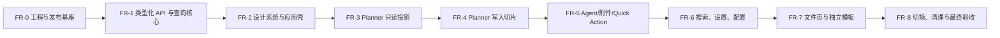

# 前端现代化重构详细实施与验收方案

> 状态：实施中；FR-0 至 FR-4 已完成并通过验收，下一阶段为 FR-5（Agent、统一附件、回滚与 Quick Action）。FR-4 仍受 React 前端开关保护，默认入口保持 legacy，未发生默认切换。
> 编制日期：2026-07-13  
> 依据：[前端界面重构前功能基线与技术选型调研.md](./前端界面重构前功能基线与技术选型调研.md)、[前端开发规范.md](./前端开发规范.md)、[后端开发规范.md](./后端开发规范.md)、[AGENT.md](../AGENT.md)  
> 适用范围：已完成 P1–P6 后的 Web 前端现代化。Django 继续承担认证、业务 API、WebSocket、模板入口与静态资源发布。

## 1. 目标、边界与完成定义

### 1.1 总目标

将当前以原生 JavaScript、全局状态和模板内联脚本为主的已登录工作台，渐进式替换为 React + TypeScript 单页应用；在不改变既有业务语义、权限边界和 P1–P6 数据/API 契约的前提下，获得可维护的组件边界、可靠的异步状态、可测试的交互和一致的响应式体验。

本方案不是后端重写，也不是重新设计业务规则。任何功能的“做法”可以重构，用户可感知的能力、数据归属、V2 API 合约和安全规则不得被削弱。

### 1.2 本次纳入范围

| 范围 | 最终结果 |
| --- | --- |
| 已登录主工作台 `/home` | React 应用壳、三栏布局、日历、待办、提醒、共享、搜索、设置、右侧 Agent、Quick Action 全部完成迁移。 |
| 文件页及共享附件选择器 | 迁移文件浏览、上传、预览、移动/删除、Markdown 编辑；Agent/日程附件使用统一的文件选择能力。 |
| API 调用层 | 统一 TypeScript DTO、错误转换、鉴权/CSRF、请求取消、Query 缓存、WebSocket 事件处理。 |
| 视觉与可访问性 | Token 化主题、可复用组件、键盘操作、焦点管理、响应式布局、减弱动态效果支持。 |
| 测试与交付 | 单元、组件、契约、端到端、无障碍、手工回归、构建及 Django 静态发布验收。 |

### 1.3 明确不在范围内

1. 不新增 Planner V1 兼容层；所有日程/待办/提醒读写只可调用 `/api/v2/...`。旧 Planner 路径返回 `410 Gone` 是预期行为。
2. 不修改已完成的 P1–P6 数据模型、RRule 语义、cohort 规则、服务端版本控制、文件权限、回滚有效窗口或 Agent 工具权限。
3. 不迁移已归档的旧 `reversion`/历史快照；P4 之后的回滚记录仍以服务端 `AgentRollbackWindow` 为唯一事实来源。
4. 不把业务真相复制进浏览器本地存储。localStorage/IndexedDB 只允许保存无敏感性的草稿、布局和用户偏好，不能保存权限、版本号、事件真相或回滚快照。
5. 不在本阶段改造移动原生端、第三方 CalDAV 行为或公开 API；这些前端仅消费已定义接口。

### 1.4 完成定义（Definition of Done）

全部满足才可宣布“前端重构完成”：

1. `/home` 和 `/files` 的生产默认入口均为 React 应用；原生 JS 管理器不再被生产模板加载。
2. 功能基线文档中每一项均有“React 落点、自动化用例、手工验收结果”三项对应记录；没有未说明的删除项。
3. 所有 Planner 请求均走 V2 client，写请求正确提供 `expected_version` 和需要时的 `occurrence_ref`；静态扫描和 E2E 网络记录中不存在旧 Planner 写路径。
4. 缓存更新采用服务端响应、Query 精确失效或 WebSocket 事件，不靠定时刷新、整页 reload 或猜测性本地改写掩盖失败。
5. Agent 文本、日程/Todo/Reminder 附件、文件/图片附件、当前对话回滚、Quick Action、共享组和提醒筛选均完成端到端测试。
6. TypeScript、lint、单元测试、构建、后端检查、关键 E2E、无障碍检查全部通过；P0/P1 缺陷为零。
7. 完成 staging 静态发布和生产灰度/回退演练，能以开关切回旧前端资源（仅限切换窗口内），不需要数据库回滚。

## 2. 技术决策与不可突破的约束

### 2.1 已采用的技术组合

| 层级 | 选型 | 责任与使用边界 |
| --- | --- | --- |
| 工程 | React、TypeScript、Vite | 独立构建前端 bundle；Django 模板只提供挂载点、启动配置和 CSRF。 |
| 样式/基础组件 | Tailwind CSS、shadcn/ui、Radix UI、Lucide | Token、可访问性原语、表单、Dialog、Popover、Tooltip、菜单、图标；禁止再造低层组件。 |
| 服务端状态 | TanStack Query | 查询缓存、失效、重试、取消、mutation 生命周期；唯一的 HTTP 服务器状态层。 |
| 纯 UI 状态 | Zustand | 面板尺寸、当前视图、弹窗开关、临时拖拽状态；不得存放 API 真相。 |
| 表单 | React Hook Form、Zod | 输入、同步校验、错误定位、DTO 转换；RRule 与日期范围必须显式校验。 |
| 日历 | FullCalendar React | 月/周/日/议程视图、资源渲染、拖拽和 resize；业务操作仍委托 V2 mutation。 |
| Agent 对话 | assistant-ui（External Store/自定义 runtime） | 会话渲染、流式消息和输入交互；协议/权限/回滚仍由现有后端决定。 |
| 拖拽/布局/动画 | dnd-kit、react-resizable-panels、Motion | 待办/附件拖拽、可调整三栏、有限且尊重减弱动效的过渡。 |
| 质量 | Vitest、React Testing Library、MSW、Playwright、axe | 分层测试，MSW 只模拟 HTTP/WS 边界，不伪造业务成功。 |

实施时需在首次工程初始化的提交中固定 Node、包管理器和每个依赖的精确版本，并记录许可证/CVE 审计结果。不得只写“latest”。如某库无法满足现有浏览器、打包体积或许可证要求，必须在实施报告中说明替换库、影响面和重新验收范围。

### 2.2 后端与接口硬约束

| 主题 | 前端必须遵守的规则 |
| --- | --- |
| Planner API | 日程、Todo、Reminder、组、共享数据只使用 `/api/v2` 契约；不可降级写入 legacy JSON。 |
| 并发 | 变更既有实体时使用服务端给出的 `expected_version`；遇到 `409` 显示可理解的冲突提示并刷新目标数据，不可静默覆盖。 |
| 重复实例 | 单次/未来范围操作必须携带服务端定义的 `occurrence_ref`，并根据接口 capabilities 决定是否展示；不可用索引或本地推算的日期替代。 |
| RRule | 编辑器生成受支持 RRULE；前端展示窗口是查询/渲染窗口，不代表无限规则被截断。 |
| 权限与共享 | UI 隐藏不是权限控制；共享组、组成员、文件附件的所有操作必须等待服务端授权结果。 |
| Agent | WebSocket 消息须按协议解析；回滚按钮只能依据当前会话返回的可回滚窗口显示。 |
| 文件/富文本 | 附件元数据使用服务端 resource ID；任何 Markdown/HTML 输出必须安全渲染，禁止危险 HTML 直插 DOM。 |
| 错误 | `400/401/403/404/409/410/422/423/5xx` 必须分别处理；`410` 是已封存接口/历史的明确状态，不能重试掩盖。 |

### 2.3 迁移原则

1. **绞杀式替换而非大爆炸。** 新入口与旧入口在阶段内可并存，完成一个可验证业务切片后才扩大默认流量。
2. **先读后写。** 每个复杂模块先实现同数据源的只读投影、比对和错误边界，再开放 mutation。
3. **组件按业务聚合。** `EventEditor`、`ReminderEditor` 等拥有领域边界；不得把原生 JS 的巨型 manager 原样搬进单个 React 文件。
4. **查询键可追溯。** 每个 mutation 必须写明影响的 query key、乐观更新策略、失败回滚和 WS 事件竞态处理。
5. **旧代码只读参考。** 迁移过程中不可在新组件继续调用旧 manager 或复制其全局可变状态。
6. **每阶段可停可验。** 阶段结束必须有测试报告、已知风险、回退条件；未过门禁不进入下一阶段。

## 3. 总体架构、目录和状态路线

### 3.1 渐进式交付序列



在 FR-0 至 FR-7，旧界面仍是默认入口或受功能开关保护的对照入口；React 所有已开放功能都必须只使用新 client。FR-8 之后旧入口仅作为短期静态回退资源，确认稳定后删除。

### 3.2 建议目录

以下为目标结构，不要求完全逐字一致，但职责不得混淆：

```text
frontend/
  src/
    app/                 # 启动、路由、Provider、ErrorBoundary、feature flag
    api/                 # fetch client、DTO、mapper、query key、WS 协议
    components/
      ui/                # shadcn/Radix 封装，不含业务规则
      shared/            # 日期、错误、附件、Markdown、确认框等跨业务组件
    features/
      planner/           # event、todo、reminder、groups、share、calendar
      agent/             # runtime、会话、回滚、context、tool/附件展示
      files/             # 文件页和统一文件选择器
      search/
      settings/
      quick-action/
    stores/              # 仅 UI store
    styles/              # token、全局基础样式、主题
    test/                # MSW handler、factory、test helper
  public/
  vite.config.ts
  package.json
core/templates/
  home_react.html        # Django 入口模板；不嵌入业务 JS
core/static/dist/        # 构建产物/manifest 的收集目标（以实际 Django 设置为准）
docs/前端重构验收报告/
```

禁止在 `components/ui` 中发 HTTP 请求；禁止在 `api` 中操作 DOM、Toast 或路由；禁止 feature 之间相互导入内部组件。跨 feature 的能力须由 `components/shared` 或清晰定义的公共 hook/DTO 暴露。

### 3.3 状态分层与持久化表

| 状态类别 | 存放位置 | 示例 | 禁止事项 |
| --- | --- | --- | --- |
| 服务端真相 | TanStack Query | planner bootstrap、事件详情、成员、文件列表、搜索结果、会话历史 | 不复制到 Zustand/localStorage 后自行同步。 |
| 服务端命令状态 | mutation/WS reducer | 保存中、流式响应、rollback 请求中、上传进度 | 成功前不可伪造已持久化版本。 |
| 短时 UI 状态 | 组件 state/Zustand | 当前 tab、选中日程、弹窗、拖拽 overlay、面板宽度 | 不含权限、实体版本、所有日程数据。 |
| 可恢复偏好 | localStorage | 主题、面板比例、最后视图、未提交草稿 | 不保存 token、消息正文附件二进制、回滚快照。 |
| URL 状态 | Router search params | 日期窗口、视图、搜索关键词、选中的实体 ID | 不把秘密/大型 JSON 编进 URL。 |

### 3.4 Query key 与失效基本约定

```ts
plannerKeys.bootstrap(userId)
plannerKeys.calendar(userId, range, filters)
plannerKeys.event(eventId)
plannerKeys.todo(todoId)
plannerKeys.reminder(reminderId)
plannerKeys.groups(userId)
plannerKeys.share(groupId)
agentKeys.session(sessionId)
agentKeys.rollbackWindow(sessionId)
fileKeys.list(pathOrParentId)
```

每个 mutation 需在同文件写出“前置取消、乐观补丁（如有）、服务端响应合并、精确失效、失败恢复”的注释或测试名称。以下为最低失效要求：

| 命令 | 必须更新/失效的目标 |
| --- | --- |
| Event 创建、更新、删除、拖拽、范围操作 | 当前 calendar range、相关 Event detail、planner bootstrap；受影响共享/提醒投影。 |
| Todo 创建、状态/分类/排序/转换 | Todo detail、当前 Todo list/quad、planner bootstrap、可能的 Event 查询。 |
| Reminder 创建、范围更新、snooze、删除 | Reminder detail、calendar range、提醒侧栏/通知计数、planner bootstrap。 |
| 组或共享成员变更 | groups、share group detail、calendar 中共享项目、成员选择器。 |
| Agent 工具造成写入 | 以 tool 结果或 WS 失效事件定位相同 Planner keys，不通过整页刷新。 |
| 文件上传/移动/删除 | 源/目标文件夹、文件详情、共享附件选择器结果。 |

## 4. 统一测试、报告与放行制度

### 4.1 测试分层

| 层级 | 主要工具 | 验证对象 | 通过标准 |
| --- | --- | --- | --- |
| 静态 | `tsc`、ESLint、Prettier、依赖审计 | 类型、导入、无死代码、依赖风险 | 0 error；新增 warning 必须有记录和批准。 |
| 单元 | Vitest | DTO mapper、RRULE 转换、query key、reducer、selector、日期工具 | 所有分支、边界值、错误映射通过。 |
| 组件 | RTL + MSW | 表单校验、Dialog、键盘、加载/空/错误、mutation 生命周期 | 用户可见状态与网络契约匹配。 |
| 契约 | MSW fixture + Django 测试环境 | 请求 method/path/body、响应解析、错误码 | 不出现 legacy Planner URL；必填 ref/version 覆盖。 |
| 端到端 | Playwright | 登录后的真实浏览器工作流、WS、拖拽、刷新后状态 | 关键场景在 Chromium/Firefox/WebKit（能力允许时）通过。 |
| 无障碍/视觉 | axe、Playwright 截图、手工键盘 | 对话框焦点、语义、对比度、窄屏 | 严重 axe 违规 0；基线截图差异已审核。 |
| 发布 | Vite build、Django collectstatic/check、staging | 静态路径、manifest、CSRF、代理、缓存 | 清缓存与不清缓存均可加载正确版本。 |

### 4.2 阶段报告模板

每完成 FR-0 至 FR-8 的一个可放行阶段，在 `docs/前端重构验收报告/FR-<编号>-验收报告.md` 创建报告。报告至少包含：

1. 目标、范围、实现文件和未触及的旧文件；
2. API 请求/响应或 WebSocket 协议变更（原则上应为无变更）；
3. 自动化命令、环境、总数、通过/失败/跳过及失败原因；
4. 手工用例、账号/fixture、浏览器、结果、截图或录屏路径；
5. 网络审计：V2 请求、403/409/410 处理、是否出现 legacy Planner URL；
6. 无障碍与响应式结果；
7. 已知问题、风险等级、回退方式及下一阶段前置条件。

### 4.3 缺陷等级与阻断规则

| 等级 | 示例 | 是否阻断下一阶段/发布 |
| --- | --- | --- |
| P0 | 数据错误写入、越权、错误回滚、附件泄露、V1 Planner 写入、无法加载主页面 | 立即阻断。 |
| P1 | Event/Todo/Reminder/Agent 核心流程不可用、重复范围错误、共享缺失、关键浏览器崩溃 | 阻断。 |
| P2 | 非核心样式错误、次要筛选异常、可绕过的交互问题 | 记录并设修复窗口；不得在同区域继续扩展。 |
| P3 | 文案、微动画、低优先级体验问题 | 可后续排期，但需要有 issue。 |

## 5. FR-0：工程基座、开发规范与安全发布通道

### 5.1 目标与边界

在不动现有生产页面行为的前提下创建可重复构建的 React/TypeScript 工程，打通 Django 模板、静态资源、认证 Cookie、CSRF、同源 API 和 WebSocket。此阶段不得迁移任何业务页面，不得切换默认入口。

### 5.2 实施步骤

1. 在仓库确认的前端根目录初始化 Vite + React + TypeScript，固定 Node 与包管理器版本，提交 lockfile；不得覆盖现有 `static/js` 或模板。
2. 配置 TypeScript strict、路径别名、ESLint、Prettier、Vitest、RTL、MSW、Playwright 与 axe；增加 `typecheck`、`lint`、`test:unit`、`test:e2e`、`build` 脚本。
3. 配置开发服务器代理：HTTP API 与 WebSocket 保持 Django 同源路径及 Cookie 行为；开发时不得通过跨域放宽来绕过 CSRF。
4. 新建最小 `home_react.html`：只输出挂载节点、用户非敏感启动配置、CSRF 获取入口和由 Django/Vite manifest 决定的资源标签。业务逻辑禁止写回模板内联脚本。
5. 定义生产构建产物目录与 `collectstatic` 流程；处理 manifest 缺失、hash 静态资源、404 fallback、缓存 header 和发布版本标记。
6. 增加前端开关（例如 Django settings/模板 context 的 `frontend_mode=legacy|react`），默认 `legacy`。开关只能选择入口资源，不得切换 Planner API 版本或改变数据写路径。
7. 建立 `.env.example`，只列公开构建变量；禁止把密钥、用户 token、生产地址硬编码到 bundle。补充本地启动、测试、构建、发布命令到前端开发规范。
8. 增加全局 `ErrorBoundary`、未捕获 Promise/WS 错误采集接口（先可输出到开发日志），以及网络超时/离线的基础反馈组件。

### 5.3 测试范围

| 类别 | 必测项 |
| --- | --- |
| 冷启动 | 空依赖目录执行安装、typecheck、lint、unit、build 均成功；构建不依赖本机全局包。 |
| Django 集成 | `collectstatic` 后模板能从 manifest 找到 hash 文件；静态资源 MIME、路径、404 情况正确。 |
| 认证 | 未登录访问受保护 React 入口走既有登录流程；登录后 Cookie 生效，API 不需要前端保存 token。 |
| CSRF | POST/PUT/PATCH/DELETE 带正确 CSRF；缺失/过期时给可理解错误，不静默失败。 |
| WebSocket | 开发代理与生产同源 URL 均能建连；断线不会让页面崩溃。 |
| 缓存 | 旧 HTML/旧 JS 与新 hash bundle 的组合不会加载到不存在资源；清缓存和普通刷新均正常。 |
| 浏览器 | 当前支持的 Chromium、Firefox、WebKit 及 1280/768、1440/900、移动窄屏 smoke test。 |

### 5.4 验收标准与输出

1. `npm ci && npm run typecheck && npm run lint && npm run test:unit && npm run build` 成功。
2. `python manage.py check`、`python manage.py collectstatic --noinput` 在隔离环境成功；选择 `react` 开关只显示“工程就绪”页面，选择 `legacy` 页面无差异。
3. 浏览器网络面板确认同源 Cookie、CSRF、WS 均正常；没有 CORS 特例、硬编码 localhost 或未捕获错误。
4. 形成 `FR-0-验收报告.md`，含构建产物、开关定位、部署/回退命令和截图。

## 6. FR-1：类型化 API、DTO 映射、错误模型与查询核心

### 6.1 目标与边界

先建立唯一的前端数据入口，消除各页面手写 `fetch`、不同字段命名和散落错误弹窗。此阶段仅以测试页或未公开页面验证读取；不得由 React 写入生产数据。

### 6.2 实施步骤

1. 实现 `apiClient`：统一 base URL、JSON/body、CSRF、超时、AbortSignal、请求 ID、响应解析与 `ApiError`。`ApiError` 至少保留 HTTP status、服务端 code/message/details、request URL/method 和可安全展示的文案。
2. 为 Event、Todo、Reminder、Group、Share、Attachment/File、Agent message/session、Quick Action、Search、Settings 建立“wire DTO / domain model / mapper”三层。后端 snake_case 不应泄漏到全部组件；mapper 必须保留 ID、`expected_version`、`occurrence_ref`、capabilities 和权限字段。
3. 建立 Planner V2 client。所有函数名称按动作区分：`createEvent`、`updateEvent`、`updateEventOccurrence`、`deleteEvent` 等；不可用一个裸 `request(path, body)` 让调用点猜路径。
4. 在 client 层校验写入前置条件：更新实体没有 `expectedVersion`、范围操作没有 `occurrenceRef`、不支持的 scope/capability 时，在发网前抛出受测试的领域错误。此校验不替代服务端校验。
5. 创建 query key factory、`QueryClient` 默认 retry 策略和统一错误转换。401、403、409、410、422、423、5xx 的用户操作分支在 feature 层处理；不得把所有错误翻成“操作失败”。
6. 为 Agent HTTP/WS、文件、共享、搜索、设置创建独立 client，复用 transport 和错误模型。WebSocket 协议必须定义判别联合类型，未知事件写开发日志并安全忽略。
7. 用 MSW 建立真实形状的 fixture：正常、空数据、权限不足、验证失败、版本冲突、已封存、重复规则、共享数据、附件和 WS 分段事件。fixture 不得简化掉 `expected_version`/`occurrence_ref`。
8. 加入 CI 静态规则：在 `frontend/src` 中扫描旧 Planner URL、`PlannerManager` 等 legacy 依赖；除迁移注释白名单外发现即失败。

### 6.3 必测 API 场景

| 场景 | 断言 |
| --- | --- |
| 成功读取/分页/空值 | mapper 的日期、null、列表、权限与未知枚举值安全转换。 |
| 写入 CSRF/取消 | method、headers、body 正确；组件 unmount 后请求可取消且不报 setState。 |
| 422 | 字段错误精确映射到表单，而非丢失 details。 |
| 409 | 显示冲突并失效目标 query；不重试覆盖。 |
| 410 | 明示“接口/历史已封存”，不切换到 legacy client。 |
| 423 | 明示当前资源锁定/不可修改，并保留服务端上下文。 |
| 重复范围 | 单次/未来均携带 occurrence ref；all 与单实例不能误用同一 payload。 |
| Agent WS | open、partial、tool、attachment、complete、error、close/重连各事件都能被 reducer 接受。 |
| 附件 | 日程/Todo/Reminder/文件/图片在统一 union 中可区分；未知类型安全显示而不崩溃。 |

### 6.4 验收标准与输出

1. 所有 API 函数有至少正常、验证失败及一个领域边界的 unit/contract test。
2. Playwright/MSW 网络断言中，Planner 请求前缀均为 `/api/v2/`；`rg` 扫描新源代码不含旧 Planner 写路径。
3. Query key 和 mutation 影响表在代码注释/测试中可追溯，API 错误无 `any` 吞没。
4. 形成 `FR-1-验收报告.md`，附 DTO 字段对照、fixture 覆盖率、禁止旧接口的扫描结果。

## 7. FR-2：设计系统、应用壳与跨模块交互原语

### 7.1 目标与边界

将原有分散 CSS、重复 icon/tooltip/dialog 和三栏布局整理为统一、可访问且可响应的视觉系统。此阶段只建壳与通用组件，不迁移 Planner 写能力。

### 7.2 实施步骤

1. 从原页面梳理颜色、字体、间距、圆角、阴影、z-index、深浅主题和状态色，定义 CSS variables/Tailwind tokens；保留当前品牌语义，不以“好看”为由改变告警/完成/共享颜色含义。
2. 安装并封装 shadcn/Radix 基元：Button、Input、Textarea、Select、Checkbox、Switch、Tabs、Dialog、AlertDialog、Popover、DropdownMenu、Tooltip、Toast、Sheet、ScrollArea、Command、Skeleton、Badge。禁止手写焦点 trap、aria menu 或 portal。
3. 建立 `AppShell`：顶栏、左侧导航/筛选、中间工作区、右侧 Agent 区，以及移动端折叠策略。用 `react-resizable-panels` 保存安全的面板比例并设置最小/最大宽度。
4. 建立共享状态组件：Loading/Empty/Error/Offline、`ApiErrorNotice`、`ConfirmDialog`、`DateTimePicker`、`TimezoneLabel`、`RecurrenceSummary`、`SafeMarkdown`、`AttachmentChip`、`AttachmentPreview`、`FilePickerTrigger`。
5. 使用 Lucide 替换散落字体图标/emoji 图标；每个仅图标按钮要有可见 Tooltip 或 `aria-label`。高风险动作使用明确文字和 ConfirmDialog。
6. 建立 Motion 规则：面板/弹窗/列表仅使用短、可取消的过渡；实现 `prefers-reduced-motion`，禁止动画延迟数据同步或遮挡失败结果。
7. 统一路由与 URL 状态：日期窗口、视图、过滤条件、选中实体、设置子页可深链；刷新后恢复合理上下文；敏感字段不入 URL。

### 7.3 测试范围

1. 所有 Dialog/Sheet 打开后焦点进入内部、Tab 循环、Escape/关闭返回触发元素；嵌套弹窗正确恢复。
2. 键盘可以访问导航、Tab、筛选、日历工具栏、附件、右侧面板和危险操作；不可只依赖 hover/drag。
3. 文字缩放 200%、高对比度、深色/浅色、减弱动效、320px 宽度无关键内容不可达；面板最小尺寸不会压坏主工作区。
4. Skeleton、空态、错误态不引起布局跳动或误报“无数据”；重试不重复提交 mutation。
5. axe 针对 AppShell、Dialog、菜单、表单、Toast 运行；严重/高危违规为零。

### 7.4 验收标准与输出

1. `AppShell` 在测试入口可切换 desktop/tablet/mobile 截图，导航与面板可键盘完成开关。
2. 基础组件有 Story/测试页或 RTL 覆盖，并且没有业务 API 调用。
3. 视觉 token 已记录来源，旧全局样式的覆盖关系有迁移清单。
4. 形成 `FR-2-验收报告.md`，含 axe、键盘路径、三种断点截图及主题结果。

## 8. FR-3：Planner 只读投影、日历渲染与共享数据对照

### 8.1 目标与边界

让 React 以同一套 V2 数据准确呈现 Event、Todo、Reminder、共享组和重复实例，先证明“看见的就是服务端真相”，再开放编辑。本阶段所有 Planner 控件必须为只读或明确显示“迁移中不可编辑”，不得暗中调用写接口。

### 8.2 实施步骤

1. 实现 `usePlannerBootstrap`、按可见日期窗口查询的 `useCalendarProjection` 与按 ID 查询的详情 hook；切换月/周/日或筛选条件时取消已过期请求，避免晚返回数据覆盖新窗口。
2. 在 FullCalendar React 中实现原有月、周、日、议程/列表视图和工具栏。视图日期、窗口范围、时区和过滤条件写入 URL；不要在组件中手算无限重复的全部实例。
3. 使用 V2 返回的实体、实例与 `occurrence_ref` 渲染 Event/Todo/Reminder。事件 DOM `data-*` 只可保存安全 ID/ref，不可把完整实体 JSON/私密描述写入 DOM。
4. 建立统一 item renderer：颜色、完成、已逾期、共享、重复、附件、提醒状态、只读权限均有可访问的视觉标记和文字说明；不能仅以颜色区分。
5. 迁移左侧日期导航、分类/组筛选、完成状态筛选、提醒筛选、共享组折叠和底部过滤器；筛选必须是纯 selector 或请求参数，不能修改缓存原始数据。
6. 迁移详情抽屉的只读内容：标题、描述、安全 Markdown、时间、时区、重复摘要、范围、所属组、共享信息、附件、创建/更新时间、版本及服务端允许的操作能力。不存在/无权限/已删除的详情需要可恢复空态。
7. 实现共享数据投影：共享组中的项目和个人项目同时可显示、来源可区分；权限不足时不展示内容细节。切换账号/组后必须清理旧用户 query cache。
8. 以固定的真实/脱敏 fixture 对照旧界面：普通一次日程、全天日程、跨日、多时区、无限 RRULE、有限 RRULE、例外/排除、Todo、单次/重复 Reminder、共享项目、空组、无数据和超大日期窗口。

### 8.3 测试范围

| 场景 | 必须断言 |
| --- | --- |
| 日期窗口竞态 | 快速跳转三个月后，仅最后窗口数据可见；被取消旧请求不覆盖 Query。 |
| 重复日程 | 无限规则在后端查询窗口内显示完整实例；UI 不将可见数量解释为规则终止。 |
| 例外与引用 | 修改/排除后的实例使用服务端给出的 identity；同一天同标题不被 React key 合并。 |
| Reminder | 中央日历、左侧重复提醒筛选、详情抽屉的数据源一致；列表不能只显示系列的一条而日历显示多条。 |
| Todo | 完成/截止/分区/转换状态与既有语义一致，且只读阶段无写请求。 |
| 共享 | 有权限显示正确来源；无权限既不泄露标题/描述/附件，也不因 403 白屏。 |
| 时区/DST | 中国时区、非中国时区、跨 DST 边界显示符合服务端 ISO 数据和用户偏好。 |
| 性能 | 连续切换、筛选、大窗口下不触发全量无限展开，不出现明显重复渲染/内存累积。 |

### 8.4 验收标准与输出

1. 对照基线账号的每一种实体，旧页面和 React 只读页的项目数、标题、时间、重复摘要、共享可见性一致；差异逐项记录并解释为修复或后端事实。
2. 网络记录显示只发生 GET/HEAD 及必需 WS 订阅；无 Planner mutation。
3. 针对“无限重复仍只显示有限个”的历史问题，验收截图必须同时展示：规则摘要为无限、当前查询窗口内多个实例、翻页后后续窗口继续出现实例。
4. 形成 `FR-3-验收报告.md`，保存对照数据范围、窗口/时区、截图和任何不一致说明。

## 9. FR-4：Planner 写入迁移（按 Event、Todo、Reminder 切片）

### 9.1 共通写入规则

FR-4 每次只开放一个领域切片。每个表单都必须：

1. 从查询实体读取当前 `expected_version`，而不是缓存初始值；提交中禁用重复提交。
2. 明确创建/编辑、普通/重复、single/future/all、个人/共享、可编辑/只读等状态；不支持的 scope 不显示为可选项。
3. 将服务器 `422` 字段错误映射到具体控件；`409` 引导刷新并保留草稿；`410` 说明已封存；`423` 说明锁定原因；网络失败不关闭表单。
4. 仅在可精确逆转时使用乐观更新。复杂重复范围、转换、共享和附件 mutation 默认等待服务端响应后合并/失效。
5. 成功后以服务端响应刷新详情、日历投影和相关列表，显示成功反馈；失败后不能让 UI 假装已保存。
6. 记录每一个写动作的 request body 与 query 失效表，加入 Playwright 网络路由断言 `/api/v2`、`expected_version` 和需要时的 `occurrence_ref`。

### 9.2 FR-4A：组与 Event

#### 实施步骤

1. 迁移个人组/共享组的创建、改名、颜色、排序、删除/归档（以现有 API capability 为准）与成员选择器；权限 UI 仅是提示，服务端响应是最终裁决。
2. 实现 Event 创建/编辑 Dialog 或 Sheet：标题、描述、安全富文本/Markdown、开始/结束、全天、时区、组、共享、附件、提醒、颜色及当前 API 支持字段。
3. 实现 `RecurrenceEditor`：无重复、每日/每周/每月/每年、间隔、周几、月日、结束于次数/日期/无限。Zod 必须拒绝无开始时间、结束早于开始、非法 interval、无效 until、次数越界、未支持 BYxxx 组合。
4. 编辑已有重复事件时，根据服务端能力显示 `single`、`future`、`all`。single/future 必须携带点击实例的 `occurrence_ref`；all 改时间可按既有规则允许，日期范围限制必须通过后端 capability 和 UI 同时表达。
5. 迁移点击编辑、拖拽移动、拖拽 resize、复制/删除和批量范围确认；拖拽应打开范围选择或直接沿用明确默认，绝不能因缺失 ref 退化成只改当前显示对象。
6. 对事件创建/更新/删除后的提醒、共享、附件、日历重取与冲突提示进行精确失效；操作失败恢复 DOM/FullCalendar 显示。

#### 测试范围

| 用例群 | 覆盖项 |
| --- | --- |
| 基础 Event | 创建、必填错误、跨日、全天、时区、编辑、删除、刷新后持久化。 |
| RRule | 无限、次数结束、日期结束、每周多日、每月边界、摘要显示、非法组合。 |
| 范围 | normal、single、future、all 的编辑与删除；确认 payload 的 ref/version/scope 正确。 |
| 时间调整 | all 改时间、不可修改日期的限制、拖动、resize、冲突/版本落后。 |
| 关联 | 多附件、共享组、无权限组、提醒与日历更新。 |
| 回归 | 旧 UI 曾出现的“弹出批量选项却只删点击实例”“编辑走 legacy Planner JSON”均为自动化回归项。 |

#### 验收标准

1. 基线中的 Event 全部操作在 React 页成功且刷新/重新登录后一致；失败操作数据不改变。
2. 每次更新网络断言包含服务器所需 version/ref；没有 `P6 legacy Planner`、V1 URL 或批量 scope 被忽略的错误。
3. Drag/resize、Dialog 编辑和删除三条路径的范围语义一致并有录像/截图证据。

### 9.3 FR-4B：Todo

#### 实施步骤

1. 迁移 Todo 列表、象限/分组、状态、截止时间、优先级、标签、详情与空态；保留原有排序和筛选语义。
2. 用 dnd-kit 实现允许的排序、跨区移动、拖入日历/Agent context。键盘拖拽必须可用；服务端拒绝排序时恢复原位置。
3. 将“真实 Todo→Event 转换”与“把 Todo 信息预填到新 Event”分成两个明确操作，分别按后端 API 语义实现；不得以 UI 复制冒充转换。
4. 迁移 Todo 附件、共享、编辑/删除和从 Agent 选择 Todo 上下文；Agent 中展示的是引用卡片而不是隐式复制完整私密数据。

#### 测试范围与验收

1. 覆盖创建、完成/取消完成、编辑、删除、筛选、排序、跨区拖拽、键盘拖拽、转换和预填两条路径。
2. 覆盖带附件/共享 Todo、版本冲突、无权限、网络中断、连续双击提交。
3. 转换前后 ID、原 Todo 是否保留、Event 字段映射以现有 API 返回为准，并在测试中断言；不得只检查 UI 文案。
4. 通过时生成 `FR-4B-验收报告.md`；所有 Todo 写入为 V2，刷新后排序和状态一致。

### 9.4 FR-4C：Reminder

#### 实施步骤

1. 迁移单次与重复 Reminder 的创建、编辑、删除、启用/停用、通知、snooze、详情、侧栏列表、日历投影和筛选。
2. 复用 `RecurrenceEditor`，但 Reminder 的能力与 Event 分开读取，不能因组件复用而假设支持 single/future。未开放的范围必须在选择前禁用并说明，不应在提交后才报模糊错误。
3. 将 Reminder 列表的“系列”与“查询窗口内实例”分离建模；左侧筛选/计数按产品定义显示，不能错误以一个系列对象替代全部应展示实例。
4. 更新成功后同步更新详情抽屉、日历事件源、左侧列表/筛选和通知调度提示；避免出现“详情显示旧数据，点击编辑却是新数据”的缓存分叉。
5. 对单次 Reminder 修改为重复规则、重复修改为单次、全部系列修改、单实例/未来 capability、snooze 过期/重复通知，按真实 API capability 逐项实现或明确禁用。

#### 测试范围

| 用例群 | 覆盖项 |
| --- | --- |
| 形态切换 | 单次→重复、重复→单次、保存、刷新、重开详情与编辑值一致。 |
| 重复显示 | 无限/有限规则在中央日历、左侧筛选、详情摘要一致；滚动/换月不漏后续实例。 |
| 编辑范围 | all 成功；single/future 仅在服务端开放时可选且 payload 正确，否则提前禁用并有解释。 |
| 状态/通知 | enable/disable、snooze、过去时间、重复下一个实例、删除。 |
| 缓存 | 保存后不用刷新页面即可在全部投影看到新值；失败恢复旧值。 |
| 回归 | “保存没变化”“详情旧而编辑新”“左侧只有一条重复提醒”均必须各有 E2E。 |

#### 验收标准

1. 单次转重复的真实 API 结果、详情、编辑器、日历和筛选全部一致；不再只保存为单个 Reminder。
2. 如果后端未提供新版 reminder 的 single/future 能力，UI 在发请求前禁止选择并解释；如果已提供，范围写入完整通过。
3. `FR-4C-验收报告.md` 给出每种 Reminder capability 的“支持/明确不支持”矩阵和实际请求证据。

### 9.5 FR-4 总体放行门禁

1. Event、Todo、Reminder 必须按 A→B→C 顺序各自通过才开放下一项；任何一项 P0/P1 回归会关闭该切片开关。
2. 对 MoMoJee 的真实数据只在授权测试环境/已明确可写环境使用，且测试前后导出实体计数、关键字段和附件引用用于核对。
3. 阶段结束做一次前端网络审计：所有 Planner 修改均为 V2，失败响应不会触发 legacy fallback 或整页 reload。

## 10. FR-5：Agent、统一附件、回滚与 Quick Action

### 10.1 目标与边界

替换当前右侧 Agent 的原生 DOM/WebSocket 管理逻辑，使消息、工具调用、附件、流式状态、当前对话回滚和 Quick Action 使用同一类型化协议和可验证状态机。此阶段不修改 Agent 模型、提示词、服务端工具实现或回滚业务规则。

### 10.2 实施步骤

1. 定义 `AgentTransport`：会话建立、历史加载、发送、停止、重连、流式 token、tool call/result、结构化附件、错误、完成、rollback window 更新等事件均由判别联合类型处理。网络断开与协议错误进入显式状态，不能永久显示“无法连接”而没有重连/诊断。
2. 基于 assistant-ui 的 External Store/runtime 对接该 transport。消息列表的唯一 ID、partial 合并、完成态、滚动锚定、停止生成和断线恢复必须由 reducer 驱动，禁止直接手工拼 DOM。
3. 建立统一附件领域模型：`event | todo | reminder | file | image | text-reference`。每种模型保留可发送给后端的 resource reference、显示标题、预览元数据、权限/已失效状态；UI 不把“视觉卡片”当附件 payload。
4. 实现统一附件选择器：从日历/详情、Todo、Reminder、文件页、拖拽、粘贴和上传入口产出相同 union；发送前验证资源仍可访问。服务端返回的附件/工具结果也走同一 renderer。
5. 实现消息草稿与回滚：回滚可用性仅来自当前 active conversation 的服务端 `AgentRollbackWindow`。点击允许的消息后调用现有 rollback API，成功后恢复该消息内容和附件到输入框、刷新窗口；历史会话/旧版本 `410` 显示“不可回滚”，绝不伪造本地快照。
6. 对“回滚后再发送附件丢失”建立专用流程：恢复的附件必须保留可提交 resource ID/上传会话，而不只是渲染名称；再次发送前做资源可用性检查，失效时要求重新选择。
7. 迁移 Agent 上下文选择（Event/Todo/Reminder）、工具执行卡片、思考/状态占位、会话切换、新建会话、删除/标题（以现有 API 为准）、token/用量展示和错误提示。
8. 迁移 Quick Action：复用各领域表单/mutation 与 API client，不可维护第二套 Planner 写逻辑。Quick Action 成功后调用与主界面相同的 Query invalidation；失败展示原始领域错误。
9. 安全渲染 Agent/文件 Markdown：默认禁用危险 HTML，链接安全属性、代码块复制、图片大小/来源限制、附件下载权限与现有后端能力一致。所有用户/Agent 输出须防 XSS。

### 10.3 Agent 与附件完整测试矩阵

| 类别 | 必测场景 | 核心断言 |
| --- | --- | --- |
| 连接 | 首次连接、服务重启、网络短断、认证过期、未知 WS 事件 | 可恢复或有明确错误；不无限“无法连接”；不重复发消息。 |
| 文本流 | 发送、partial、多段完成、停止、服务端错误、切会话 | 顺序/内容不重复不丢失，输入和滚动状态正确。 |
| Planner 附件 | Event、Todo、单次 Reminder、重复 Reminder（系列/实例） | 发送 payload 含可解析 ID/ref；Agent 接收端确实能获得结构化附件而非只显示卡片。 |
| 文件附件 | 文档、图片、拖拽、粘贴、上传中、上传失败、无权限/删除后 | UI 与实际发送一致；不把上传失败标为已发送。 |
| 回滚 | 当期可回滚消息、无工具消息、含工具消息、历史会话、更新前历史、410 | 仅允许服务端窗口内回滚；恢复文本和所有附件；再次发送后 Agent 可见。 |
| 工具写入 | Agent 创建/修改 Event/Todo/Reminder、工具错误 | 与主 Planner 同步刷新，写入走既有后端 V2 工具链，无 legacy fallback。 |
| XSS | HTML、script、事件属性、恶意链接、Markdown 图片 | 无脚本执行、无敏感数据泄露，合法格式仍可读。 |
| Quick Action | Event/Todo/Reminder 创建/编辑快捷入口、验证失败、冲突 | 与完整表单同字段/校验/API；成功同步全部投影。 |

### 10.4 验收标准与输出

1. 对截图中“日程附件发送后 Agent 看不到”的场景，E2E 需验证：选择 Event→发送请求 payload→服务端/Agent 回显的结构化附件三点一致；Todo/Reminder 同样覆盖。
2. 对“回滚后重发文件/图片 Agent 看不到”，E2E 需验证恢复草稿中的 attachment reference 与重发 payload 一致，并由测试服务端确认接收。
3. 回滚按钮不因“是否发生 Agent 工具调用”而错误隐藏；它仅受当前窗口权限限制。`410` 属于预期历史限制，文案可理解且不影响当前会话继续使用。
4. Quick Action 与 Agent 工具均不直接访问数据库/legacy manager，且成功后无需手动刷新即可更新相关 UI。
5. 形成 `FR-5-验收报告.md`，附 WS 事件序列、附件 payload 脱敏样例、回滚矩阵、XSS 结果和网络断线录像。

## 11. FR-6：搜索、设置、Agent 配置与课程/辅助页面

### 11.1 目标与边界

迁移导航可达的非 Planner 主视图，消除多个模板之间行为、样式和错误处理不一致的问题。业务 API 不变，未被调研确认的独立页面不得悄然下线。

### 11.2 实施步骤

1. 迁移全局搜索：输入防抖、AbortSignal、最小查询长度、加载/空/错误态、键盘选择、结果按 Event/Todo/Reminder/File/会话等类型路由。过期响应不得替换新关键词结果。
2. 迁移设置：个人资料、主题、时区、通知、日历显示、布局、集成/连接状态及现有设置 API 对应项。设置保存要区分即时本地偏好和服务端偏好，失败时恢复控件。
3. 迁移 Agent 配置：模型/偏好、工具/技能展示、Token/用量、会话辅助设置等现有能力。敏感配置不可输出到日志、URL 或 localStorage；权限/配额以服务端为准。
4. 迁移课程导入、日程导入或其他辅助 workflow（以功能基线记录为完整清单）：文件选择、上传进度、解析预览、确认、部分失败和结果回写。
5. 将每个曾由模板入口承载的页面分类为“纳入 React 路由”“短期保留 Django 独立模板”“已废弃”，记录负责人、原因和迁移期限。没有分类的页面不得在切换时失去链接。

### 11.3 测试范围

1. 搜索：快速连续输入、空格/中文、网络慢、取消、无权限结果、键盘上下/Enter/Escape、深链返回。
2. 设置：每项修改、刷新、跨标签页、请求失败、权限不足、主题/时区即刻应用及持久化边界。
3. Agent 配置：有效/无效配置、配额不足、隐藏敏感信息、配置影响新会话但不篡改旧历史。
4. 导入：合法文件、超大/错误类型、解析失败、部分成功、重复导入、取消和刷新后结果。
5. 所有页面：未登录、403、404、500、离线、窄屏、键盘和页面标题/焦点更新。

### 11.4 验收标准与输出

1. 每个导航入口均能进入相应 React 路由或明确保留页，没有死链接/空白页。
2. 搜索不会因旧请求回写错误结果；设置和导入不会因局部失败显示全局成功。
3. 形成 `FR-6-验收报告.md`，附页面分类清单、导航矩阵、关键表单与导入证据。

## 12. FR-7：文件页、共享文件选择器与独立模板收口

### 12.1 目标与边界

迁移文件管理和所有复用其资源的选择/预览体验，确保文件附件在 Agent 与 Planner 中具有一致的身份、权限、错误和刷新行为。此阶段不改变文件存储后端、分享权限模型或上传协议。

### 12.2 实施步骤

1. 迁移 `/files` 路由：目录树、面包屑、列表/网格、排序、分页/懒加载、创建文件夹、重命名、移动、删除、下载、上传、拖拽上传和右键菜单。
2. 按现有服务端能力实现预览：图片、文本、Markdown、无法预览类型、加载/下载失败、无权限/已删除文件。Markdown 预览复用 `SafeMarkdown`，编辑保存使用版本/冲突契约（若 API 支持）。
3. 建立 `FilePicker` 公共能力：可按当前用户权限筛选、搜索、选择单/多文件、显示上传状态/失效状态。Planner 表单、Agent 附件、Quick Action 都通过它选择文件，不复制请求代码。
4. 用 dnd-kit 实现文件拖拽移动和从文件页拖到可接受附件区；需要在 drop 前显示目的地/类型限制。失败时恢复位置，禁止仅改视觉顺序。
5. 清点所有独立 Django 模板、iframe、旧弹窗和静态页面。对于仍必须独立保留的页面，至少使用共享 token、错误页、导航返回路径；明确迁移计划或永久保留理由。
6. 定义文件缓存策略：列表按目录 query key、上传/移动/删除精确失效源和目标目录；附件已被删除时，关联 UI 显示失效而不保留可提交的幽灵 ID。

### 12.3 测试范围

| 场景 | 断言 |
| --- | --- |
| 文件 CRUD | 新建/重命名/移动/删除/刷新/取消；源、目标目录与详情同步。 |
| 上传 | 文件类型、大小、同名、进度、取消、失败、重试、网络中断；成功后服务端 ID 可用于附件。 |
| 权限 | 个人/共享/无权限文件的列举、预览、选择、下载/移动/删除均以服务端结果为准。 |
| 预览 | 图片、Markdown、纯文本、未知二进制、恶意 Markdown、空文件、大文件。 |
| 选择器复用 | 从 Event、Todo、Reminder、Agent、Quick Action 五处选择同一文件，payload identity 一致。 |
| 拖拽 | 鼠标、触控（支持时）、键盘、非法目的地、失败恢复和可访问性提示。 |

### 12.4 验收标准与输出

1. 文件页的所有基线功能可使用，且附件选择器不再有第二套文件 API/状态。
2. 文件被删除或失去权限后，已选附件不能被误发送；用户得到重新选择/移除提示。
3. 全部独立模板都有分类和链接验证结果。形成 `FR-7-验收报告.md`，附文件流矩阵和模板收口清单。

## 13. FR-8：入口切换、旧代码清理、发布演练与最终验收

### 13.1 目标与边界

将 React 设为默认生产前端，安全移除不再使用的原生 JS 资产、模板内联业务逻辑和重复 CSS，同时完成可操作的短期回退方案。此阶段仍不需要数据库迁移；回退只切换前端资源/开关，绝不将请求降级到 Planner V1。

### 13.2 实施步骤

1. 完成功能基线逐项映射表：原文件/功能、React feature/组件、API client、自动化用例、手工用例、迁移状态、旧代码删除提交。每个“有意废弃”项须有产品确认。
2. 在 staging 设置 React 默认入口，使用具有普通、重复、共享、附件、Agent 回滚和文件数据的验收账号完整回归；保留 legacy 开关用于对照，不允许两个 UI 同时写同一操作进行“比对测试”。
3. 为发布建立版本化步骤：构建、后端测试、`collectstatic`、静态 manifest 核验、重启/服务健康检查、缓存策略核验、开关切换、冒烟与监控窗口。
4. 通过 `rg`、Django 模板引用和浏览器 coverage 确认旧 JS/CSS/模板不再被 React 入口引用后，分提交删除；删除前备份/保留 Git 历史，禁止大范围无验证清理。
5. 删除原生 manager 的全局事件监听、轮询、重复 fetch、legacy DOM ready 脚本；确保没有两套计时器/WS/通知同时运行。
6. 更新 `README.md`、`AGENT.md`、前端/后端规范、API 示例和部署说明：前端目录、构建命令、静态发布、feature flag、V2-only 规则、测试命令、回退边界和浏览器支持范围。
7. 配置发布后监控：前端 JS 错误、未处理 Promise、API 4xx/5xx、WS 断连/重连、Agent 发送失败、Planner mutation 成功率、页面加载/资源 404。日志不得收集消息正文/附件内容。
8. 设定灰度与回退阈值：出现 P0、连续核心 flow P1、显著 5xx/资源 404/WS 失败上升时，将入口开关切回 legacy 静态入口；保留数据库和 API 状态，不执行数据回滚。稳定期后删除 legacy 开关和资产的时点需单独确认。

### 13.3 最终自动化命令

以下命令需按项目实际脚本名落地并写入 CI；文档示例不允许代替真实结果：

```powershell
# 前端
npm ci
npm run typecheck
npm run lint
npm run test:unit
npm run build
npm run test:e2e

# Django（以项目现有测试标签/环境变量为准）
python manage.py check
python manage.py test
python manage.py collectstatic --noinput
```

其中 E2E 至少分为 `smoke`、`planner`、`agent`、`files`、`a11y` 五个可独立重跑的项目；遇到不稳定测试必须修复等待条件/测试数据，不能以无限重试掩盖。

### 13.4 最终手工验收矩阵

| 领域 | 操作范围 | 通过判据 |
| --- | --- | --- |
| 认证/壳 | 登录、登出、刷新、过期、三栏、窄屏、主题 | 正确跳转、无白屏、焦点/布局正常。 |
| Event | 一次/全天/跨日/重复创建，single/future/all 编辑删除，拖拽/resize，组/共享/附件 | 数据、实例、范围、版本、详情与刷新后一致。 |
| Todo | 创建、完成、筛选、排序、拖拽、转换/预填、附件/共享 | 操作语义和 API 结果一致，失败可恢复。 |
| Reminder | 单次↔重复、无限/有限、全部范围、日历/左侧/详情、snooze | 各投影同步且能力限制明确。 |
| Agent | 连接、文本流、工具调用、Planner/文件附件、回滚重发、会话切换 | 实际服务端收到附件/消息，当前窗口回滚准确。 |
| 文件 | 上传、预览、移动、删除、权限、从所有入口选择附件 | 无幽灵附件，缓存/权限正确。 |
| 搜索/设置 | 搜索并跳转、所有设置、Agent 配置、导入 | 取消/错误/刷新和权限行为正确。 |
| 质量 | 网络慢/断线、409/410/422/423、键盘、读屏、缩放、三浏览器 | 可理解错误、无严重 axe、无未捕获错误。 |

### 13.5 最终验收标准

1. 该文档第 1.4 节所有完成定义逐项勾选，并由相应报告/测试链接佐证。
2. 全自动化命令在干净环境通过；没有已知 P0/P1；P2/P3 有明确 issue、影响与计划。
3. E2E 网络日志中不存在 Planner legacy 请求；`410` 仅出现在用户实际请求已封存历史/路径的受控测试中。
4. staging 与生产发布演练完成：不清缓存普通刷新、硬刷新、旧浏览器标签打开、静态 CDN/服务器缓存场景都能取到匹配 HTML 的 hash bundle。
5. 清理后 `rg` 确认被替换的 legacy manager、重复 CSS 和模板内联逻辑没有生产引用；文档和运行命令与实际仓库一致。
6. 完成 `FR-8-验收报告.md` 和一份总验收报告，列明发布版本、开关状态、回退执行人/命令、监控窗口和最终遗留项。

## 14. 阶段依赖、进入条件与交付节奏

| 阶段 | 主要交付物 | 开始条件 | 离开门禁 |
| --- | --- | --- | --- |
| FR-0 | 前端工程、Django 静态通道、开关 | 确认 Node/包管理器与发布目录 | 构建/collectstatic/认证/WS smoke 通过。 |
| FR-1 | V2 类型 API、DTO、MSW | FR-0 通过 | 无旧 Planner client，错误/并发/范围 fixture 通过。 |
| FR-2 | Design tokens、AppShell、共享组件 | FR-1 通过 | a11y/响应式/键盘基座通过。 |
| FR-3 | Planner 只读日历/详情/共享 | FR-2 通过，准备对照 fixture | 与旧界面数据投影对照通过，无写请求。 |
| FR-4A | Group/Event 写入 | FR-3 通过 | Event 范围语义、drag/resize、V2 网络断言通过。 |
| FR-4B | Todo 写入 | FR-4A 通过 | Todo 拖拽/转换/附件通过。 |
| FR-4C | Reminder 写入 | FR-4B 通过 | 单次↔重复、投影同步、能力矩阵通过。 |
| FR-5 | Agent/附件/回滚/Quick | FR-4 全部通过 | WS、真实附件、回滚重发、XSS 通过。 |
| FR-6 | 搜索/设置/辅助页 | FR-5 通过 | 全导航可达、取消/权限/导入通过。 |
| FR-7 | 文件页/模板收口 | FR-6 通过 | 文件流和统一选择器通过。 |
| FR-8 | 默认切换/清理/发布 | FR-0–7 报告齐全 | 最终测试、staging 演练、回退演练通过。 |

每个阶段只允许在上一个阶段验收报告结论为“通过”或“通过（仅 P3 遗留）”时开始。报告结论为“条件通过”时，必须写明阻塞项、负责人和最迟修复阶段；涉及 P0/P1 时一律视为“不通过”。

## 15. 实施前必须确认的项目参数

开始 FR-0 前，由项目负责人一次性确认下列不影响业务语义、但影响落地路径的参数；确认后写入 `FR-0-验收报告.md`：

1. Node LTS 主版本、包管理器（npm/pnpm）及锁文件策略；
2. Vite 工程目录、Django static/manifest 真实配置、开发代理端口和生产静态服务器/CDN 缓存策略；
3. feature flag 的配置位置、staging 与生产的开关权限及回退执行人；
4. 浏览器最低支持版本、是否必须覆盖触控/移动 Safari；
5. 用于 E2E/staging 的隔离账号、脱敏 fixture、可写测试数据清理规则；
6. 功能基线中仍属独立模板的页面，分别是立即迁移、暂时保留还是明确废弃；
7. CI 平台、截图/录像/测试报告的保存位置和保留期；
8. 前端错误监控接入位置及脱敏规则。

确认这些参数不等于重新讨论技术栈；其目的只是让 FR-0 可以直接、可复现地实施，避免把环境差异留到上线阶段才发现。

## 16. 下一步执行顺序

本方案获确认后，实际工作必须从 FR-0 开始，不得先建业务页面。首次实施回合的最小交付是：工程初始化、Django 挂载/静态链路、feature flag、质量工具、最小 React 挂载页、认证/CSRF/WS smoke test 和 `FR-0-验收报告.md`。FR-0 验收后再进入 FR-1。
