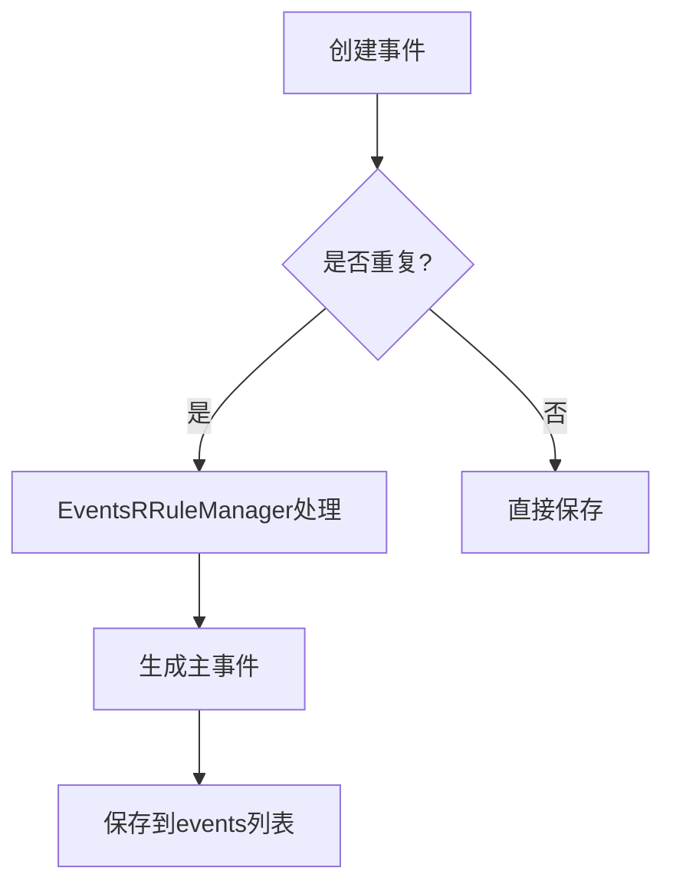
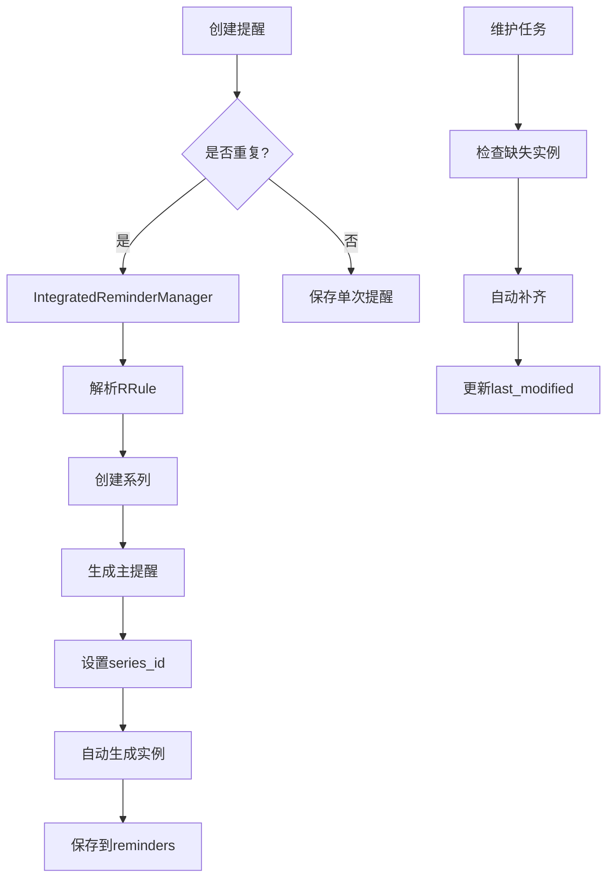

# Events功能实现分析与问题总结

基于对Events模块全面代码分析，与Reminder模块对比，发现以下核心问题和改进点：

## 一、数据模型对比分析

### 1.1 Events数据结构（当前）
```python
"events": {
    "id": str,
    "title": str,
    "start": str,
    "end": str,
    "description": str,
    "importance": str,
    "urgency": str,
    "groupID": str,
    "ddl": str,
    "last_modified": str,
    # RRule相关字段（不完整）
    "rrule": str,
    "rrule_generated": bool,
    "rrule_parent_id": str,
    # 新增字段
    "linked_reminders": list,
    "tags": list,
    "location": str,
    "status": str  # confirmed|tentative|cancelled
}
```

### 1.2 Reminder数据结构（参考标准）
```python
"reminders": {
    "id": str,
    "title": str,
    "description": str,
    "trigger_time": str,
    "status": str,
    "priority": str,
    "category": str,
    "tags": list,
    "created_at": str,
    "last_modified": str,
    # 完整RRule支持
    "rrule": str,
    "series_id": str,
    "is_recurring": bool,
    "is_main_reminder": bool,
    "is_detached": bool,
    "recurrence_id": str,
    "parent_reminder_id": str,
    "original_trigger_time": str,
    "exceptions": list,
    "sequence": int,
    "snooze_until": str,
    "custom_snooze_options": list
}
```

### 🔴 **关键问题1：Events RRule字段缺失**
Events缺少Reminder中完整的RRule支持字段：
- `series_id` - 系列唯一标识
- `is_recurring` - 是否重复事件
- `is_main_event` - 是否主事件
- `is_detached` - 是否已脱离系列
- `recurrence_id` - 重复实例标识
- `parent_event_id` - 父事件引用
- `original_start_time` - 原始开始时间
- `exceptions` - 异常实例列表
- `sequence` - 序列号

## 二、API接口实现对比

### 2.1 Events API实现（当前存在的接口）
- `get_events_impl()` - 获取事件列表，有RRule处理
- `create_event_impl()` - 创建事件（不完整）
- `delete_event_impl()` - 删除事件，支持scope
- `bulk_edit_events_impl()` - 批量编辑
- `split_event_series_impl()` - 分割系列
- `update_events_impl()` - 更新事件

### 2.2 Reminder API实现（完整参考）
- `get_reminders()` - 完整的筛选、排序、分页
- `create_reminder()` - 完整RRule支持
- `update_reminder()` - 单个/系列/未来更新
- `update_reminder_status()` - 状态管理
- `bulk_edit_reminders()` - 批量操作
- `delete_reminder()` - 三种删除scope
- `snooze_reminder()` - 延期功能
- `dismiss_reminder()` - 忽略功能
- `complete_reminder()` - 完成功能
- `auto_generate_missing_instances()` - 自动补齐实例
- `generate_reminder_instances()` - 生成重复实例

### 🔴 **关键问题2：Events API功能不完整**
缺少的核心功能：
1. **状态管理API** - 无confirmed/tentative/cancelled状态切换
2. **RRule实例生成** - 缺少类似`generate_reminder_instances()`的功能
3. **自动维护** - 缺少`auto_generate_missing_instances()`
4. **异常处理** - 无RRule异常实例处理
5. **序列管理** - 无序列号和版本控制

## 三、RRule引擎实现对比

### 3.1 Events RRule实现问题
```python
class EventsRRuleManager(IntegratedReminderManager):
    def __init__(self, user):
        # 🔴 问题：创建模拟request对象，架构不合理
        class MockRequest:
            def __init__(self, user):
                self.user = user
        mock_request = MockRequest(user)
        super().__init__(mock_request)
        
        # 🔴 问题：硬编码storage_key
        self.storage_backend.storage_key = "events_rrule_series"
```

### 🔴 **关键问题3：Events RRule架构缺陷**
1. **继承关系混乱** - Events直接继承Reminder的管理器
2. **存储模式不统一** - 使用不同的storage_key
3. **数据结构不兼容** - Event和Reminder字段映射混乱
4. **业务逻辑重复** - 重复实现RRule解析逻辑

### 3.2 正确的架构设计（基于Reminder模式）
```python
# 应该是独立的Events RRule管理器
class EventsRRuleManager:
    def __init__(self, user):
        self.user = user
        self.rrule_engine = RRuleEngine()
        self.storage_backend = EventsStorageBackend(user)
        
    def create_recurring_event(self, event_data, rrule):
        # 独立的事件RRule处理逻辑
        pass
```

## 四、前端实现对比

### 4.1 Events前端（EventManager.js）
- **基础功能**：FullCalendar集成、CRUD操作
- **RRule支持**：基本的重复选项UI
- **状态管理**：无明确状态管理
- **实例管理**：无重复实例管理

### 4.2 Reminder前端（ReminderManager.js）
- **完整功能**：完整CRUD + 状态管理
- **RRule支持**：完整RRule配置和预览
- **状态管理**：pending/completed/snoozed/dismissed
- **实例管理**：完整的重复实例管理
- **UI组件**：模态框、筛选器、批量操作

### 🔴 **关键问题4：Events前端功能缺失**
1. **RRule配置界面不完整** - 缺少复杂重复模式配置
2. **无重复实例管理** - 无法编辑单个实例
3. **无状态切换UI** - 缺少confirmed/tentative/cancelled切换
4. **无批量操作界面** - 缺少批量编辑功能

## 五、业务流程对比

### 5.1 Events业务流程（现状）


### 5.2 Reminder业务流程（完整参考）


### 🔴 **关键问题5：Events缺少完整业务流程**
1. **无自动维护机制** - 不会自动补齐缺失实例
2. **无异常处理流程** - 编辑重复事件无异常处理
3. **无序列管理** - 无法追踪事件系列版本
4. **无状态流转** - 事件状态变更无规范流程

## 六、性能和数据一致性问题

### 🔴 **关键问题6：数据一致性问题**
1. **双重存储** - events和temp_events数据可能不一致
2. **无事务管理** - 批量操作无回滚机制
3. **无版本控制** - 编辑冲突检测缺失
4. **索引缺失** - 大量事件时查询性能差

### 🔴 **关键问题7：URL路由混乱**
```python
# 现有路由混乱
path('get_calendar/events/', views.get_events),           # 老接口
path('events/create_event/', views.create_event),         # 新接口
path('get_calendar/delete_event/', views.delete_event),   # 老接口
path('api/events/bulk-edit/', views_events.bulk_edit_events_impl),  # 新接口
```

## 七、升级改进方案

### 7.1 短期修复（紧急）
1. **统一数据模型** - 添加缺失的RRule字段
2. **修复API接口** - 补全缺失的CRUD功能
3. **统一URL路由** - 迁移到`/api/events/`前缀
4. **修复前端UI** - 补全重复事件配置界面

### 7.2 中期重构（推荐）
1. **独立Events RRule引擎** - 不再继承Reminder管理器
2. **完整状态管理** - 实现confirmed/tentative/cancelled流程
3. **自动维护机制** - 实现类似Reminder的维护任务
4. **完善前端组件** - 实现完整的事件管理界面

### 7.3 长期优化（架构）
1. **数据库优化** - 添加索引和事务管理
2. **缓存机制** - 实现事件数据缓存
3. **同步机制** - 实现与外部日历的同步
4. **通知集成** - 与Reminder系统集成通知

## 八、具体实施步骤

### 第一阶段：数据模型统一（1-2天）
1. 更新`core/models.py`中Events数据结构
2. 创建数据迁移脚本
3. 更新现有Events数据

### 第二阶段：后端API完善（3-5天）
1. 重构`EventsRRuleManager`为独立实现
2. 补全缺失的API接口
3. 统一URL路由结构
4. 添加完整的测试用例

### 第三阶段：前端功能补全（3-4天）
1. 更新`event-manager.js`
2. 添加重复事件配置界面
3. 实现状态管理UI
4. 添加批量操作功能

### 第四阶段：集成测试（1-2天）
1. 端到端测试
2. 性能测试
3. 数据一致性验证
4. 用户接受度测试

## 总结

Events模块当前实现存在严重的架构问题和功能缺失。通过对比Reminder模块的完整实现，发现Events需要进行大幅重构才能达到生产级别的稳定性和功能完整性。建议按照上述分阶段计划进行升级改造。