# Reminder功能实现文档

## 项目概述

UniSchedulerSuper项目中的Reminder模块是一个完整的提醒管理系统，支持单次提醒和基于RRule标准的重复提醒功能。本文档详细描述了Reminder模块的前后端实现，包括数据模型、API接口、业务逻辑和前端交互。

## 目录

1. [数据模型设计](#1-数据模型设计)
2. [后端API实现](#2-后端api实现)
3. [RRule引擎实现](#3-rrule引擎实现)
4. [前端JavaScript实现](#4-前端javascript实现)
5. [用户界面设计](#5-用户界面设计)
6. [核心功能流程](#6-核心功能流程)

---

## 1. 数据模型设计

### 1.1 Reminder数据结构

基于`core/models.py`中的`DATA_SCHEMA`定义，Reminder的数据模型如下：

```python
"reminders": {
    "type": list,
    "nullable": False,
    "default": [],
    "items": {
        "id": {
            "type": str,
            "nullable": False,
        },
        "title": {
            "type": str,
            "nullable": False,
        },
        "content": {
            "type": str,
            "nullable": True,
            "default": "",
        },
        "trigger_time": {
            "type": str,
            "nullable": False,
        },
        "priority": {
            "type": str,
            "nullable": False,
            "default": "normal",  # critical|high|normal|low|debug
        },
        "advance_triggers": {
            "type": list,
            "nullable": False,
            "default": [],
            "items": {
                "time_before": {
                    "type": str,
                    "nullable": False,
                },
                "priority": {
                    "type": str,
                    "nullable": False,
                },
                "message": {
                    "type": str,
                    "nullable": True,
                    "default": "",
                },
            },
        },
        "rrule": {
            "type": str,
            "nullable": True,
            "default": "",
        },
        "linked_event_id": {
            "type": str,
            "nullable": True,
            "default": "",
        },
        "linked_todo_id": {
            "type": str,
            "nullable": True,
            "default": "",
        },
        "status": {
            "type": str,
            "nullable": False,
            "default": "active",  # active|dismissed|snoozed
        },
        "snooze_until": {
            "type": str,
            "nullable": True,
            "default": "",
        },
        "notification_sent": {
            "type": bool,
            "nullable": False,
            "default": False,
        },
        "created_at": {
            "type": str,
            "nullable": False,
            "default": datetime.datetime.now().strftime("%Y-%m-%d %H:%M:%S"),
        },
        "last_modified": {
            "type": str,
            "nullable": False,
            "default": datetime.datetime.now().strftime("%Y-%m-%d %H:%M:%S"),
        },
    },
}
```

### 1.2 字段说明

#### 基础字段
- **id**: 提醒的唯一标识符（UUID格式）
- **title**: 提醒标题（必填）
- **content**: 提醒内容描述（可选）
- **trigger_time**: 触发时间（ISO格式字符串）
- **priority**: 优先级（critical/high/normal/low/debug）

#### 重复相关字段
- **rrule**: RFC5545标准的重复规则字符串
- **series_id**: 重复提醒系列ID（用于关联同一系列的所有实例）
- **is_recurring**: 是否为重复提醒
- **is_main_reminder**: 是否为主提醒（系列中的第一个）
- **is_detached**: 是否已从系列中分离
- **original_trigger_time**: 原始计划触发时间

#### 状态管理字段
- **status**: 提醒状态（active/dismissed/snoozed_15m/snoozed_1h/snoozed_1d/completed）
- **snooze_until**: 延后到的时间
- **notification_sent**: 是否已发送通知

#### 关联字段
- **linked_event_id**: 关联的事件ID
- **linked_todo_id**: 关联的待办事项ID
- **advance_triggers**: 提前提醒设置列表

#### 元数据字段
- **created_at**: 创建时间
- **last_modified**: 最后修改时间

### 1.3 数据存储机制

Reminder数据通过Django的`UserData`模型进行存储，采用JSON格式序列化：

```python
from core.models import UserData

# 获取或初始化用户提醒数据
user_reminders_data, created, result = UserData.get_or_initialize(request, new_key="reminders")
reminders = user_reminders_data.get_value()

# 保存更新后的数据
user_reminders_data.set_value(reminders)
```

### 1.4 重复提醒的数据组织

重复提醒采用"系列+实例"的组织方式：

1. **主提醒（Main Reminder）**: 系列中的第一个提醒，包含完整的RRule信息
2. **实例提醒（Instance Reminder）**: 根据RRule生成的具体时间实例
3. **分离提醒（Detached Reminder）**: 从系列中独立出来的单个提醒

```python
# 示例：重复提醒系列
{
    "id": "main-reminder-uuid",
    "series_id": "series-uuid", 
    "is_recurring": True,
    "is_main_reminder": True,
    "rrule": "FREQ=DAILY;INTERVAL=1",
    # ... 其他字段
}

# 示例：生成的实例
{
    "id": "instance-uuid",
    "series_id": "series-uuid",
    "is_recurring": True, 
    "is_main_reminder": False,
    "original_trigger_time": "2025-09-16T09:00:00",
    # ... 其他字段
}
```

---

## 2. 后端API实现

### 2.1 API路由配置

在`core/urls.py`中定义了完整的Reminder API接口：

```python
# Reminders API
path('api/reminders/', views.get_reminders, name='get_reminders'),
path('api/reminders/create/', views.create_reminder, name='create_reminder'),
path('api/reminders/update/', views.update_reminder, name='update_reminder'),
path('api/reminders/update-status/', views.update_reminder_status, name='update_reminder_status'),
path('api/reminders/bulk-edit/', views.bulk_edit_reminders, name='bulk_edit_reminders'),
path('api/reminders/convert-to-single/', views.convert_recurring_to_single, name='convert_recurring_to_single'),
path('api/reminders/delete/', views.delete_reminder, name='delete_reminder'),
path('api/reminders/pending/', views.get_pending_reminders, name='get_pending_reminders'),
path('api/reminders/maintain/', views.maintain_reminders, name='maintain_reminders'),
path('api/reminders/mark-sent/', views.mark_notification_sent, name='mark_notification_sent'),
```

### 2.2 核心视图函数

所有Reminder相关的视图函数都在`core/views_reminder.py`中实现，并通过`core/views.py`进行导入和封装。

#### 2.2.1 获取提醒列表 - `get_reminders()`

**功能**: 获取用户的所有提醒，并自动生成缺失的重复提醒实例

**URL**: `GET /api/reminders/`

**实现逻辑**:
```python
@csrf_exempt
def get_reminders(request):
    """获取所有提醒"""
    if request.method == 'GET':
        user_reminders_data, created, result = UserData.get_or_initialize(request, new_key="reminders")
        reminders = user_reminders_data.get_value()
        
        # 自动检查并生成缺失的重复提醒实例
        new_instances_generated = auto_generate_missing_instances(reminders)
        
        if new_instances_generated > 0:
            # 如果生成了新实例，保存更新后的数据
            user_reminders_data.set_value(reminders)
            print(f"DEBUG: Auto-generated {new_instances_generated} new reminder instances")
        
        # 返回提醒数据
        return JsonResponse({'reminders': reminders})
```

**关键特性**:
- 自动检测重复提醒系列是否需要生成新实例
- 对于无截止时间的重复提醒，确保未来30天内有足够的实例
- 返回完整的提醒列表供前端使用

#### 2.2.2 创建提醒 - `create_reminder()`

**功能**: 创建新的单次或重复提醒

**URL**: `POST /api/reminders/create/`

**请求参数**:
```json
{
    "title": "提醒标题",
    "content": "提醒内容",
    "trigger_time": "2025-09-15T09:00:00",
    "priority": "normal",
    "rrule": "FREQ=DAILY;INTERVAL=1"  // 可选，重复规则
}
```

**实现逻辑**:
```python
@csrf_exempt
def create_reminder(request):
    """创建新提醒 - 使用新的 RRule 引擎"""
    if request.method == 'POST':
        # ... 数据验证 ...
        
        if rrule and 'FREQ=' in rrule:
            # 创建重复提醒
            reminder_mgr = get_reminder_manager(request)
            recurring_reminder = reminder_mgr.create_recurring_reminder(reminder_data, rrule)
            reminders.append(recurring_reminder)
            
            # 处理数据生成实例
            updated_reminders = reminder_mgr.process_reminder_data(reminders)
            user_reminders_data.set_value(updated_reminders)
            
            return JsonResponse({
                'status': 'success', 
                'message': f'重复提醒已创建，系列ID: {recurring_reminder["series_id"]}'
            })
        else:
            # 创建单个提醒
            reminder_data.update({
                'id': str(uuid.uuid4()),
                'series_id': None,
                'rrule': '',
                'is_recurring': False,
                'is_main_reminder': False,
                'is_detached': False
            })
            reminders.append(reminder_data)
            user_reminders_data.set_value(reminders)
            
            return JsonResponse({'status': 'success', 'message': '提醒已创建'})
```

**关键特性**:
- 支持单次和重复提醒的创建
- 使用`IntegratedReminderManager`处理重复提醒逻辑
- 自动生成系列ID和实例

#### 2.2.3 更新提醒 - `update_reminder()`

**功能**: 更新现有提醒，支持重复规则的修改

**URL**: `POST /api/reminders/update/`

**请求参数**:
```json
{
    "id": "reminder-uuid",
    "title": "新标题",
    "content": "新内容", 
    "trigger_time": "2025-09-15T10:00:00",
    "priority": "high",
    "rrule": "FREQ=WEEKLY;INTERVAL=1",  // 可选
    "rrule_change_scope": "all"  // 仅当添加重复规则时需要
}
```

**实现逻辑**:
```python
@csrf_exempt
def update_reminder(request):
    """更新提醒 - 只处理前端实际使用的场景"""
    if request.method == 'POST':
        data = json.loads(request.body)
        rrule_change_scope = data.get('rrule_change_scope')
        
        if rrule_change_scope == 'all' and not target_reminder.get('series_id') and data.get('rrule'):
            # 普通提醒转重复提醒（唯一使用重复规则变化的场景）
            manager = IntegratedReminderManager(request)
            
            # 更新提醒基本信息
            if 'title' in data: target_reminder['title'] = data['title']
            # ... 其他字段更新 ...
            
            # 从提醒列表中移除原提醒
            reminders = [r for r in reminders if r['id'] != reminder_id]
            
            # 创建新的重复提醒
            new_recurring_reminder = manager.create_recurring_reminder(target_reminder, data.get('rrule'))
            reminders.append(new_recurring_reminder)
            
            # 处理重复提醒数据
            final_reminders = manager.process_reminder_data(reminders)
            user_reminders_data.set_value(final_reminders)
            
            return JsonResponse({'status': 'success'})
        else:
            # 简单更新，直接修改提醒字段
            if 'title' in data: target_reminder['title'] = data['title']
            # ... 其他字段更新 ...
            
            target_reminder['last_modified'] = datetime.datetime.now().strftime("%Y-%m-%d %H:%M:%S")
            user_reminders_data.set_value(reminders)
            return JsonResponse({'status': 'success'})
```

**关键特性**:
- 支持基本字段的直接更新
- 支持将单次提醒转换为重复提醒
- 复杂的重复提醒编辑使用批量编辑API

#### 2.2.4 更新提醒状态 - `update_reminder_status()`

**功能**: 更新提醒的状态（完成/忽略/延后/激活）

**URL**: `POST /api/reminders/update-status/`

**请求参数**:
```json
{
    "id": "reminder-uuid",
    "status": "completed",  // active|completed|dismissed|snoozed_15m|snoozed_1h|snoozed_1d
    "snooze_until": "2025-09-15T15:00:00"  // 延后时可选
}
```

**支持的状态**:
- `active`: 激活状态
- `completed`: 已完成
- `dismissed`: 已忽略
- `snoozed_15m`: 延后15分钟
- `snoozed_1h`: 延后1小时  
- `snoozed_1d`: 延后1天

#### 2.2.5 删除提醒 - `delete_reminder()`

**功能**: 删除单个提醒或整个重复系列

**URL**: `POST /api/reminders/delete/`

**请求参数**:
```json
{
    "id": "reminder-uuid",
    "delete_scope": "single"  // single|future|all
}
```

**删除范围**:
- `single`: 仅删除当前实例
- `future`: 删除当前及未来所有实例
- `all`: 删除整个重复系列

#### 2.2.6 批量编辑 - `bulk_edit_reminders()`

**功能**: 批量编辑重复提醒系列

**URL**: `POST /api/reminders/bulk-edit/`

**请求参数**:
```json
{
    "series_id": "series-uuid",
    "changes": {
        "title": "新标题",
        "rrule": "FREQ=WEEKLY;INTERVAL=2"
    },
    "edit_scope": "future",  // current|future|all
    "target_date": "2025-09-15T09:00:00"
}
```

#### 2.2.7 辅助功能函数

**auto_generate_missing_instances()**: 自动生成缺失的重复提醒实例
```python
def auto_generate_missing_instances(reminders):
    """自动生成缺失的重复提醒实例"""
    new_instances_count = 0
    now = datetime.datetime.now()
    
    # 获取所有重复系列
    recurring_series = {}
    for reminder in reminders:
        series_id = reminder.get('series_id')
        rrule = reminder.get('rrule')
        
        if series_id and rrule and 'FREQ=' in rrule and not reminder.get('is_detached', False):
            # 只处理没有截止时间的重复提醒
            if 'UNTIL=' not in rrule:
                if series_id not in recurring_series:
                    recurring_series[series_id] = {
                        'reminders': [],
                        'rrule': rrule,
                        'base_reminder': reminder
                    }
                recurring_series[series_id]['reminders'].append(reminder)
    
    # 检查每个系列是否需要生成新实例
    for series_id, series_data in recurring_series.items():
        # 如果最晚的提醒时间距离现在少于30天，生成新实例
        # ...实现逻辑...
    
    return new_instances_count
```

**generate_reminder_instances()**: 根据RRule生成提醒实例
```python
def generate_reminder_instances(base_reminder, days_ahead=90, min_instances=10):
    """生成重复提醒的实例"""
    instances = []
    if not base_reminder.get('rrule') or 'FREQ=' not in base_reminder.get('rrule', ''):
        return instances
    
    # 解析RRule并生成实例
    # 支持 DAILY, WEEKLY, MONTHLY 重复
    # 处理 INTERVAL, BYDAY, BYMONTHDAY, UNTIL 等参数
    # ...详细实现逻辑...
    
    return instances
```

### 2.3 提醒管理器工厂函数

```python
def get_reminder_manager(request):
    """获取用户专属的提醒管理器实例"""
    if request:
        return IntegratedReminderManager(request=request)
    else:
        return IntegratedReminderManager()
```

这个工厂函数确保每个用户获得独立的提醒管理器实例，支持用户数据的隔离和个性化处理。

---

## 3. RRule引擎实现

### 3.1 引擎架构概述

RRule引擎由两个核心文件组成：
- `rrule_engine.py`: 通用重复规则引擎，处理RRule解析和实例生成
- `integrated_reminder_manager.py`: 集成提醒管理器，专门处理提醒相关的RRule逻辑

### 3.2 RRule引擎核心类 (`rrule_engine.py`)

#### 3.2.1 RRuleSegment类

**作用**: 表示某个时间段内的重复规则

```python
class RRuleSegment:
    """RRule规则段 - 表示某个时间段内的重复规则"""
    
    def __init__(self, uid: str, sequence: int, rrule_str: str, 
                 dtstart: datetime, until: Optional[datetime] = None,
                 exdates: Optional[List[datetime]] = None, 
                 created_at: Optional[datetime] = None):
        self.uid = uid              # 唯一标识符
        self.sequence = sequence    # 规则段序号
        self.rrule_str = rrule_str  # RRule字符串
        self.dtstart = dtstart      # 开始时间
        self.until = until          # 结束时间（可选）
        self.exdates = exdates or []  # 例外日期列表
        self.created_at = created_at or datetime.now()
        
    def to_dict(self) -> Dict[str, Any]:
        """转换为字典格式，用于数据库存储"""
        return {
            'uid': self.uid,
            'sequence': self.sequence,
            'rrule_str': self.rrule_str,
            'dtstart': self.dtstart.isoformat(),
            'until': self.until.isoformat() if self.until else None,
            'exdates': [d.isoformat() for d in self.exdates],
            'created_at': self.created_at.isoformat()
        }
    
    @classmethod
    def from_dict(cls, data: Dict[str, Any]) -> 'RRuleSegment':
        """从字典格式创建实例"""
        return cls(
            uid=data['uid'],
            sequence=data['sequence'],
            rrule_str=data['rrule_str'],
            dtstart=datetime.fromisoformat(data['dtstart']),
            until=datetime.fromisoformat(data['until']) if data['until'] else None,
            exdates=[datetime.fromisoformat(d) for d in data['exdates']],
            created_at=datetime.fromisoformat(data['created_at'])
        )
```

#### 3.2.2 RRuleSeries类

**作用**: 管理一个完整的重复任务生命周期

```python
class RRuleSeries:
    """RRule系列 - 管理一个完整的重复任务生命周期"""
    
    def __init__(self, uid: Optional[str] = None):
        self.uid = uid or str(uuid.uuid4())
        self.segments: List[RRuleSegment] = []
        
    def add_segment(self, rrule_str: str, dtstart: datetime, 
                   until: Optional[datetime] = None) -> RRuleSegment:
        """添加新的规则段"""
        sequence = max([s.sequence for s in self.segments], default=0) + 1
        segment = RRuleSegment(
            uid=self.uid,
            sequence=sequence,
            rrule_str=rrule_str,
            dtstart=dtstart,
            until=until
        )
        self.segments.append(segment)
        return segment
    
    def add_exception(self, exception_date: datetime, segment_sequence: Optional[int] = None):
        """为指定规则段添加例外日期"""
        if segment_sequence is None:
            # 找到包含该日期的规则段
            target_segment = None
            for segment in sorted(self.segments, key=lambda s: s.sequence):
                if segment.dtstart <= exception_date:
                    if segment.until is None or exception_date <= segment.until:
                        target_segment = segment
                        break
            
            if target_segment:
                target_segment.exdates.append(exception_date)
        else:
            # 为指定序号的规则段添加例外
            for segment in self.segments:
                if segment.sequence == segment_sequence:
                    segment.exdates.append(exception_date)
```

### 3.3 集成提醒管理器 (`integrated_reminder_manager.py`)

#### 3.3.1 存储后端

**UserDataStorageBackend类**: 基于UserData的持久化存储

```python
class UserDataStorageBackend:
    """基于UserData的持久化存储后端"""
    
    def __init__(self, request):
        self.request = request
        self.storage_key = "rrule_series_storage"  # 统一的存储键
    
    def save_segments(self, uid: str, segments_data: List[Dict[str, Any]]):
        """保存规则段数据到UserData"""
        from core.models import UserData
        
        user_data, created, result_info = UserData.get_or_initialize(self.request, self.storage_key)
        current_data = user_data.get_value()
        
        # 确保有segments字段
        if "segments" not in current_data:
            current_data["segments"] = []
        
        segments = current_data["segments"]
        
        # 移除同一uid的旧数据
        segments = [s for s in segments if s.get("uid") != uid]
        
        # 添加新的段数据
        for segment in segments_data:
            segments.append(segment)
        
        current_data["segments"] = segments
        user_data.set_value(current_data)
        
    def load_segments(self, uid: str) -> Optional[List[Dict[str, Any]]]:
        """从UserData加载规则段数据"""
        from core.models import UserData
        
        user_data, created, result_info = UserData.get_or_initialize(self.request, self.storage_key)
        current_data = user_data.get_value()
        segments = current_data.get("segments", [])
        
        # 过滤出指定uid的段数据
        uid_segments = [s for s in segments if s.get("uid") == uid]
        return uid_segments if uid_segments else None
        
    def delete_segments(self, uid: str):
        """删除指定uid的规则段数据"""
        from core.models import UserData
        
        user_data, created, result_info = UserData.get_or_initialize(self.request, self.storage_key)
        current_data = user_data.get_value()
        segments = current_data.get("segments", [])
        
        # 过滤掉指定uid的段数据
        current_data["segments"] = [s for s in segments if s.get("uid") != uid]
        user_data.set_value(current_data)
```

#### 3.3.2 异常处理机制

**save_exception()**: 保存重复系列的异常
```python
def save_exception(self, series_id: str, exception_date: str, exception_type: str, new_data: Optional[Dict] = None):
    """保存异常数据到UserData"""
    # 创建异常记录
    exception_record = {
        "series_id": series_id,
        "exception_date": exception_date,
        "type": exception_type,  # "delete", "modify", "move"
        "new_data": new_data or {}
    }
    
    # 检查并更新现有异常或添加新异常
    # ...实现逻辑...
```

**load_exceptions()**: 加载指定系列的所有异常
```python
def load_exceptions(self, series_id: str) -> List[Dict[str, Any]]:
    """加载指定系列的所有异常"""
    # 从UserData中获取异常数据
    # 过滤出指定系列的异常
    # 返回异常列表
```

### 3.4 IntegratedReminderManager类

#### 3.4.1 核心功能

**create_recurring_reminder()**: 创建重复提醒
```python
def create_recurring_reminder(self, reminder_data: Dict, rrule: str) -> Dict:
    """创建重复提醒"""
    series_id = str(uuid.uuid4())
    
    # 创建主提醒
    main_reminder = reminder_data.copy()
    main_reminder.update({
        'id': str(uuid.uuid4()),
        'series_id': series_id,
        'rrule': rrule,
        'is_recurring': True,
        'is_main_reminder': True,
        'is_detached': False,
        'original_trigger_time': reminder_data['trigger_time']
    })
    
    return main_reminder
```

**process_reminder_data()**: 处理提醒数据并生成实例
```python
def process_reminder_data(self, reminders: List[Dict]) -> List[Dict]:
    """处理提醒数据，生成重复提醒实例"""
    processed_reminders = []
    
    for reminder in reminders:
        if reminder.get('is_recurring') and reminder.get('is_main_reminder'):
            # 处理主重复提醒
            instances = self.generate_instances_for_reminder(reminder)
            processed_reminders.extend(instances)
        else:
            # 普通提醒直接添加
            processed_reminders.append(reminder)
    
    return processed_reminders
```

#### 3.4.2 RRule解析和实例生成

**支持的RRule模式**:

1. **每日重复**: `FREQ=DAILY;INTERVAL=n`
2. **每周重复**: `FREQ=WEEKLY;INTERVAL=n;BYDAY=MO,TU,WE,TH,FR,SA,SU`
3. **每月重复**: 
   - 按日期: `FREQ=MONTHLY;INTERVAL=n;BYMONTHDAY=15`
   - 按星期: `FREQ=MONTHLY;INTERVAL=n;BYDAY=2MO` (第二个周一)
4. **每年重复**: `FREQ=YEARLY;INTERVAL=n`

**UNTIL参数处理**:
```python
# 解析UNTIL限制
until_time = None
if 'UNTIL=' in rrule:
    until_match = re.search(r'UNTIL=([^;]+)', rrule)
    if until_match:
        until_str = until_match.group(1)
        # 支持多种UNTIL格式
        if until_str.endswith('Z'):
            # UTC格式：20250830T000000Z
            until_time = datetime.fromisoformat(until_str.replace('Z', ''))
        elif 'T' in until_str and len(until_str) == 15:
            # 本地时间格式：20250830T000000
            until_formatted = (until_str[:4] + '-' + until_str[4:6] + '-' + until_str[6:8] + 
                             'T' + until_str[9:11] + ':' + until_str[11:13] + ':' + until_str[13:15])
            until_time = datetime.fromisoformat(until_formatted)
```

### 3.5 实例生成算法

#### 3.5.1 每日重复算法
```python
if 'FREQ=DAILY' in rrule:
    interval = 1
    if 'INTERVAL=' in rrule:
        interval_match = re.search(r'INTERVAL=(\d+)', rrule)
        if interval_match:
            interval = int(interval_match.group(1))
    
    current_time = start_time + timedelta(days=interval)
    while current_time <= end_time and len(instances) < max_instances:
        instance = base_reminder.copy()
        instance['id'] = str(uuid.uuid4())
        instance['trigger_time'] = current_time.strftime("%Y-%m-%dT%H:%M:%S")
        instance['original_trigger_time'] = current_time.strftime("%Y-%m-%dT%H:%M:%S")
        instances.append(instance)
        current_time += timedelta(days=interval)
```

#### 3.5.2 每周重复算法
```python
if 'FREQ=WEEKLY' in rrule:
    # 处理BYDAY规则
    weekdays = []
    if 'BYDAY=' in rrule:
        byday_match = re.search(r'BYDAY=([A-Z,]+)', rrule)
        if byday_match:
            weekday_str = byday_match.group(1)
            weekday_mapping = {
                'MO': 0, 'TU': 1, 'WE': 2, 'TH': 3, 
                'FR': 4, 'SA': 5, 'SU': 6
            }
            weekdays = [weekday_mapping[day] for day in weekday_str.split(',') if day in weekday_mapping]
    
    if weekdays:
        # 按指定星期几重复
        current_date = start_time.date()
        while count < max_instances:
            current_date += timedelta(days=1)
            if current_date.weekday() in weekdays:
                # 检查间隔要求
                week_diff = (current_date - start_time.date()).days // 7
                if week_diff % interval == 0:
                    # 生成实例
                    # ...
```

#### 3.5.3 每月重复算法
```python
if 'FREQ=MONTHLY' in rrule:
    if 'BYMONTHDAY=' in rrule:
        # 按月的日期重复（如每月15日）
        monthday_match = re.search(r'BYMONTHDAY=(-?\d+)', rrule)
        if monthday_match:
            monthday = int(monthday_match.group(1))
            # 处理月末情况（monthday == -1）
            if monthday == -1:
                from calendar import monthrange
                last_day = monthrange(next_year, next_month)[1]
                next_date = datetime(next_year, next_month, last_day, start_time.hour, start_time.minute)
            else:
                next_date = datetime(next_year, next_month, monthday, start_time.hour, start_time.minute)
                
    elif 'BYDAY=' in rrule:
        # 按月的星期重复（如每月第2个星期一）
        byday_match = re.search(r'BYDAY=(-?\d+)([A-Z]{2})', rrule)
        if byday_match:
            week_num = int(byday_match.group(1))  # 第几周（可以是负数表示倒数）
            weekday_str = byday_match.group(2)    # 星期几
            # ...计算具体日期...
```

---

## 4. 前端JavaScript实现

### 4.1 模块化架构

前端采用模块化设计，主要包含以下JavaScript文件：
- `core/static/js/reminder-manager.js`: 提醒管理核心模块
- `core/static/js/rrule-manager.js`: RRule处理模块
- `core/static/js/modal-manager.js`: 模态框管理模块

### 4.2 ReminderManager类 (`reminder-manager.js`)

#### 4.2.1 类结构和初始化

```javascript
class ReminderManager {
    constructor() {
        this.reminders = [];
        this.reminderContainer = null;
        this.pendingBulkEdit = null;
    }

    // 获取CSRF Token
    getCSRFToken() {
        return window.CSRF_TOKEN || '';
    }

    // 初始化提醒管理器
    init() {
        this.reminderContainer = document.getElementById('reminderList');
        
        this.loadReminders();
        this.startReminderCheck();
        this.initFilterListeners();
    }
}
```

#### 4.2.2 数据加载和渲染

**loadReminders()**: 从服务器加载提醒数据
```javascript
async loadReminders() {
    try {
        const response = await fetch('/api/reminders/');
        const data = await response.json();
        this.reminders = data.reminders || [];
        
        console.log('提醒数据加载完成，等待设置管理器应用筛选');
        // 等待设置管理器统一控制筛选
    } catch (error) {
        console.error('Error loading reminders:', error);
        this.reminders = [];
        this.renderReminders();
    }
}
```

**renderReminders()**: 渲染提醒列表
```javascript
renderReminders(filters = {}) {
    if (!this.reminderContainer) return;
    
    // 应用筛选条件
    let filteredReminders = this.reminders.filter(reminder => {
        // 时间范围筛选
        if (filters.timeRange && filters.timeRange !== 'all') {
            const triggerTime = new Date(reminder.trigger_time);
            const now = new Date();
            let rangeStart = new Date(now);
            let rangeEnd = new Date(now);
            
            switch (filters.timeRange) {
                case 'today':
                    rangeStart.setHours(0, 0, 0, 0);
                    rangeEnd.setHours(23, 59, 59, 999);
                    break;
                case 'week':
                    rangeStart.setDate(now.getDate() - now.getDay());
                    rangeStart.setHours(0, 0, 0, 0);
                    rangeEnd.setDate(rangeStart.getDate() + 6);
                    rangeEnd.setHours(23, 59, 59, 999);
                    break;
                case 'month':
                    rangeStart.setDate(1);
                    rangeStart.setHours(0, 0, 0, 0);
                    rangeEnd.setMonth(rangeEnd.getMonth() + 1, 0);
                    rangeEnd.setHours(23, 59, 59, 999);
                    break;
                // ... 其他时间范围
            }
            
            if (triggerTime < rangeStart || triggerTime > rangeEnd) {
                return false;
            }
        }
        
        // 状态筛选
        if (filters.status && filters.status !== 'all') {
            if (filters.status === 'snoozed') {
                if (!reminder.status.startsWith('snoozed_')) return false;
            } else {
                if (reminder.status !== filters.status) return false;
            }
        }
        
        // 优先级筛选
        if (filters.priority && filters.priority !== 'all') {
            if (reminder.priority !== filters.priority) return false;
        }
        
        // 类型筛选
        if (filters.type && filters.type !== 'all') {
            const hasRRule = reminder.rrule && reminder.rrule.includes('FREQ=');
            if (filters.type === 'recurring' && !hasRRule) return false;
            if (filters.type === 'single' && hasRRule) return false;
            if (filters.type === 'detached' && !reminder.is_detached) return false;
        }
        
        return true;
    });
    
    // 按触发时间排序
    filteredReminders.sort((a, b) => new Date(a.trigger_time) - new Date(b.trigger_time));

    this.reminderContainer.innerHTML = '';

    if (filteredReminders.length === 0) {
        this.reminderContainer.innerHTML = '<div class="empty-state">暂无符合条件的提醒</div>';
        return;
    }

    filteredReminders.forEach(reminder => {
        const reminderElement = this.createReminderElement(reminder);
        this.reminderContainer.appendChild(reminderElement);
    });
}
```

**createReminderElement()**: 创建单个提醒元素
```javascript
createReminderElement(reminder) {
    const div = document.createElement('div');
    div.className = `reminder-item ${reminder.priority}`;
    div.dataset.reminderId = reminder.id;
    
    const priorityIcon = this.getPriorityIcon(reminder.priority);
    const displayTime = this.getEffectiveReminderTime(reminder);
    const timeStr = this.formatTriggerTime(displayTime);
    const isOverdue = new Date(displayTime) < new Date();
    
    div.innerHTML = `
        <div class="reminder-content">
            <div class="reminder-header">
                <span class="reminder-priority">${priorityIcon}</span>
                <span class="reminder-title ${isOverdue ? 'overdue' : ''}">${this.escapeHtml(reminder.title)}</span>
                <div class="reminder-actions">
                    ${this.renderStatusButtons(reminder)}
                    <button class="btn-small" onclick="reminderManager.editReminder('${reminder.id}', '${reminder.series_id}')">编辑</button>
                    ${this.renderSnoozeButton(reminder)}
                    <button class="btn-small btn-danger" onclick="reminderManager.deleteReminder('${reminder.id}', '${reminder.series_id}')">删除</button>
                </div>
            </div>
            ${reminder.content ? `<div class="reminder-content-text">${this.escapeHtml(reminder.content)}</div>` : ''}
            <div class="reminder-meta">
                <span class="reminder-time ${isOverdue ? 'overdue' : ''}">${timeStr}</span>
                ${reminder.rrule ? '<span class="reminder-repeat">🔄 重复</span>' : ''}
            </div>
        </div>
    `;
    
    return div;
}
```

#### 4.2.3 核心操作函数

**createReminder()**: 创建新提醒
```javascript
async createReminder(reminderData) {
    try {
        const response = await fetch('/api/reminders/create/', {
            method: 'POST',
            headers: {
                'Content-Type': 'application/json',
                'X-CSRFToken': this.getCSRFToken()
            },
            body: JSON.stringify(reminderData)
        });
        
        const data = await response.json();
        if (data.status === 'success') {
            console.log('提醒创建成功');
            await this.loadReminders();
            this.applyFilters();
            return true;
        } else {
            console.error('提醒创建失败:', data.message);
            return false;
        }
    } catch (error) {
        console.error('创建提醒时发生错误:', error);
        return false;
    }
}
```

**updateReminder()**: 更新提醒
```javascript
async updateReminder(reminderId, updateData) {
    try {
        const response = await fetch('/api/reminders/update/', {
            method: 'POST',
            headers: {
                'Content-Type': 'application/json',
                'X-CSRFToken': this.getCSRFToken()
            },
            body: JSON.stringify({
                id: reminderId,
                ...updateData
            })
        });
        
        const data = await response.json();
        if (data.status === 'success') {
            console.log('提醒更新成功');
            await this.loadReminders();
            this.applyFilters();
            return true;
        } else {
            console.error('提醒更新失败:', data.message);
            return false;
        }
    } catch (error) {
        console.error('更新提醒时发生错误:', error);
        return false;
    }
}
```

**deleteReminder()**: 删除提醒
```javascript
async deleteReminder(reminderId, seriesId = null) {
    if (!reminderId) {
        console.error('删除提醒失败：缺少提醒ID');
        return false;
    }

    try {
        let deleteScope = 'single';
        
        // 如果是重复提醒，询问删除范围
        if (seriesId) {
            const choice = await this.showDeleteConfirmDialog();
            if (!choice) return false; // 用户取消
            deleteScope = choice;
        } else {
            // 单个提醒，直接确认删除
            if (!confirm('确定要删除这个提醒吗？')) {
                return false;
            }
        }

        const response = await fetch('/api/reminders/delete/', {
            method: 'POST',
            headers: {
                'Content-Type': 'application/json',
                'X-CSRFToken': this.getCSRFToken()
            },
            body: JSON.stringify({
                id: reminderId,
                delete_scope: deleteScope
            })
        });

        const data = await response.json();
        if (data.status === 'success') {
            console.log(`提醒删除成功 (${deleteScope})`);
            await this.loadReminders();
            this.applyFilters();
            return true;
        } else {
            console.error('提醒删除失败:', data.message);
            return false;
        }
    } catch (error) {
        console.error('删除提醒时发生错误:', error);
        return false;
    }
}
```

#### 4.2.4 状态管理

**updateReminderStatus()**: 更新提醒状态
```javascript
async updateReminderStatus(reminderId, newStatus, snoozeUntil = '') {
    try {
        const response = await fetch('/api/reminders/update-status/', {
            method: 'POST',
            headers: {
                'Content-Type': 'application/json',
                'X-CSRFToken': this.getCSRFToken()
            },
            body: JSON.stringify({
                id: reminderId,
                status: newStatus,
                snooze_until: snoozeUntil
            })
        });
        
        const data = await response.json();
        if (data.status === 'success') {
            console.log(`提醒状态更新成功: ${newStatus}`);
            await this.loadReminders();
            this.applyFilters();
            return true;
        } else {
            console.error('提醒状态更新失败:', data.message);
            return false;
        }
    } catch (error) {
        console.error('更新提醒状态时发生错误:', error);
        return false;
    }
}
```

**snoozeReminder()**: 延后提醒
```javascript
async snoozeReminder(reminderId, duration) {
    const now = new Date();
    let snoozeUntil;
    let status;
    
    switch (duration) {
        case '15m':
            snoozeUntil = new Date(now.getTime() + 15 * 60 * 1000);
            status = 'snoozed_15m';
            break;
        case '1h':
            snoozeUntil = new Date(now.getTime() + 60 * 60 * 1000);
            status = 'snoozed_1h';
            break;
        case '1d':
            snoozeUntil = new Date(now.getTime() + 24 * 60 * 60 * 1000);
            status = 'snoozed_1d';
            break;
        default:
            console.error('无效的延后时长:', duration);
            return false;
    }
    
    return await this.updateReminderStatus(reminderId, status, snoozeUntil.toISOString());
}
```

#### 4.2.5 筛选器管理

**initFilterListeners()**: 初始化筛选器事件监听
```javascript
initFilterListeners() {
    const timeRangeSelect = document.getElementById('reminderTimeRange');
    const statusSelect = document.getElementById('reminderStatusFilter');
    const prioritySelect = document.getElementById('reminderPriorityFilter');
    const typeSelect = document.getElementById('reminderTypeFilter');

    if (timeRangeSelect) {
        timeRangeSelect.addEventListener('change', () => {
            console.log('提醒时间范围筛选变化:', timeRangeSelect.value);
            this.applyFilters();
        });
    }

    // 其他筛选器的事件监听...
    
    console.log('✅ 提醒筛选器初始化成功');
}
```

**applyFilters()**: 应用筛选条件
```javascript
applyFilters() {
    const filters = {
        timeRange: document.getElementById('reminderTimeRange')?.value || 'all',
        status: document.getElementById('reminderStatusFilter')?.value || 'all',
        priority: document.getElementById('reminderPriorityFilter')?.value || 'all',
        type: document.getElementById('reminderTypeFilter')?.value || 'all'
    };
    
    console.log('应用提醒筛选条件:', filters);
    this.renderReminders(filters);
}
```

### 4.3 RRuleManager类 (`rrule-manager.js`)

#### 4.3.1 RRule构建和解析

**buildRRule()**: 根据用户输入构建RRule字符串
```javascript
buildRRule(freq, interval, options = {}) {
    let rrule = `FREQ=${freq}`;
    
    if (interval > 1) {
        rrule += `;INTERVAL=${interval}`;
    }
    
    // 处理BYDAY（用于周重复）
    if (options.weekdays && options.weekdays.length > 0) {
        rrule += `;BYDAY=${options.weekdays.join(',')}`;
    }
    
    // 处理BYMONTHDAY（用于月重复）
    if (options.monthday) {
        rrule += `;BYMONTHDAY=${options.monthday}`;
    }
    
    // 处理BYDAY with position（用于月重复的第N个星期X）
    if (options.weekPosition && options.weekday) {
        rrule += `;BYDAY=${options.weekPosition}${options.weekday}`;
    }
    
    // 处理UNTIL（结束时间）
    if (options.until) {
        const untilDate = new Date(options.until);
        const untilStr = untilDate.toISOString().replace(/[-:]/g, '').split('.')[0] + 'Z';
        rrule += `;UNTIL=${untilStr}`;
    }
    
    return rrule;
}
```

**parseRRule()**: 解析RRule字符串
```javascript
parseRRule(rrule) {
    const parsed = {
        freq: null,
        interval: 1,
        weekdays: [],
        monthday: null,
        weekPosition: null,
        weekday: null,
        until: null
    };
    
    if (!rrule) return parsed;
    
    // 解析FREQ
    const freqMatch = rrule.match(/FREQ=([A-Z]+)/);
    if (freqMatch) parsed.freq = freqMatch[1];
    
    // 解析INTERVAL
    const intervalMatch = rrule.match(/INTERVAL=(\d+)/);
    if (intervalMatch) parsed.interval = parseInt(intervalMatch[1]);
    
    // 解析BYDAY
    const bydayMatch = rrule.match(/BYDAY=([^;]+)/);
    if (bydayMatch) {
        const bydayStr = bydayMatch[1];
        if (/^[A-Z,]+$/.test(bydayStr)) {
            // 简单的星期列表
            parsed.weekdays = bydayStr.split(',');
        } else if (/^-?\d+[A-Z]{2}$/.test(bydayStr)) {
            // 第N个星期X格式
            const match = bydayStr.match(/^(-?\d+)([A-Z]{2})$/);
            if (match) {
                parsed.weekPosition = match[1];
                parsed.weekday = match[2];
            }
        }
    }
    
    // 解析BYMONTHDAY
    const monthdayMatch = rrule.match(/BYMONTHDAY=(-?\d+)/);
    if (monthdayMatch) parsed.monthday = parseInt(monthdayMatch[1]);
    
    // 解析UNTIL
    const untilMatch = rrule.match(/UNTIL=([^;]+)/);
    if (untilMatch) {
        const untilStr = untilMatch[1];
        // 处理多种UNTIL格式
        if (untilStr.endsWith('Z')) {
            parsed.until = new Date(untilStr);
        } else {
            // 处理本地时间格式
            const formatted = untilStr.replace(/(\d{4})(\d{2})(\d{2})T(\d{2})(\d{2})(\d{2})/, '$1-$2-$3T$4:$5:$6');
            parsed.until = new Date(formatted);
        }
    }
    
    return parsed;
}
```

#### 4.3.2 重复预览功能

**generatePreview()**: 生成重复规则预览
```javascript
generatePreview(rrule) {
    if (!rrule || !rrule.includes('FREQ=')) {
        return '不重复';
    }
    
    const parsed = this.parseRRule(rrule);
    let preview = '';
    
    switch (parsed.freq) {
        case 'DAILY':
            if (parsed.interval === 1) {
                preview = '每天';
            } else {
                preview = `每${parsed.interval}天`;
            }
            break;
            
        case 'WEEKLY':
            if (parsed.weekdays.length > 0) {
                const dayNames = {
                    'MO': '一', 'TU': '二', 'WE': '三', 'TH': '四',
                    'FR': '五', 'SA': '六', 'SU': '日'
                };
                const days = parsed.weekdays.map(day => dayNames[day]).join('、');
                
                if (parsed.interval === 1) {
                    preview = `每周${days}`;
                } else {
                    preview = `每${parsed.interval}周的${days}`;
                }
            } else {
                if (parsed.interval === 1) {
                    preview = '每周';
                } else {
                    preview = `每${parsed.interval}周`;
                }
            }
            break;
            
        case 'MONTHLY':
            if (parsed.monthday) {
                const dayStr = parsed.monthday === -1 ? '月末' : `${parsed.monthday}日`;
                if (parsed.interval === 1) {
                    preview = `每月${dayStr}`;
                } else {
                    preview = `每${parsed.interval}个月的${dayStr}`;
                }
            } else if (parsed.weekPosition && parsed.weekday) {
                const positionNames = {
                    '1': '第一个', '2': '第二个', '3': '第三个', 
                    '4': '第四个', '-1': '最后一个'
                };
                const dayNames = {
                    'MO': '周一', 'TU': '周二', 'WE': '周三', 'TH': '周四',
                    'FR': '周五', 'SA': '周六', 'SU': '周日'
                };
                
                const position = positionNames[parsed.weekPosition];
                const day = dayNames[parsed.weekday];
                
                if (parsed.interval === 1) {
                    preview = `每月${position}${day}`;
                } else {
                    preview = `每${parsed.interval}个月的${position}${day}`;
                }
            } else {
                if (parsed.interval === 1) {
                    preview = '每月';
                } else {
                    preview = `每${parsed.interval}个月`;
                }
            }
            break;
            
        case 'YEARLY':
            if (parsed.interval === 1) {
                preview = '每年';
            } else {
                preview = `每${parsed.interval}年`;
            }
            break;
            
        default:
            preview = '自定义重复';
    }
    
    // 添加结束时间信息
    if (parsed.until) {
        const untilStr = parsed.until.toLocaleDateString();
        preview += `（至${untilStr}）`;
    }
    
    return preview;
}
```

### 4.4 模态框管理 (ModalManager)

#### 4.4.1 创建提醒模态框

**openCreateReminderModal()**: 打开创建提醒对话框
```javascript
openCreateReminderModal() {
    const modal = document.getElementById('createReminderModal');
    if (modal) {
        // 重置表单
        document.getElementById('createReminderForm').reset();
        
        // 设置默认时间为当前时间+1小时
        const now = new Date();
        now.setHours(now.getHours() + 1);
        now.setMinutes(0);
        document.getElementById('newReminderTriggerTime').value = now.toISOString().slice(0, 16);
        
        // 隐藏重复选项
        document.getElementById('newRepeatOptions').style.display = 'none';
        document.getElementById('newReminderRepeat').checked = false;
        
        // 更新预览
        updateRepeatPreview('new');
        
        modal.style.display = 'flex';
    }
}
```

**handleCreateReminder()**: 处理提醒创建
```javascript
async handleCreateReminder() {
    const form = document.getElementById('createReminderForm');
    if (!form.checkValidity()) {
        form.reportValidity();
        return;
    }

    const reminderData = {
        title: document.getElementById('newReminderTitle').value,
        content: document.getElementById('newReminderContent').value || '',
        trigger_time: document.getElementById('newReminderTriggerTime').value,
        priority: document.getElementById('newReminderPriority').value
    };

    // 处理重复规则
    const isRepeat = document.getElementById('newReminderRepeat').checked;
    if (isRepeat) {
        const rrule = window.rruleManager.buildRRuleFromForm('new');
        if (rrule) {
            reminderData.rrule = rrule;
        }
    }

    const success = await window.reminderManager.createReminder(reminderData);
    if (success) {
        this.closeAllModals();
        this.showNotification('提醒创建成功', 'success');
    } else {
        this.showNotification('提醒创建失败', 'error');
    }
}
```

#### 4.4.2 编辑提醒模态框

**openEditReminderModal()**: 打开编辑提醒对话框
```javascript
openEditReminderModal(reminderId, seriesId = null) {
    const reminder = window.reminderManager.reminders.find(r => r.id === reminderId);
    if (!reminder) {
        console.error('未找到要编辑的提醒');
        return;
    }

    const modal = document.getElementById('editReminderModal');
    if (modal) {
        // 填充表单数据
        document.getElementById('reminderId').value = reminder.id;
        document.getElementById('editReminderTitle').value = reminder.title;
        document.getElementById('editReminderContent').value = reminder.content || '';
        document.getElementById('editReminderTriggerTime').value = reminder.trigger_time.slice(0, 16);
        document.getElementById('editReminderPriority').value = reminder.priority;

        // 处理重复规则
        const hasRRule = reminder.rrule && reminder.rrule.includes('FREQ=');
        document.getElementById('editReminderRepeat').checked = hasRRule;
        
        if (hasRRule) {
            // 解析并填充重复选项
            const parsed = window.rruleManager.parseRRule(reminder.rrule);
            this.fillRepeatFormFromParsed('edit', parsed);
            document.getElementById('editRepeatOptions').style.display = 'block';
        } else {
            document.getElementById('editRepeatOptions').style.display = 'none';
        }

        // 更新预览
        updateRepeatPreview('edit');

        modal.style.display = 'flex';
    }
}
```

### 4.5 重复提醒UI组件

#### 4.5.1 重复选项切换

**toggleRepeatOptions()**: 切换重复选项显示
```javascript
function toggleRepeatOptions(mode) {
    const repeatCheckbox = document.getElementById(`${mode}ReminderRepeat`);
    const repeatOptions = document.getElementById(`${mode}RepeatOptions`);
    
    if (repeatCheckbox.checked) {
        repeatOptions.style.display = 'block';
        updateRepeatOptions(mode);
        updateRepeatPreview(mode);
    } else {
        repeatOptions.style.display = 'none';
        updateRepeatPreview(mode);
    }
}
```

**updateRepeatOptions()**: 根据频率更新重复选项
```javascript
function updateRepeatOptions(mode) {
    const freq = document.getElementById(`${mode}RepeatFreq`).value;
    const intervalUnit = document.getElementById(`${mode}IntervalUnit`);
    const weekdaysOptions = document.getElementById(`${mode}WeekdaysOptions`);
    const monthlyOptions = document.getElementById(`${mode}MonthlyOptions`);
    
    // 更新间隔单位显示
    const units = {
        'DAILY': '天',
        'WEEKLY': '周',
        'MONTHLY': '月',
        'YEARLY': '年'
    };
    if (intervalUnit) {
        intervalUnit.textContent = units[freq] || '天';
    }
    
    // 显示/隐藏相关选项
    if (weekdaysOptions) {
        weekdaysOptions.style.display = freq === 'WEEKLY' ? 'block' : 'none';
    }
    
    if (monthlyOptions) {
        monthlyOptions.style.display = freq === 'MONTHLY' ? 'block' : 'none';
    }
    
    // 触发预览更新
    updateRepeatPreview(mode);
}
```

#### 4.5.2 月重复选项管理

**updateMonthlyOptions()**: 更新月重复选项
```javascript
function updateMonthlyOptions(mode) {
    const monthlyType = document.getElementById(`${mode}MonthlyType`).value;
    const dateOptions = document.getElementById(`${mode}MonthlyDateOptions`);
    const weekOptions = document.getElementById(`${mode}MonthlyWeekOptions`);
    const weekdayOptions = document.getElementById(`${mode}MonthlyWeekdayOptions`);
    
    // 隐藏所有选项
    if (dateOptions) dateOptions.style.display = 'none';
    if (weekOptions) weekOptions.style.display = 'none';
    if (weekdayOptions) weekdayOptions.style.display = 'none';
    
    // 根据类型显示相应选项
    switch (monthlyType) {
        case 'bymonthday':
            if (dateOptions) dateOptions.style.display = 'block';
            break;
        case 'byweekday':
            if (weekOptions) weekOptions.style.display = 'block';
            if (weekdayOptions) weekdayOptions.style.display = 'block';
            break;
    }
    
    // 触发预览更新
    updateRepeatPreview(mode);
}
```

#### 4.5.3 实时预览功能

**updateRepeatPreview()**: 更新重复规则预览
```javascript
function updateRepeatPreview(mode) {
    const previewElement = document.getElementById(`${mode}RepeatPreview`);
    const repeatCheckbox = document.getElementById(`${mode}ReminderRepeat`);
    
    if (!previewElement) return;
    
    if (!repeatCheckbox.checked) {
        previewElement.textContent = '预览：不重复';
        return;
    }
    
    try {
        const rrule = window.rruleManager.buildRRuleFromForm(mode);
        const preview = window.rruleManager.generatePreview(rrule);
        previewElement.textContent = `预览：${preview}`;
    } catch (error) {
        console.error('生成重复预览失败:', error);
        previewElement.textContent = '预览：规则无效';
    }
}
```

---

## 5. 用户界面设计

### 5.1 主界面布局

主界面采用卡片式布局，提醒模块位于右侧面板：

```html
<div class="reminder-section section-half">
    <div class="section-header">
        <h3><i class="fas fa-bell me-2"></i>提醒</h3>
        <div class="section-controls">
            <button class="btn btn-primary btn-sm create-btn" onclick="modalManager.openCreateReminderModal()">
                <i class="fas fa-plus me-1"></i>创建提醒
            </button>
        </div>
    </div>
    
    <!-- 筛选器区域 -->
    <div class="reminder-filters mb-2">
        <div class="row g-2">
            <div class="col-md-3">
                <select id="reminderTimeRange" class="form-select form-select-sm">
                    <option value="all">全部时间</option>
                    <option value="today">今天</option>
                    <option value="week">本周</option>
                    <option value="month">本月</option>
                    <option value="quarter">本季度</option>
                    <option value="year">今年</option>
                </select>
            </div>
            
            <div class="col-md-3">
                <select id="reminderStatusFilter" class="form-select form-select-sm">
                    <option value="all">全部状态</option>
                    <option value="active">活跃</option>
                    <option value="completed">已完成</option>
                    <option value="dismissed">已忽略</option>
                    <option value="snoozed">已延后</option>
                </select>
            </div>
            
            <div class="col-md-3">
                <select id="reminderPriorityFilter" class="form-select form-select-sm">
                    <option value="all">全部优先级</option>
                    <option value="critical">紧急</option>
                    <option value="high">高</option>
                    <option value="normal">普通</option>
                    <option value="low">低</option>
                </select>
            </div>
            
            <div class="col-md-3">
                <select id="reminderTypeFilter" class="form-select form-select-sm">
                    <option value="all">全部类型</option>
                    <option value="single">单次提醒</option>
                    <option value="recurring">重复提醒</option>
                    <option value="detached">独立提醒</option>
                </select>
            </div>
        </div>
    </div>
    
    <!-- 提醒列表 -->
    <div id="reminderList" class="reminder-list">
        <!-- 动态生成的提醒项 -->
    </div>
</div>
```

### 5.2 提醒项UI组件

#### 5.2.1 基本提醒项结构

```html
<div class="reminder-item normal" data-reminder-id="uuid">
    <div class="reminder-content">
        <div class="reminder-header">
            <span class="reminder-priority">🔔</span>
            <span class="reminder-title">提醒标题</span>
            <div class="reminder-actions">
                <button class="btn-small btn-success">完成</button>
                <button class="btn-small">编辑</button>
                <button class="btn-small btn-warning">延后</button>
                <button class="btn-small btn-danger">删除</button>
            </div>
        </div>
        <div class="reminder-content-text">提醒内容描述</div>
        <div class="reminder-meta">
            <span class="reminder-time">2025-09-15 09:00</span>
            <span class="reminder-repeat">🔄 重复</span>
        </div>
    </div>
</div>
```

#### 5.2.2 优先级图标系统

```javascript
getPriorityIcon(priority) {
    const icons = {
        'critical': '🚨',
        'high': '🔴', 
        'normal': '🔔',
        'low': '🔕',
        'debug': '🔧'
    };
    return icons[priority] || icons['normal'];
}
```

#### 5.2.3 状态按钮渲染

```javascript
renderStatusButtons(reminder) {
    if (reminder.status === 'active') {
        return `
            <button class="btn-small btn-success" onclick="reminderManager.updateReminderStatus('${reminder.id}', 'completed')">完成</button>
            <button class="btn-small btn-secondary" onclick="reminderManager.updateReminderStatus('${reminder.id}', 'dismissed')">忽略</button>
        `;
    } else if (reminder.status === 'completed') {
        return `
            <button class="btn-small btn-outline-primary" onclick="reminderManager.updateReminderStatus('${reminder.id}', 'active')">重新激活</button>
        `;
    } else if (reminder.status === 'dismissed') {
        return `
            <button class="btn-small btn-outline-primary" onclick="reminderManager.updateReminderStatus('${reminder.id}', 'active')">重新激活</button>
        `;
    } else if (reminder.status.startsWith('snoozed_')) {
        return `
            <button class="btn-small btn-outline-primary" onclick="reminderManager.updateReminderStatus('${reminder.id}', 'active')">取消延后</button>
        `;
    }
    return '';
}
```

### 5.3 创建提醒模态框

#### 5.3.1 基本信息区域

```html
<div class="row g-3">
    <div class="col-12">
        <label for="newReminderTitle" class="form-label">标题 *</label>
        <input type="text" class="form-control form-input" id="newReminderTitle" required>
    </div>
    
    <div class="col-md-6">
        <label for="newReminderTriggerTime" class="form-label">提醒时间 *</label>
        <input type="datetime-local" class="form-control form-input" id="newReminderTriggerTime" required>
    </div>
    
    <div class="col-md-6">
        <label for="newReminderPriority" class="form-label">优先级</label>
        <select class="form-select" id="newReminderPriority">
            <option value="low">低</option>
            <option value="normal" selected>普通</option>
            <option value="high">高</option>
            <option value="urgent">紧急</option>
        </select>
    </div>
    
    <div class="col-12">
        <label for="newReminderContent" class="form-label">提醒内容</label>
        <textarea class="form-control" id="newReminderContent" rows="3"></textarea>
    </div>
</div>
```

#### 5.3.2 重复设置区域

```html
<div class="col-12">
    <div class="form-check form-switch">
        <input class="form-check-input" type="checkbox" id="newReminderRepeat" onchange="toggleRepeatOptions('new')">
        <label class="form-check-label" for="newReminderRepeat">
            <i class="fas fa-repeat me-2"></i>重复提醒
        </label>
    </div>
</div>

<div class="col-12" id="newRepeatOptions" style="display: none;">
    <div class="card bg-light">
        <div class="card-body p-3">
            <div class="row g-3">
                <!-- 频率选择 -->
                <div class="col-md-6">
                    <label for="newRepeatFreq" class="form-label">重复频率</label>
                    <select class="form-select" id="newRepeatFreq" onchange="updateRepeatOptions('new')">
                        <option value="DAILY">每天</option>
                        <option value="WEEKLY">每周</option>
                        <option value="MONTHLY">每月</option>
                        <option value="YEARLY">每年</option>
                    </select>
                </div>
                
                <!-- 间隔设置 -->
                <div class="col-md-6">
                    <label for="newRepeatInterval" class="form-label">间隔</label>
                    <div class="input-group">
                        <span class="input-group-text">每</span>
                        <input type="number" class="form-control" id="newRepeatInterval" value="1" min="1" max="365">
                        <span class="input-group-text" id="newIntervalUnit">天</span>
                    </div>
                </div>
                
                <!-- 星期选择（周重复时显示） -->
                <div class="col-12" id="newWeekdaysOptions" style="display: none;">
                    <label class="form-label">重复日期</label>
                    <div class="btn-group weekdays-toggle" role="group">
                        <input type="checkbox" class="btn-check" id="newMO" value="MO">
                        <label class="btn btn-outline-primary btn-sm" for="newMO">一</label>
                        
                        <input type="checkbox" class="btn-check" id="newTU" value="TU">
                        <label class="btn btn-outline-primary btn-sm" for="newTU">二</label>
                        
                        <!-- ... 其他星期按钮 ... -->
                    </div>
                </div>
                
                <!-- 月重复选项 -->
                <div class="col-md-6" id="newMonthlyOptions" style="display: none;">
                    <label for="newMonthlyType" class="form-label">月重复方式</label>
                    <select class="form-select" id="newMonthlyType" onchange="updateMonthlyOptions('new')">
                        <option value="simple">每隔指定月数</option>
                        <option value="bymonthday">按日期（例如：每月15日）</option>
                        <option value="byweekday">按星期（例如：每月第二个周一）</option>
                    </select>
                </div>
                
                <!-- 结束时间 -->
                <div class="col-md-6">
                    <label for="newRepeatUntil" class="form-label">结束时间（可选）</label>
                    <input type="date" class="form-control" id="newRepeatUntil">
                </div>
            </div>
            
            <!-- 预览区域 -->
            <div class="mt-2">
                <small class="text-muted">
                    <i class="fas fa-info-circle me-1"></i>
                    <span id="newRepeatPreview">预览：不重复</span>
                </small>
            </div>
        </div>
    </div>
</div>
```

### 5.4 样式设计系统

#### 5.4.1 提醒项样式

```css
.reminder-item {
    background: white;
    border: 1px solid #e0e0e0;
    border-radius: 8px;
    margin-bottom: 8px;
    padding: 12px;
    transition: all 0.2s ease;
}

.reminder-item:hover {
    box-shadow: 0 2px 8px rgba(0,0,0,0.1);
    border-color: #007bff;
}

.reminder-item.critical {
    border-left: 4px solid #dc3545;
}

.reminder-item.high {
    border-left: 4px solid #fd7e14;
}

.reminder-item.normal {
    border-left: 4px solid #007bff;
}

.reminder-item.low {
    border-left: 4px solid #6c757d;
}
```

#### 5.4.2 状态指示器

```css
.reminder-time.overdue {
    color: #dc3545;
    font-weight: bold;
}

.reminder-title.overdue {
    color: #dc3545;
}

.reminder-repeat {
    color: #28a745;
    font-size: 0.85em;
}

.empty-state {
    text-align: center;
    color: #6c757d;
    padding: 40px 20px;
    font-style: italic;
}
```

#### 5.4.3 重复选项样式

```css
.weekdays-toggle .btn {
    border-radius: 50%;
    width: 40px;
    height: 40px;
    margin: 0 2px;
}

.weekdays-toggle .btn-check:checked + .btn {
    background-color: #007bff;
    border-color: #007bff;
    color: white;
}

.repeat-preview {
    background: #f8f9fa;
    border: 1px solid #dee2e6;
    border-radius: 4px;
    padding: 8px 12px;
    font-size: 0.9em;
    margin-top: 8px;
}
```

---

## 6. 核心功能流程

### 6.1 创建提醒流程

#### 6.1.1 单次提醒创建流程

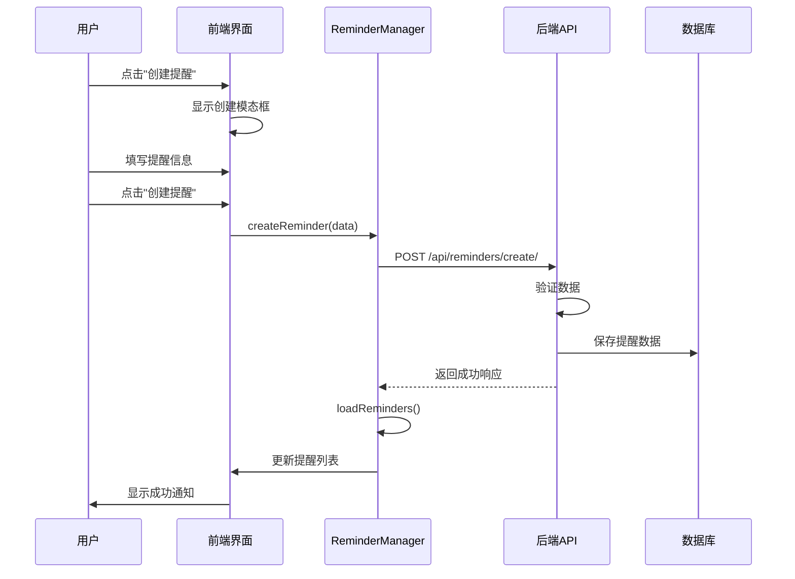

**前端处理逻辑**:
```javascript
// 1. 收集表单数据
const reminderData = {
    title: document.getElementById('newReminderTitle').value,
    content: document.getElementById('newReminderContent').value || '',
    trigger_time: document.getElementById('newReminderTriggerTime').value,
    priority: document.getElementById('newReminderPriority').value
};

// 2. 发送创建请求
const success = await window.reminderManager.createReminder(reminderData);

// 3. 处理响应
if (success) {
    this.closeAllModals();
    this.showNotification('提醒创建成功', 'success');
}
```

**后端处理逻辑**:
```python
# 1. 数据验证
if not title or not trigger_time:
    return JsonResponse({'status': 'error', 'message': '标题和触发时间是必填项'}, status=400)

# 2. 创建提醒对象
reminder_data = {
    "title": title,
    "content": content,
    "trigger_time": trigger_time,
    "priority": priority,
    "status": "active",
    "created_at": datetime.datetime.now().strftime("%Y-%m-%d %H:%M:%S"),
    # ... 其他字段
}

# 3. 保存到数据库
reminder_data.update({
    'id': str(uuid.uuid4()),
    'series_id': None,
    'rrule': '',
    'is_recurring': False,
    'is_main_reminder': False,
    'is_detached': False
})
reminders.append(reminder_data)
user_reminders_data.set_value(reminders)
```

#### 6.1.2 重复提醒创建流程

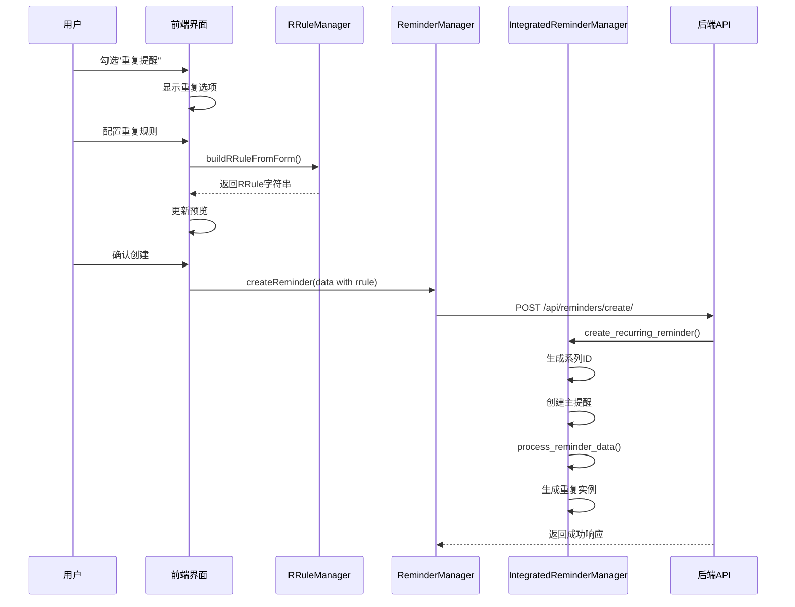

**RRule构建过程**:
```javascript
// 1. 收集重复配置
const freq = document.getElementById('newRepeatFreq').value;
const interval = parseInt(document.getElementById('newRepeatInterval').value);
const until = document.getElementById('newRepeatUntil').value;

// 2. 构建基础RRule
let rrule = `FREQ=${freq}`;
if (interval > 1) {
    rrule += `;INTERVAL=${interval}`;
}

// 3. 处理特殊选项
if (freq === 'WEEKLY') {
    const weekdays = this.getSelectedWeekdays('new');
    if (weekdays.length > 0) {
        rrule += `;BYDAY=${weekdays.join(',')}`;
    }
}

// 4. 添加结束时间
if (until) {
    const untilDate = new Date(until + 'T23:59:59');
    const untilStr = untilDate.toISOString().replace(/[-:]/g, '').split('.')[0] + 'Z';
    rrule += `;UNTIL=${untilStr}`;
}
```

**重复实例生成过程**:
```python
# 1. 创建主提醒
main_reminder = reminder_data.copy()
main_reminder.update({
    'id': str(uuid.uuid4()),
    'series_id': series_id,
    'rrule': rrule,
    'is_recurring': True,
    'is_main_reminder': True,
    'original_trigger_time': reminder_data['trigger_time']
})

# 2. 生成重复实例
instances = generate_reminder_instances(main_reminder, days_ahead=90, min_instances=10)

# 3. 合并主提醒和实例
all_reminders = [main_reminder] + instances
```

### 6.2 提醒编辑流程

#### 6.2.1 单次提醒编辑

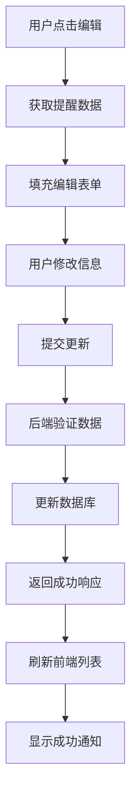

**前端流程**:
```javascript
// 1. 打开编辑模态框
const reminder = window.reminderManager.reminders.find(r => r.id === reminderId);

// 2. 填充表单数据
document.getElementById('editReminderTitle').value = reminder.title;
document.getElementById('editReminderContent').value = reminder.content || '';
document.getElementById('editReminderTriggerTime').value = reminder.trigger_time.slice(0, 16);
document.getElementById('editReminderPriority').value = reminder.priority;

// 3. 提交更新
const updateData = {
    title: document.getElementById('editReminderTitle').value,
    content: document.getElementById('editReminderContent').value,
    trigger_time: document.getElementById('editReminderTriggerTime').value,
    priority: document.getElementById('editReminderPriority').value
};

await window.reminderManager.updateReminder(reminderId, updateData);
```

#### 6.2.2 重复提醒编辑

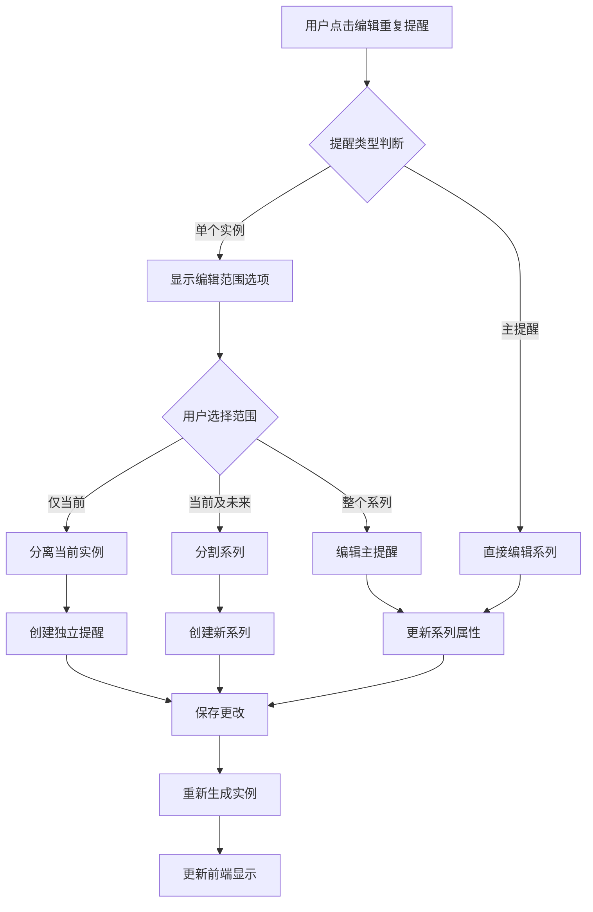

重复提醒的编辑支持多种场景：

1. **仅编辑当前实例**: 将实例从系列中分离
2. **编辑当前及未来**: 在当前时间点分割系列
3. **编辑整个系列**: 修改主提醒和所有实例

**批量编辑API调用**:
```javascript
const editData = {
    series_id: reminder.series_id,
    changes: {
        title: newTitle,
        rrule: newRRule
    },
    edit_scope: 'future', // current|future|all
    target_date: reminder.trigger_time
};

const response = await fetch('/api/reminders/bulk-edit/', {
    method: 'POST',
    headers: {
        'Content-Type': 'application/json',
        'X-CSRFToken': this.getCSRFToken()
    },
    body: JSON.stringify(editData)
});
```

### 6.3 提醒状态管理流程

#### 6.3.1 状态转换图

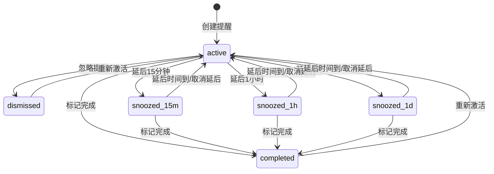

#### 6.3.2 延后逻辑实现

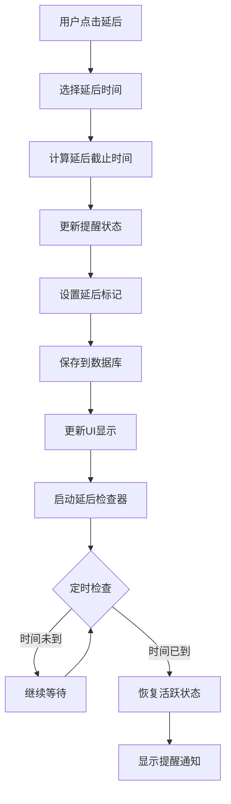

**前端延后处理**:
```javascript
async snoozeReminder(reminderId, duration) {
    const now = new Date();
    let snoozeUntil;
    let status;
    
    switch (duration) {
        case '15m':
            snoozeUntil = new Date(now.getTime() + 15 * 60 * 1000);
            status = 'snoozed_15m';
            break;
        case '1h':
            snoozeUntil = new Date(now.getTime() + 60 * 60 * 1000);
            status = 'snoozed_1h';
            break;
        case '1d':
            snoozeUntil = new Date(now.getTime() + 24 * 60 * 60 * 1000);
            status = 'snoozed_1d';
            break;
    }
    
    return await this.updateReminderStatus(reminderId, status, snoozeUntil.toISOString());
}
```

**后端状态更新**:
```python
@csrf_exempt
def update_reminder_status(request):
    if request.method == 'POST':
        data = json.loads(request.body)
        reminder_id = data.get('id')
        new_status = data.get('status')
        snooze_until = data.get('snooze_until', '')
        
        # 查找并更新提醒
        for reminder in reminders:
            if reminder['id'] == reminder_id:
                reminder['status'] = new_status
                reminder['snooze_until'] = snooze_until
                reminder['last_modified'] = datetime.datetime.now().strftime("%Y-%m-%d %H:%M:%S")
                
                # 如果是激活，清空延后时间
                if new_status == 'active':
                    reminder['snooze_until'] = ''
                
                break
        
        user_reminders_data.set_value(reminders)
        return JsonResponse({'status': 'success'})
```

### 6.4 自动实例生成流程

#### 6.4.1 实例生成触发机制

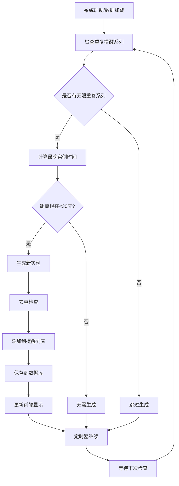

系统会在以下情况自动生成重复提醒实例：

1. **加载提醒时**: `get_reminders()` API调用时
2. **定期检查**: 前端定时器检查
3. **手动触发**: 用户刷新或切换筛选器时

**自动生成逻辑**:
```python
def auto_generate_missing_instances(reminders):
    """自动生成缺失的重复提醒实例"""
    new_instances_count = 0
    now = datetime.datetime.now()
    
    # 获取所有重复系列
    recurring_series = {}
    for reminder in reminders:
        series_id = reminder.get('series_id')
        rrule = reminder.get('rrule')
        
        # 只处理活跃的重复系列
        if series_id and rrule and 'FREQ=' in rrule and not reminder.get('is_detached', False):
            if 'UNTIL=' not in rrule:  # 无截止时间的重复提醒
                if series_id not in recurring_series:
                    recurring_series[series_id] = {
                        'reminders': [],
                        'rrule': rrule,
                        'base_reminder': reminder
                    }
                recurring_series[series_id]['reminders'].append(reminder)
    
    # 检查每个系列是否需要生成新实例
    for series_id, series_data in recurring_series.items():
        series_reminders = series_data['reminders']
        
        # 找到最晚的提醒时间
        latest_time = None
        for reminder in series_reminders:
            trigger_time = datetime.datetime.fromisoformat(reminder['trigger_time'])
            if latest_time is None or trigger_time > latest_time:
                latest_time = trigger_time
        
        if latest_time:
            # 如果最晚的提醒时间距离现在少于30天，生成新实例
            days_ahead = (latest_time - now).days
            if days_ahead < 30:
                new_instances = generate_reminder_instances(series_data['base_reminder'], 90, 10)
                
                # 过滤掉已存在的实例
                existing_times = {r['trigger_time'] for r in series_reminders}
                truly_new_instances = [
                    instance for instance in new_instances 
                    if instance['trigger_time'] not in existing_times
                ]
                
                if truly_new_instances:
                    reminders.extend(truly_new_instances)
                    new_instances_count += len(truly_new_instances)
    
    return new_instances_count
```

#### 6.4.2 实例去重机制

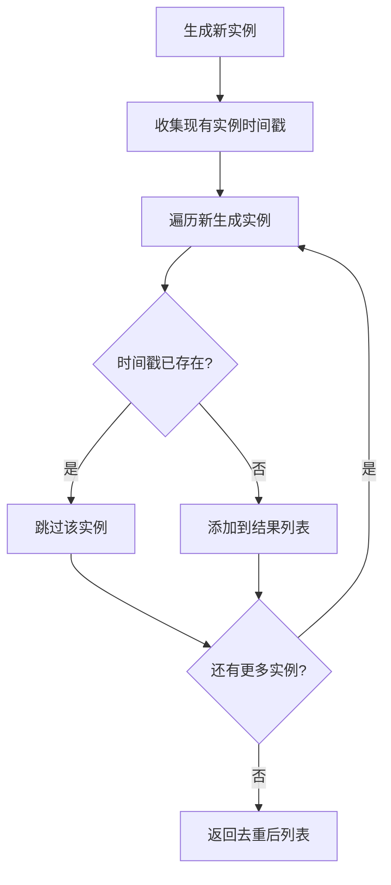

为避免重复生成相同的实例，系统采用以下去重策略：

1. **时间戳去重**: 基于 `trigger_time` 字段去重
2. **ID唯一性**: 每个实例都有唯一的UUID
3. **系列管理**: 通过 `series_id` 关联同一系列的所有实例

### 6.5 数据同步和一致性

#### 6.5.1 前后端数据同步

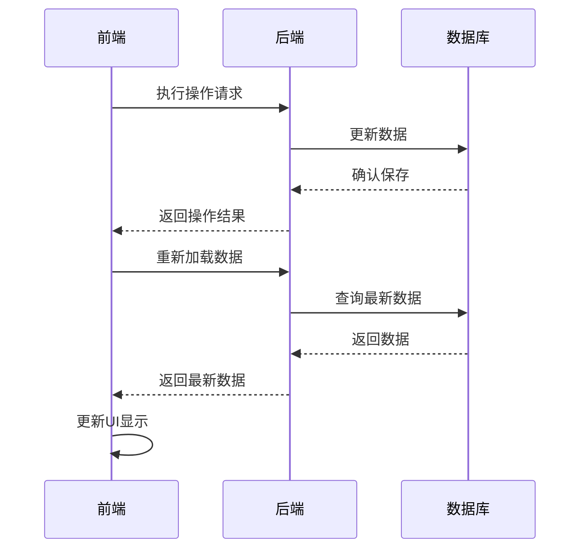

**前端数据更新策略**:
```javascript
// 1. 操作后自动刷新
async updateReminder(reminderId, updateData) {
    const response = await fetch('/api/reminders/update/', {/*...*/});
    
    if (response.ok) {
        // 立即重新加载数据，确保一致性
        await this.loadReminders();
        this.applyFilters();
    }
}

// 2. 定期同步检查
startReminderCheck() {
    // 每5分钟检查一次
    setInterval(() => {
        this.checkPendingReminders();
    }, 5 * 60 * 1000);
    
    // 每小时完整同步一次
    setInterval(() => {
        this.loadReminders();
    }, 60 * 60 * 1000);
}
```

#### 6.5.2 数据完整性保障

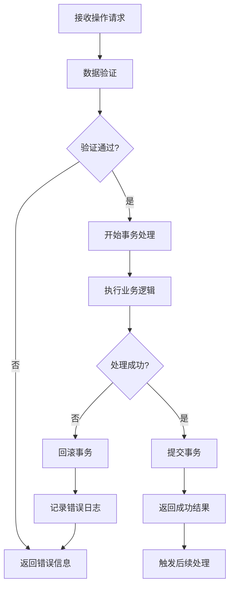

**事务性操作**:
```python
try:
    # 1. 数据验证
    if not self.validate_reminder_data(reminder_data):
        raise ValueError("数据验证失败")
    
    # 2. 业务逻辑处理
    processed_reminders = self.process_reminder_operations(reminders, operation)
    
    # 3. 原子性保存
    user_reminders_data.set_value(processed_reminders)
    
    return JsonResponse({'status': 'success'})
    
except Exception as e:
    logger.error(f"提醒操作失败: {e}")
    return JsonResponse({'status': 'error', 'message': str(e)}, status=500)
```

### 6.6 性能优化策略

#### 6.6.1 前端性能优化

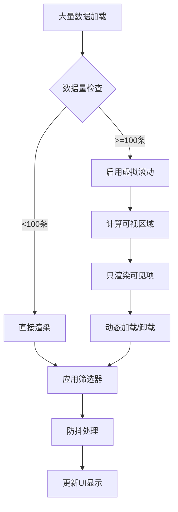

1. **懒加载**: 大量提醒时分页加载
2. **虚拟滚动**: 长列表虚拟化渲染
3. **防抖处理**: 搜索和筛选操作防抖
4. **缓存策略**: 本地缓存提醒数据

```javascript
// 防抖筛选
const debouncedFilter = debounce(() => {
    this.applyFilters();
}, 300);

// 虚拟滚动实现
renderVisibleReminders() {
    const container = this.reminderContainer;
    const scrollTop = container.scrollTop;
    const containerHeight = container.clientHeight;
    const itemHeight = 80; // 估计的单项高度
    
    const startIndex = Math.floor(scrollTop / itemHeight);
    const endIndex = Math.min(startIndex + Math.ceil(containerHeight / itemHeight) + 5, this.filteredReminders.length);
    
    // 只渲染可见区域的提醒
    this.renderReminderRange(startIndex, endIndex);
}
```

#### 6.6.2 后端性能优化

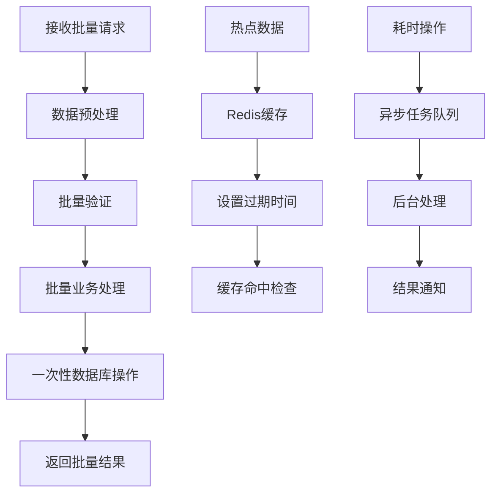

1. **批量操作**: 支持批量创建、更新、删除
2. **增量同步**: 只返回变更的数据
3. **缓存机制**: Redis缓存热点数据
4. **异步处理**: 耗时操作异步化

```python
# 批量操作示例
@csrf_exempt
def bulk_edit_reminders(request):
    """批量编辑提醒"""
    if request.method == 'POST':
        data = json.loads(request.body)
        series_id = data.get('series_id')
        changes = data.get('changes', {})
        edit_scope = data.get('edit_scope', 'current')
        
        # 批量处理，减少数据库操作
        affected_reminders = []
        for reminder in reminders:
            if reminder.get('series_id') == series_id:
                if should_apply_changes(reminder, edit_scope, data.get('target_date')):
                    for key, value in changes.items():
                        reminder[key] = value
                    reminder['last_modified'] = datetime.datetime.now().strftime("%Y-%m-%d %H:%M:%S")
                    affected_reminders.append(reminder)
        
        # 一次性保存所有变更
        user_reminders_data.set_value(reminders)
        
        return JsonResponse({
            'status': 'success', 
            'affected_count': len(affected_reminders)
        })
```

---

## 总结

Reminder功能模块实现了一个功能完整、性能优良的提醒管理系统，主要特点包括：

### 核心特性
1. **完整的CRUD操作**: 支持提醒的创建、读取、更新、删除
2. **强大的重复功能**: 基于RFC5545标准的RRule实现
3. **灵活的状态管理**: 支持完成、忽略、延后等多种状态
4. **智能的实例生成**: 自动生成和维护重复提醒实例
5. **用户友好的界面**: 直观的操作界面和实时预览

### 技术亮点
1. **模块化架构**: 前后端分离，职责清晰
2. **数据一致性**: 完善的同步机制和事务处理
3. **性能优化**: 多层次的性能优化策略
4. **扩展性强**: 易于添加新功能和集成其他模块

### 应用价值
该Reminder模块为Events功能的升级提供了完整的参考实现，特别是RRule相关的逻辑处理和用户界面设计，可以直接借鉴和复用到Events模块中。

---

*文档生成完成 - 2025年9月15日*
```
```
