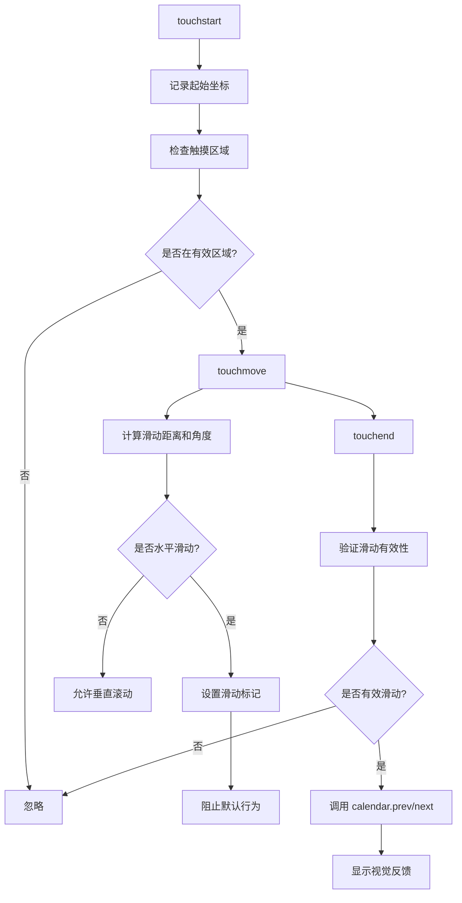

# 日历触屏滑动功能实现文档

## 📅 更新日期
2025年11月4日

## 🎯 功能概述
为 UniSchedulerSuper 的日历界面添加触屏滑动支持，用户可以通过在日历区域左右滑动来切换到上一个/下一个时间段，实现与点击箭头按钮相同的效果。

## ✨ 功能特性

### 1. 滑动手势识别
- **向右滑动**：查看上一个时间段（相当于点击左箭头）
- **向左滑动**：查看下一个时间段（相当于点击右箭头）
- **最小滑动距离**：50 像素（避免误触）
- **角度阈值**：30 度（确保是水平滑动）

### 2. 智能区域判断
滑动功能仅在日历的主要视图区域生效，以下区域会被排除：
- 工具栏和按钮区域
- 筛选下拉菜单
- 模态框
- 其他交互元素

### 3. 视觉反馈
- 滑动完成后会显示一个短暂的指示器图标
- 指示器位置：屏幕左侧或右侧（取决于滑动方向）
- 指示器样式：蓝色圆形背景，白色箭头图标
- 动画效果：淡入淡出，持续 0.6 秒

### 4. 性能优化
- 使用被动事件监听器提升滚动性能
- 仅在需要时阻止默认行为
- 智能判断垂直滚动 vs 水平滑动

## 📂 文件结构

### 新增文件
```
core/static/js/calendar-touch-swipe.js    # 触屏滑动功能模块
staticfiles/js/calendar-touch-swipe.js    # 静态文件副本
```

### 修改文件
```
core/templates/home_new.html              # 引入新模块并初始化
```

## 🔧 技术实现

### 1. 核心类：CalendarTouchSwipe

```javascript
class CalendarTouchSwipe {
    constructor(calendar) {
        this.calendar = calendar;        // FullCalendar 实例
        this.touchStartX = 0;            // 触摸起始 X 坐标
        this.touchStartY = 0;            // 触摸起始 Y 坐标
        this.touchEndX = 0;              // 触摸结束 X 坐标
        this.touchEndY = 0;              // 触摸结束 Y 坐标
        this.isSwiping = false;          // 滑动标记
        
        // 配置参数
        this.config = {
            minSwipeDistance: 50,        // 最小滑动距离
            maxVerticalDistance: 100,    // 最大垂直偏移
            swipeAngleThreshold: 30      // 滑动角度阈值
        };
    }
}
```

### 2. 事件处理流程



### 3. 关键方法

#### handleTouchStart(event)
- 记录触摸起始坐标
- 检查触摸点是否在有效区域
- 初始化滑动状态

#### handleTouchMove(event)
- 计算实时滑动距离
- 判断滑动方向和角度
- 在水平滑动时阻止默认行为

#### handleTouchEnd(event)
- 验证滑动的有效性
- 调用日历的 prev/next 方法
- 显示滑动指示器

#### isInCalendarViewArea(target)
- 检查触摸点是否在日历主视图区域
- 排除按钮、工具栏等交互元素

#### showSwipeIndicator(direction)
- 显示临时的滑动指示器
- 提供视觉反馈

### 4. 滑动判断逻辑

```javascript
// 有效滑动的条件：
const isValidSwipe = 
    horizontalDistance > this.config.minSwipeDistance &&      // 水平距离足够
    verticalDistance < this.config.maxVerticalDistance &&    // 垂直偏移不太大
    horizontalDistance > verticalDistance;                    // 主要是水平移动
```

## 🎨 样式和动画

### CSS 动画
```css
@keyframes swipeIndicatorFade {
    0% {
        opacity: 0;
        transform: translateY(-50%) scale(0.5);
    }
    20% {
        opacity: 1;
        transform: translateY(-50%) scale(1.1);
    }
    40% {
        transform: translateY(-50%) scale(1);
    }
    100% {
        opacity: 0;
        transform: translateY(-50%) scale(0.8);
    }
}
```

### 指示器样式
- 固定定位，居中显示
- 蓝色半透明背景
- 白色图标
- 圆形，50x50 像素
- 阴影效果增强视觉层次

## 🚀 使用方法

### 初始化
```javascript
// 在 FullCalendar 初始化完成后
const calendarSwipe = new CalendarTouchSwipe(calendarInstance);
```

### 销毁
```javascript
// 如果需要禁用触屏滑动
calendarSwipe.destroy();
```

## 📱 兼容性

### 支持的设备
- ✅ iOS Safari
- ✅ Android Chrome
- ✅ 平板设备
- ✅ 触摸屏笔记本

### 支持的视图
- ✅ 月视图（dayGridMonth）
- ✅ 周视图（timeGridWeek）
- ✅ 2日视图（timeGridTwoDay）
- ✅ 日视图（timeGridDay）
- ✅ 列表视图（listWeek）

## 🔍 配置参数

可以通过修改 `config` 对象来调整滑动行为：

```javascript
this.config = {
    minSwipeDistance: 50,        // 最小滑动距离（像素）
    maxVerticalDistance: 100,    // 允许的最大垂直偏移（像素）
    swipeAngleThreshold: 30      // 滑动角度阈值（度）
};
```

### 参数说明
- **minSwipeDistance**: 较小的值会让滑动更敏感，但可能误触
- **maxVerticalDistance**: 较大的值允许更多垂直偏移，但可能与滚动冲突
- **swipeAngleThreshold**: 较大的值允许更倾斜的滑动方向

## ⚠️ 注意事项

1. **性能考虑**
   - 使用被动监听器避免影响滚动性能
   - 仅在必要时阻止默认行为

2. **用户体验**
   - 在按钮和工具栏区域禁用滑动，避免干扰点击
   - 提供视觉反馈，让用户知道滑动已生效

3. **维护建议**
   - 如果修改了日历的 DOM 结构，需要更新 `isInCalendarViewArea` 方法
   - 如果添加了新的交互元素，可能需要在排除列表中添加

## 🧪 测试建议

### 手动测试
1. **基本滑动**
   - [ ] 在日历上向右滑动，确认切换到上一个时间段
   - [ ] 在日历上向左滑动，确认切换到下一个时间段
   - [ ] 验证滑动指示器正确显示

2. **区域判断**
   - [ ] 在工具栏上滑动，确认不触发切换
   - [ ] 在按钮上滑动，确认不触发切换
   - [ ] 在筛选菜单上滑动，确认不触发切换

3. **边界情况**
   - [ ] 短距离滑动不触发切换
   - [ ] 垂直滚动不触发切换
   - [ ] 斜向滑动根据角度决定是否触发

4. **多视图测试**
   - [ ] 在月视图下测试滑动
   - [ ] 在周视图下测试滑动
   - [ ] 在日视图下测试滑动
   - [ ] 在列表视图下测试滑动

### 设备测试
- [ ] iOS Safari
- [ ] Android Chrome
- [ ] 平板设备
- [ ] 触摸屏笔记本

## 📝 更新日志

### v20251104-003
- ✅ 实现基础触屏滑动功能
- ✅ 添加滑动区域判断
- ✅ 实现视觉反馈指示器
- ✅ 优化性能和用户体验
- ✅ 添加完整的文档和注释

## 🔮 未来优化方向

1. **增强功能**
   - 添加滑动距离预览（边滑动边显示部分内容）
   - 支持多指手势（如双指缩放切换视图）
   - 添加触觉反馈（vibration API）

2. **性能优化**
   - 使用 requestAnimationFrame 优化动画
   - 减少重绘和重排

3. **用户体验**
   - 添加设置项，允许用户自定义滑动参数
   - 提供开关选项，允许禁用触屏滑动

## 👨‍💻 开发者
- 实现日期: 2025年11月4日
- 版本: v1.0.0
- 状态: ✅ 已完成并测试

## 📚 参考资料
- [Touch Events API](https://developer.mozilla.org/en-US/docs/Web/API/Touch_events)
- [FullCalendar Documentation](https://fullcalendar.io/docs)
- [Passive Event Listeners](https://developer.mozilla.org/en-US/docs/Web/API/EventTarget/addEventListener#improving_scrolling_performance_with_passive_listeners)
