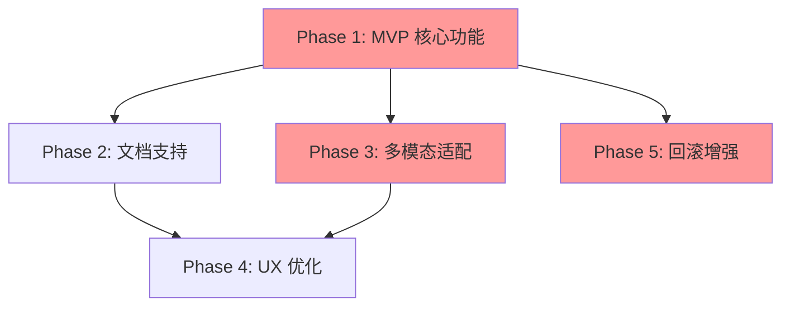

# 📎 统一附件系统 - 升级方案

**版本**: v1.0  
**创建日期**: 2026-02-10  
**状态**: 📝 规划中

---

## 📋 目录

1. [概述](#1-概述)
2. [核心功能](#2-核心功能)
3. [架构设计](#3-架构设计)
4. [数据模型](#4-数据模型)
5. [解析器系统](#5-解析器系统)
6. [多模态适配](#6-多模态适配)
7. [前端交互](#7-前端交互)
8. [文件存储](#8-文件存储)
9. [边缘情况处理](#9-边缘情况处理)
10. [API 设计](#10-api-设计)
11. [实现路线图](#11-实现路线图)

---

## 1. 概述

### 1.1 背景

当前系统已实现基础的工作流提示附件功能，但存在以下问题：
- ❌ 生硬的文本拼接，用户体验差
- ❌ 不支持外部文件上传
- ❌ 缺乏多模态能力
- ❌ 无法将内部元素（events/todo/reminder）作为附件

### 1.2 目标

构建现代化的统一附件系统，支持：
1. ✅ 内部元素附件（events, todos, reminders）
2. ✅ 外部文件上传（图片、PDF、Office 文档）
3. ✅ 多模态能力适配（根据模型自动降级）
4. ✅ 拖拽交互（从列表拖入 Agent 侧边栏）
5. ✅ 会话级存储（7天自动过期）
6. ✅ 文件预览与管理

### 1.3 参考案例

- **Cursor**: 拖拽代码片段、文件上传、多模态支持
- **ChatGPT**: 图片上传、PDF 解析、多模态对话
- **Claude**: Artifacts、文档理解、结构化输出
- **Notion AI**: 内部元素引用、@mention 语法

---

## 2. 核心功能

### 2.1 功能清单

#### Phase 1 - 核心功能 (MVP)
- [ ] 2.1.1 内部元素附件
  - [ ] Events 拖拽到 Agent
  - [ ] Todos 拖拽到 Agent
  - [ ] Reminders 拖拽到 Agent
  - [ ] Markdown 格式化
- [ ] 2.1.2 图片上传
  - [ ] 拖拽/点击上传
  - [ ] 缩略图生成
  - [ ] OCR 文字提取（降级方案）
- [ ] 2.1.3 文件存储
  - [ ] 会话级目录
  - [ ] 文件元信息管理
  - [ ] 自动过期清理

#### Phase 2 - 文档支持
- [ ] 2.2.1 PDF 解析
  - [ ] 文字提取
  - [ ] 表格识别
  - [ ] 页面截图
- [ ] 2.2.2 Office 文档解析
  - [ ] Word (python-docx)
  - [ ] Excel (openpyxl)
  - [ ] PowerPoint (python-pptx)
- [ ] 2.2.3 预览功能
  - [ ] 前端预览组件
  - [ ] 分页浏览
  - [ ] 下载原文件

#### Phase 3 - 多模态适配
- [ ] 2.3.1 模型能力检测
  - [ ] api_keys.json 配置扩展
  - [ ] ModelCapabilities 工具类
  - [ ] 动态能力查询
- [ ] 2.3.2 Base64 图片支持
  - [ ] 图片编码
  - [ ] 格式验证
  - [ ] 大小限制
- [ ] 2.3.3 自动降级策略
  - [ ] Vision → OCR Text
  - [ ] 图片质量调整
  - [ ] Token 优化

#### Phase 4 - 用户体验
- [ ] 2.4.1 拖拽上传
  - [ ] Drop Zone 实现
  - [ ] 拖拽预览
  - [ ] 进度反馈
- [ ] 2.4.2 批量处理
  - [ ] 多文件上传
  - [ ] 批量删除
  - [ ] 批量下载
- [ ] 2.4.3 状态管理
  - [ ] 上传进度
  - [ ] 解析状态
  - [ ] 错误处理

---

## 3. 架构设计

### 3.1 整体架构

```
┌─────────────────────────────────────────────────────────────┐
│                        前端层                                │
│                     (agent-chat.js)                          │
├─────────────────┬──────────────────┬────────────────────────┤
│  附件管理器     │   拖拽交互模块   │   预览/下载模块         │
│ AttachmentMgr  │  DragAndDrop     │  PreviewPanel          │
└────────┬────────┴────────┬─────────┴────────┬───────────────┘
         │                 │                  │
         │ HTTP POST       │ HTTP POST        │ HTTP GET
         │                 │                  │
┌────────▼─────────────────▼──────────────────▼───────────────┐
│                        后端 API 层                           │
│                  (agent_service/views_api.py)                │
├──────────────────────────────────────────────────────────────┤
│  • POST /api/agent/attachments/upload/   文件上传           │
│  • GET  /api/agent/attachments/          列出可附加项        │
│  • POST /api/agent/attachments/format/   格式化内容(现有)   │
│  • GET  /api/agent/attachments/preview/  预览文件           │
│  • DELETE /api/agent/attachments/{id}/   删除附件           │
│  • POST /api/agent/attachments/restore/  恢复附件(回滚用)   │
└────────┬─────────────────────────────────────────────────────┘
         │
         │ 调用
         │
┌────────▼─────────────────────────────────────────────────────┐
│                       业务逻辑层                              │
│              (agent_service/attachment_handler.py)            │
├──────────────────────────────────────────────────────────────┤
│  AttachmentHandler:                                          │
│    • handle_upload()      处理文件上传                       │
│    • handle_internal()    处理内部元素                       │
│    • get_formatted()      获取格式化内容                     │
│    • detect_model_caps()  检测模型能力                       │
│    • choose_format()      选择合适的格式                     │
└────────┬────────────────┬────────────────────────────────────┘
         │                │
         │                │ 调用解析器
         │                │
         │         ┌──────▼───────────────────────────┐
         │         │      解析器池 (Parser Pool)      │
         │         ├──────────────────────────────────┤
         │         │  • ImageParser (OCR)            │
         │         │  • PDFParser                    │
         │         │  • DocumentParser (Word/Excel)  │
         │         │  • InternalElementParser        │
         │         └──────────────────────────────────┘
         │
         │ 读写数据库
         │
┌────────▼──────────────────────────────────────────────────────┐
│                       数据持久层                               │
│              (agent_service/models.py)                         │
├───────────────────────────────────────────────────────────────┤
│  SessionAttachment 模型:                                      │
│    • 附件元信息（文件名、类型、大小等）                        │
│    • 原始文件路径                                              │
│    • Base64 编码数据（多模态）                                 │
│    • 解析文本（降级方案）                                      │
│    • 关联 session_id 和 message_index                         │
│    • 软删除标记和恢复信息                                      │
└───────────────────────────────────────────────────────────────┘
         │
         │ 物理存储
         │
┌────────▼──────────────────────────────────────────────────────┐
│                       文件存储层                               │
│                  (media/attachments/)                          │
├───────────────────────────────────────────────────────────────┤
│  目录结构:                                                     │
│    media/attachments/{session_id}/                            │
│      ├── original_{uuid}.{ext}    原始文件                    │
│      └── thumb_{uuid}.{ext}       缩略图                      │
└───────────────────────────────────────────────────────────────┘
```

### 3.2 组件关系

#### 3.2.1 核心组件

**AttachmentHandler** (业务逻辑中心):
- 协调各个解析器
- 检测模型能力
- 决定使用哪种格式（base64 vs text）
- 管理附件生命周期

**Parser Pool** (解析器集合):
- `ImageParser`: 处理图片（OCR、缩略图）
- `PDFParser`: 提取 PDF 文本和表格
- `DocumentParser`: 解析 Word/Excel
- `InternalElementParser`: 格式化内部元素（events/todos/reminders）

**ModelCapabilityDetector** (能力检测):
- 读取 `config/api_keys.json` 的模型配置
- 从 `core.UserData` 读取用户当前模型 (`agent_config.model_id`)
- 返回模型的 `supports_vision` 和 `supports_multimodal` 标志

#### 3.2.2 数据流

**上传流程**:
```
1. 前端: 用户拖拽文件或点击上传
2. 前端: FormData 包含文件 + session_id
3. 后端: views_api 接收请求
4. 后端: AttachmentHandler.handle_upload()
5. 后端: 保存原始文件到 media/attachments/{session_id}/
6. 后端: 根据文件类型选择解析器
7. 解析器: 生成缩略图 + OCR/文本提取
8. 后端: 创建 SessionAttachment 记录（同时存储 base64 和 parsed_text）
9. 后端: 返回附件信息给前端
10. 前端: 显示在附件列表中
```

**格式化流程** (发送消息时):
```
1. 前端: 用户点击"发送"
2. 前端: 调用 /api/agent/attachments/format/ 包含附件 ID 列表
3. 后端: AttachmentHandler.get_formatted()
4. 后端: ModelCapabilityDetector 检测当前模型能力
5. 后端: 根据能力选择格式:
   - Vision 模型 → 返回 base64 格式指令
   - 非 Vision 模型 → 返回 parsed_text
6. 前端: 将格式化内容附加到用户消息
7. 前端: 发送到 Agent (WebSocket)
```

**回滚流程**:
```
1. 前端: 用户点击回滚到消息 #N
2. 前端: 调用 /api/agent/rollback/to-message/
3. 后端: 查询受影响的附件 (message_index >= N)
4. 后端: 返回确认信息（附件列表、总大小）
5. 前端: 显示确认对话框
6. 用户确认后:
   a. 后端: 软删除附件 (is_deleted=True, deleted_at=now())
   b. 后端: 回滚消息（现有逻辑）
   c. 前端: 刷新附件列表
7. Celery 任务: 7天后物理删除文件
```

### 3.3 与现有系统集成

#### 3.3.1 与 AgentSession 的关系

```python
# SessionAttachment 通过 session_id 关联 AgentSession
SessionAttachment.session_id → AgentSession.session_id

# 每个附件还记录它在哪条消息中被发送
SessionAttachment.message_index → 对应 LangGraph messages 数组索引
```

#### 3.3.2 与 UserData 的关系

```python
# 模型配置存储在 UserData
UserData.objects.get(user=user, key='agent_config')
# 返回: {"model_id": "system_deepseek", ...}

# AttachmentHandler 读取配置确定当前模型
# 然后从 config/api_keys.json 读取模型能力
```

#### 3.3.3 与现有附件系统的兼容

- **现有**: workflow 附件通过 `/api/agent/attachments/format/` 返回文本
- **升级**: 保持此接口，扩展支持文件附件
- **前端**: `selectedAttachments` 数组同时支持 `{type: 'workflow', id: 1}` 和 `{type: 'file', id: 5}`

---

## 4. 数据模型

### 4.1 SessionAttachment 模型

#### 4.1.1 完整字段设计

```python
# agent_service/models.py

from django.db import models
from django.contrib.auth.models import User
from django.utils import timezone
from datetime import timedelta

class SessionAttachment(models.Model):
    """
    会话附件模型
    支持外部文件和内部元素作为附件
    """
    
    # ========== 类型定义 ==========
    TYPE_CHOICES = [
        ('image', '图片'),
        ('pdf', 'PDF文档'),
        ('word', 'Word文档'),
        ('excel', 'Excel表格'),
        ('workflow', '工作流规则'),
        ('event', '日程事件'),
        ('todo', '待办事项'),
        ('reminder', '提醒'),
    ]
    
    # ========== 基础信息 ==========
    user = models.ForeignKey(User, on_delete=models.CASCADE, related_name='session_attachments')
    session_id = models.CharField(max_length=200, db_index=True, help_text="关联的 AgentSession.session_id")
    
    type = models.CharField(max_length=20, choices=TYPE_CHOICES, help_text="附件类型")
    filename = models.CharField(max_length=255, help_text="文件名或元素标题")
    
    # ========== 消息关联 ==========
    message_index = models.IntegerField(
        null=True, 
        blank=True, 
        help_text="附件被发送时的消息索引（LangGraph messages 数组索引）"
    )
    sent_at = models.DateTimeField(null=True, blank=True, help_text="发送时间")
    
    # ========== 文件存储（外部文件） ==========
    file = models.FileField(
        upload_to='attachments/%Y/%m/%d/', 
        null=True, 
        blank=True, 
        help_text="原始文件"
    )
    file_size = models.BigIntegerField(default=0, help_text="文件大小（字节）")
    mime_type = models.CharField(max_length=100, blank=True, default='', help_text="MIME 类型")
    thumbnail_url = models.CharField(max_length=500, blank=True, default='', help_text="缩略图 URL")
    
    # ========== 多模态支持 ==========
    base64_data = models.TextField(
        blank=True, 
        default='', 
        help_text="Base64 编码的图片数据（用于 vision 模型）"
    )
    
    # ========== 降级方案 ==========
    parsed_text = models.TextField(
        blank=True, 
        default='', 
        help_text="解析后的文本内容（OCR/文档提取，用于非 vision 模型）"
    )
    
    # ========== 内部元素引用（内部附件） ==========
    internal_type = models.CharField(
        max_length=20, 
        blank=True, 
        default='', 
        help_text="内部元素类型：event, todo, reminder, workflow"
    )
    internal_id = models.IntegerField(
        null=True, 
        blank=True, 
        help_text="内部元素的 ID（如 Event.id, Todo.id）"
    )
    internal_snapshot = models.JSONField(
        default=dict, 
        blank=True, 
        help_text="内部元素的快照（防止元素被删除或修改）"
    )
    
    # ========== 发送记录 ==========
    sent_as_format = models.CharField(
        max_length=20, 
        blank=True, 
        default='', 
        help_text="实际发送时使用的格式：base64, text, markdown"
    )
    sent_with_model = models.CharField(
        max_length=100, 
        blank=True, 
        default='', 
        help_text="发送时使用的模型 ID（用于追踪）"
    )
    
    # ========== 软删除支持 ==========
    is_deleted = models.BooleanField(default=False, help_text="是否已软删除")
    deleted_at = models.DateTimeField(null=True, blank=True, help_text="软删除时间")
    deleted_with_message_index = models.IntegerField(
        null=True, 
        blank=True, 
        help_text="回滚时一起删除的消息索引"
    )
    deleted_reason = models.CharField(
        max_length=50, 
        blank=True, 
        default='', 
        help_text="删除原因：rollback, manual, expired"
    )
    
    # ========== 时间戳 ==========
    created_at = models.DateTimeField(auto_now_add=True)
    updated_at = models.DateTimeField(auto_now=True)
    
    class Meta:
        ordering = ['-created_at']
        verbose_name = "会话附件"
        verbose_name_plural = "会话附件"
        indexes = [
            models.Index(fields=['session_id', 'is_deleted']),
            models.Index(fields=['user', 'is_deleted']),
            models.Index(fields=['deleted_at']),  # 用于清理任务
        ]
    
    def __str__(self):
        return f"{self.user.username}: {self.filename} ({self.type})"
    
    @property
    def can_restore(self):
        """是否可以恢复（7天内）"""
        if not self.is_deleted or not self.deleted_at:
            return False
        grace_period = timedelta(days=7)
        return timezone.now() - self.deleted_at < grace_period
    
    @property
    def is_internal(self):
        """是否为内部元素附件"""
        return self.internal_type in ['event', 'todo', 'reminder', 'workflow']
    
    @property
    def is_file(self):
        """是否为外部文件附件"""
        return self.type in ['image', 'pdf', 'word', 'excel']
    
    def get_display_name(self):
        """获取显示名称"""
        if self.is_internal:
            return self.internal_snapshot.get('title') or self.filename
        return self.filename
    
    def get_formatted_content(self, model_supports_vision=False):
        """
        根据模型能力返回格式化内容
        
        Args:
            model_supports_vision: 当前模型是否支持 vision
            
        Returns:
            dict: {
                "type": "base64" | "text" | "markdown",
                "content": str,
                "metadata": dict
            }
        """
        if self.is_internal:
            # 内部元素始终返回 Markdown 格式
            return {
                "type": "markdown",
                "content": self.parsed_text or self._format_internal_element(),
                "metadata": {
                    "internal_type": self.internal_type,
                    "internal_id": self.internal_id
                }
            }
        
        # 外部文件根据模型能力决定
        if model_supports_vision and self.base64_data and self.type == 'image':
            return {
                "type": "base64",
                "content": self.base64_data,
                "metadata": {
                    "filename": self.filename,
                    "mime_type": self.mime_type
                }
            }
        else:
            # 降级到文本
            return {
                "type": "text",
                "content": self.parsed_text or "[无法解析内容]",
                "metadata": {
                    "filename": self.filename,
                    "original_type": self.type
                }
            }
    
    def _format_internal_element(self):
        """格式化内部元素为 Markdown"""
        snapshot = self.internal_snapshot or {}
        
        if self.internal_type == 'event':
            return f"""### 📅 {snapshot.get('title', '无标题事件')}
- **时间**: {snapshot.get('start', '')} ~ {snapshot.get('end', '')}
- **描述**: {snapshot.get('description', '无描述')}
"""
        elif self.internal_type == 'todo':
            return f"""### ✅ {snapshot.get('title', '无标题任务')}
- **状态**: {'已完成' if snapshot.get('completed') else '待完成'}
- **截止时间**: {snapshot.get('due_date', '无')}
"""
        elif self.internal_type == 'reminder':
            return f"""### ⏰ {snapshot.get('title', '无标题提醒')}
- **提醒时间**: {snapshot.get('remind_at', '')}
- **内容**: {snapshot.get('message', '')}
"""
        elif self.internal_type == 'workflow':
            return f"""### 🔄 {snapshot.get('name', '工作流规则')}
- **触发条件**: {snapshot.get('trigger', '')}
- **执行步骤**: {snapshot.get('steps', '')}
"""
        return "[未知元素类型]"
    
    def soft_delete(self, reason='manual', message_index=None):
        """软删除附件"""
        self.is_deleted = True
        self.deleted_at = timezone.now()
        self.deleted_reason = reason
        if message_index is not None:
            self.deleted_with_message_index = message_index
        self.save(update_fields=['is_deleted', 'deleted_at', 'deleted_reason', 'deleted_with_message_index'])
    
    def restore(self):
        """恢复附件"""
        if self.can_restore:
            self.is_deleted = False
            self.deleted_at = None
            self.deleted_reason = ''
            self.deleted_with_message_index = None
            self.save(update_fields=['is_deleted', 'deleted_at', 'deleted_reason', 'deleted_with_message_index'])
            return True
        return False
    
    def hard_delete(self):
        """物理删除（包括文件）"""
        # 删除文件
        if self.file:
            try:
                self.file.delete(save=False)
            except Exception as e:
                from logger import logger
                logger.warning(f"删除附件文件失败 {self.id}: {e}")
        
        # 删除缩略图
        if self.thumbnail_url:
            try:
                import os
                from django.conf import settings
                thumb_path = os.path.join(settings.MEDIA_ROOT, self.thumbnail_url)
                if os.path.exists(thumb_path):
                    os.remove(thumb_path)
            except Exception as e:
                from logger import logger
                logger.warning(f"删除缩略图失败 {self.id}: {e}")
        
        # 删除数据库记录
        self.delete()
```

#### 4.1.2 字段说明

**基础信息**:
- `user`, `session_id`: 关联到用户和会话
- `type`: 附件类型（8种类型）
- `filename`: 显示名称

**消息关联**:
- `message_index`: 记录在哪条消息中发送，用于回滚时定位
- `sent_at`: 发送时间戳

**文件存储**:
- `file`: Django FileField，自动管理文件上传
- `file_size`, `mime_type`: 文件元信息
- `thumbnail_url`: 缩略图路径（图片附件）

**双格式存储**:
- `base64_data`: 图片的 base64 编码（vision 模型使用）
- `parsed_text`: OCR/文档提取的文本（非 vision 模型使用）

**内部元素**:
- `internal_type`, `internal_id`: 引用内部元素
- `internal_snapshot`: JSON 快照，防止元素被删除

**软删除**:
- `is_deleted`: 标记是否删除
- `deleted_at`: 删除时间（用于 7 天清理）
- `deleted_with_message_index`: 回滚时关联的消息索引
- `deleted_reason`: 删除原因（回滚/手动/过期）

### 4.2 数据库迁移

#### 4.2.1 创建迁移

不再导入不存在的 AttachmentFile，而是直接定义 SessionAttachment：

```python
# agent_service/models.py (修改)
# 移除这一行：
# from .models_attachment import AttachmentFile

# 在文件末尾添加 SessionAttachment 模型（见 4.1.1）
```

生成迁移文件：
```bash
python manage.py makemigrations agent_service
```

应用迁移：
```bash
python manage.py migrate agent_service
```

#### 4.2.2 迁移内容预览

Django 将生成类似以下的迁移文件：

```python
# agent_service/migrations/000X_sessionattachment.py

from django.conf import settings
from django.db import migrations, models
import django.db.models.deletion

class Migration(migrations.Migration):

    dependencies = [
        migrations.swappable_dependency(settings.AUTH_USER_MODEL),
        ('agent_service', '000X_previous_migration'),
    ]

    operations = [
        migrations.CreateModel(
            name='SessionAttachment',
            fields=[
                ('id', models.BigAutoField(auto_created=True, primary_key=True, serialize=False, verbose_name='ID')),
                ('session_id', models.CharField(db_index=True, help_text='关联的 AgentSession.session_id', max_length=200)),
                ('type', models.CharField(choices=[...], help_text='附件类型', max_length=20)),
                ('filename', models.CharField(help_text='文件名或元素标题', max_length=255)),
                ('message_index', models.IntegerField(blank=True, help_text='附件被发送时的消息索引', null=True)),
                # ... 其他字段
                ('user', models.ForeignKey(on_delete=django.db.models.deletion.CASCADE, related_name='session_attachments', to=settings.AUTH_USER_MODEL)),
            ],
            options={
                'verbose_name': '会话附件',
                'verbose_name_plural': '会话附件',
                'ordering': ['-created_at'],
            },
        ),
        migrations.AddIndex(
            model_name='sessionattachment',
            index=models.Index(fields=['session_id', 'is_deleted'], name='agent_servi_session_idx'),
        ),
        # ... 其他索引
    ]
```

#### 4.2.3 配置 media 文件

在 `UniSchedulerSuper/settings.py` 中确保配置了 MEDIA 设置：

```python
# settings.py

import os
from pathlib import Path

BASE_DIR = Path(__file__).resolve().parent.parent

# Media 文件配置
MEDIA_URL = '/media/'
MEDIA_ROOT = os.path.join(BASE_DIR, 'media')

# 确保目录存在
os.makedirs(MEDIA_ROOT, exist_ok=True)
```

在开发环境的 `urls.py` 中添加 media 路由：

```python
# UniSchedulerSuper/urls.py

from django.conf import settings
from django.conf.urls.static import static

urlpatterns = [
    # ... 现有路由
]

# 开发环境提供 media 文件
if settings.DEBUG:
    urlpatterns += static(settings.MEDIA_URL, document_root=settings.MEDIA_ROOT)
```

---

## 5. 解析器系统

### 5.1 解析器接口

定义统一的解析器接口，所有解析器实现同一套 API：

```python
# agent_service/parsers/base.py

from abc import ABC, abstractmethod
from typing import Dict, Any, Optional

class BaseParser(ABC):
    """解析器基类"""
    
    @abstractmethod
    def can_parse(self, file_path: str, mime_type: str) -> bool:
        """
        判断是否能解析该文件
        
        Args:
            file_path: 文件路径
            mime_type: MIME 类型
            
        Returns:
            是否支持解析
        """
        pass
    
    @abstractmethod
    def parse(self, file_path: str, **kwargs) -> Dict[str, Any]:
        """
        解析文件
        
        Args:
            file_path: 文件路径
            **kwargs: 额外参数
            
        Returns:
            {
                "text": str,          # 提取的文本
                "metadata": dict,     # 元信息
                "success": bool,      # 是否成功
                "error": str          # 错误信息（如果失败）
            }
        """
        pass
    
    def generate_thumbnail(self, file_path: str, output_path: str, size: tuple = (200, 200)) -> bool:
        """
        生成缩略图（可选实现）
        
        Args:
            file_path: 原文件路径
            output_path: 输出路径
            size: 缩略图尺寸
            
        Returns:
            是否成功生成
        """
        return False
```

### 5.2 图片解析器

```python
# agent_service/parsers/image_parser.py

import os
import base64
from PIL import Image
from typing import Dict, Any
from .base import BaseParser

class ImageParser(BaseParser):
    """图片解析器 - OCR + Base64 编码 + 缩略图"""
    
    SUPPORTED_FORMATS = ['image/jpeg', 'image/png', 'image/gif', 'image/webp']
    
    def can_parse(self, file_path: str, mime_type: str) -> bool:
        return mime_type in self.SUPPORTED_FORMATS
    
    def parse(self, file_path: str, **kwargs) -> Dict[str, Any]:
        """
        解析图片
        - 生成 base64 编码（用于 vision 模型）
        - OCR 提取文字（用于非 vision 模型降级）
        """
        try:
            # 1. 读取图片并生成 base64
            with open(file_path, 'rb') as f:
                image_data = f.read()
                base64_str = base64.b64encode(image_data).decode('utf-8')
            
            # 2. OCR 文字提取（降级方案）
            ocr_text = self._extract_text_ocr(file_path)
            
            # 3. 获取图片元信息
            with Image.open(file_path) as img:
                metadata = {
                    "width": img.width,
                    "height": img.height,
                    "format": img.format,
                    "mode": img.mode
                }
            
            return {
                "success": True,
                "text": ocr_text or "[图片，无文字内容]",
                "base64": base64_str,
                "metadata": metadata,
                "error": ""
            }
            
        except Exception as e:
            return {
                "success": False,
                "text": "",
                "base64": "",
                "metadata": {},
                "error": str(e)
            }
    
    def _extract_text_ocr(self, file_path: str) -> str:
        """
        使用 OCR 提取图片中的文字
        优先使用 EasyOCR，如果不可用则返回占位符
        """
        try:
            # 尝试导入 EasyOCR
            import easyocr
            
            # 初始化 OCR（只在需要时加载）
            if not hasattr(self, '_ocr_reader'):
                self._ocr_reader = easyocr.Reader(['ch_sim', 'en'])
            
            # 提取文字
            results = self._ocr_reader.readtext(file_path, detail=0)
            text = '\n'.join(results)
            
            return text if text.strip() else ""
            
        except ImportError:
            # EasyOCR 未安装，返回提示
            return "[需要安装 easyocr 库以提取图片文字]"
        except Exception as e:
            from logger import logger
            logger.warning(f"OCR 提取失败: {e}")
            return ""
    
    def generate_thumbnail(self, file_path: str, output_path: str, size: tuple = (200, 200)) -> bool:
        """生成缩略图"""
        try:
            with Image.open(file_path) as img:
                # 转换为 RGB（处理 RGBA、P 模式）
                if img.mode in ('RGBA', 'LA', 'P'):
                    background = Image.new('RGB', img.size, (255, 255, 255))
                    if img.mode == 'P':
                        img = img.convert('RGBA')
                    background.paste(img, mask=img.split()[-1] if img.mode in ('RGBA', 'LA') else None)
                    img = background
                elif img.mode != 'RGB':
                    img = img.convert('RGB')
                
                # 生成缩略图（保持宽高比）
                img.thumbnail(size, Image.Resampling.LANCZOS)
                
                # 保存
                os.makedirs(os.path.dirname(output_path), exist_ok=True)
                img.save(output_path, 'JPEG', quality=85)
                
                return True
        except Exception as e:
            from logger import logger
            logger.error(f"生成缩略图失败: {e}")
            return False
```

### 5.3 文档解析器

```python
# agent_service/parsers/document_parser.py

from typing import Dict, Any
from .base import BaseParser

class PDFParser(BaseParser):
    """PDF 解析器"""
    
    def can_parse(self, file_path: str, mime_type: str) -> bool:
        return mime_type == 'application/pdf'
    
    def parse(self, file_path: str, **kwargs) -> Dict[str, Any]:
        """解析 PDF 文件"""
        try:
            import pdfplumber
            
            text_content = []
            metadata = {"pages": 0, "has_tables": False}
            
            with pdfplumber.open(file_path) as pdf:
                metadata["pages"] = len(pdf.pages)
                
                for page in pdf.pages:
                    # 提取文本
                    page_text = page.extract_text()
                    if page_text:
                        text_content.append(page_text)
                    
                    # 检测表格
                    tables = page.extract_tables()
                    if tables:
                        metadata["has_tables"] = True
                        for table in tables:
                            # 将表格转换为 Markdown
                            table_md = self._table_to_markdown(table)
                            text_content.append(table_md)
            
            full_text = '\n\n'.join(text_content)
            
            return {
                "success": True,
                "text": full_text or "[PDF 无文本内容]",
                "metadata": metadata,
                "error": ""
            }
            
        except ImportError:
            return {
                "success": False,
                "text": "",
                "metadata": {},
                "error": "需要安装 pdfplumber 库"
            }
        except Exception as e:
            return {
                "success": False,
                "text": "",
                "metadata": {},
                "error": str(e)
            }
    
    def _table_to_markdown(self, table) -> str:
        """将表格转换为 Markdown 格式"""
        if not table or len(table) == 0:
            return ""
        
        lines = []
        
        # 表头
        header = table[0]
        lines.append('| ' + ' | '.join(str(cell or '') for cell in header) + ' |')
        lines.append('| ' + ' | '.join(['---'] * len(header)) + ' |')
        
        # 数据行
        for row in table[1:]:
            lines.append('| ' + ' | '.join(str(cell or '') for cell in row) + ' |')
        
        return '\n'.join(lines)


class WordParser(BaseParser):
    """Word 文档解析器"""
    
    def can_parse(self, file_path: str, mime_type: str) -> bool:
        return mime_type in [
            'application/vnd.openxmlformats-officedocument.wordprocessingml.document',
            'application/msword'
        ]
    
    def parse(self, file_path: str, **kwargs) -> Dict[str, Any]:
        """解析 Word 文档"""
        try:
            from docx import Document
            
            doc = Document(file_path)
            
            # 提取段落
            paragraphs = [p.text for p in doc.paragraphs if p.text.strip()]
            
            # 提取表格
            tables_text = []
            for table in doc.tables:
                table_data = []
                for row in table.rows:
                    row_data = [cell.text for cell in row.cells]
                    table_data.append(row_data)
                
                # 转换为 Markdown
                if table_data:
                    tables_text.append(self._table_to_markdown(table_data))
            
            full_text = '\n\n'.join(paragraphs + tables_text)
            
            metadata = {
                "paragraphs": len(paragraphs),
                "tables": len(doc.tables)
            }
            
            return {
                "success": True,
                "text": full_text or "[Word 文档无内容]",
                "metadata": metadata,
                "error": ""
            }
            
        except ImportError:
            return {
                "success": False,
                "text": "",
                "metadata": {},
                "error": "需要安装 python-docx 库"
            }
        except Exception as e:
            return {
                "success": False,
                "text": "",
                "metadata": {},
                "error": str(e)
            }
    
    def _table_to_markdown(self, table_data) -> str:
        """同 PDFParser 的实现"""
        if not table_data or len(table_data) == 0:
            return ""
        
        lines = []
        header = table_data[0]
        lines.append('| ' + ' | '.join(str(cell or '') for cell in header) + ' |')
        lines.append('| ' + ' | '.join(['---'] * len(header)) + ' |')
        
        for row in table_data[1:]:
            lines.append('| ' + ' | '.join(str(cell or '') for cell in row) + ' |')
        
        return '\n'.join(lines)


class ExcelParser(BaseParser):
    """Excel 表格解析器"""
    
    def can_parse(self, file_path: str, mime_type: str) -> bool:
        return mime_type in [
            'application/vnd.openxmlformats-officedocument.spreadsheetml.sheet',
            'application/vnd.ms-excel'
        ]
    
    def parse(self, file_path: str, **kwargs) -> Dict[str, Any]:
        """解析 Excel 文件"""
        try:
            import openpyxl
            
            wb = openpyxl.load_workbook(file_path, data_only=True)
            sheets_text = []
            
            for sheet_name in wb.sheetnames:
                ws = wb[sheet_name]
                
                # 获取数据
                data = []
                for row in ws.iter_rows(values_only=True):
                    if any(cell is not None for cell in row):
                        data.append([str(cell) if cell is not None else '' for cell in row])
                
                if data:
                    sheet_md = f"## Sheet: {sheet_name}\n\n"
                    sheet_md += self._table_to_markdown(data)
                    sheets_text.append(sheet_md)
            
            full_text = '\n\n'.join(sheets_text)
            
            metadata = {
                "sheets": len(wb.sheetnames),
                "sheet_names": wb.sheetnames
            }
            
            return {
                "success": True,
                "text": full_text or "[Excel 文件无数据]",
                "metadata": metadata,
                "error": ""
            }
            
        except ImportError:
            return {
                "success": False,
                "text": "",
                "metadata": {},
                "error": "需要安装 openpyxl 库"
            }
        except Exception as e:
            return {
                "success": False,
                "text": "",
                "metadata": {},
                "error": str(e)
            }
    
    def _table_to_markdown(self, table_data) -> str:
        """同上"""
        if not table_data or len(table_data) == 0:
            return ""
        
        lines = []
        header = table_data[0]
        lines.append('| ' + ' | '.join(str(cell) for cell in header) + ' |')
        lines.append('| ' + ' | '.join(['---'] * len(header)) + ' |')
        
        for row in table_data[1:]:
            lines.append('| ' + ' | '.join(str(cell) for cell in row) + ' |')
        
        return '\n'.join(lines)
```

### 5.4 内部元素解析器

```python
# agent_service/parsers/internal_parser.py

from typing import Dict, Any, Optional
from django.contrib.auth.models import User
from .base import BaseParser

class InternalElementParser(BaseParser):
    """内部元素解析器 - 处理 events, todos, reminders, workflows"""
    
    def can_parse(self, file_path: str, mime_type: str) -> bool:
        # 内部元素不走文件解析流程
        return False
    
    def parse_element(self, user: User, element_type: str, element_id: int) -> Dict[str, Any]:
        """
        解析内部元素
        
        Args:
            user: 用户对象
            element_type: 元素类型 (event, todo, reminder, workflow)
            element_id: 元素 ID
            
        Returns:
            {
                "success": bool,
                "markdown": str,      # Markdown 格式化内容
                "snapshot": dict,     # 元素快照
                "error": str
            }
        """
        try:
            if element_type == 'event':
                return self._parse_event(user, element_id)
            elif element_type == 'todo':
                return self._parse_todo(user, element_id)
            elif element_type == 'reminder':
                return self._parse_reminder(user, element_id)
            elif element_type == 'workflow':
                return self._parse_workflow(user, element_id)
            else:
                return {
                    "success": False,
                    "markdown": "",
                    "snapshot": {},
                    "error": f"不支持的元素类型: {element_type}"
                }
        except Exception as e:
            return {
                "success": False,
                "markdown": "",
                "snapshot": {},
                "error": str(e)
            }
    
    def _parse_event(self, user: User, event_id: int) -> Dict[str, Any]:
        """解析 Event"""
        from core.models import Event
        
        try:
            event = Event.objects.get(id=event_id, user=user)
        except Event.DoesNotExist:
            return {
                "success": False,
                "markdown": "",
                "snapshot": {},
                "error": "日程不存在或无权访问"
            }
        
        snapshot = {
            "id": event.id,
            "title": event.title,
            "start": event.start.isoformat() if event.start else "",
            "end": event.end.isoformat() if event.end else "",
            "description": event.description or "",
            "location": event.location or "",
            "is_all_day": event.is_all_day
        }
        
        markdown = f"""### 📅 {event.title}

- **开始时间**: {event.start.strftime('%Y-%m-%d %H:%M') if event.start else '未设置'}
- **结束时间**: {event.end.strftime('%Y-%m-%d %H:%M') if event.end else '未设置'}
"""
        
        if event.is_all_day:
            markdown += "- **全天事件**: 是\n"
        
        if event.location:
            markdown += f"- **地点**: {event.location}\n"
        
        if event.description:
            markdown += f"\n**描述**:\n{event.description}\n"
        
        return {
            "success": True,
            "markdown": markdown,
            "snapshot": snapshot,
            "error": ""
        }
    
    def _parse_todo(self, user: User, todo_id: int) -> Dict[str, Any]:
        """解析 Todo"""
        from core.models import Todo
        
        try:
            todo = Todo.objects.get(id=todo_id, user=user)
        except Todo.DoesNotExist:
            return {
                "success": False,
                "markdown": "",
                "snapshot": {},
                "error": "待办事项不存在或无权访问"
            }
        
        snapshot = {
            "id": todo.id,
            "title": todo.title,
            "completed": todo.completed,
            "due_date": todo.due_date.isoformat() if hasattr(todo, 'due_date') and todo.due_date else "",
            "description": getattr(todo, 'description', '') or ""
        }
        
        status_icon = "✅" if todo.completed else "⬜"
        markdown = f"""### {status_icon} {todo.title}

- **状态**: {'已完成' if todo.completed else '待完成'}
"""
        
        if hasattr(todo, 'due_date') and todo.due_date:
            markdown += f"- **截止时间**: {todo.due_date.strftime('%Y-%m-%d %H:%M')}\n"
        
        if hasattr(todo, 'description') and todo.description:
            markdown += f"\n**描述**:\n{todo.description}\n"
        
        return {
            "success": True,
            "markdown": markdown,
            "snapshot": snapshot,
            "error": ""
        }
    
    def _parse_reminder(self, user: User, reminder_id: int) -> Dict[str, Any]:
        """解析 Reminder"""
        from core.models import Reminder
        
        try:
            reminder = Reminder.objects.get(id=reminder_id, user=user)
        except Reminder.DoesNotExist:
            return {
                "success": False,
                "markdown": "",
                "snapshot": {},
                "error": "提醒不存在或无权访问"
            }
        
        snapshot = {
            "id": reminder.id,
            "title": reminder.title,
            "remind_at": reminder.remind_at.isoformat() if reminder.remind_at else "",
            "message": reminder.message or ""
        }
        
        markdown = f"""### ⏰ {reminder.title}

- **提醒时间**: {reminder.remind_at.strftime('%Y-%m-%d %H:%M') if reminder.remind_at else '未设置'}
"""
        
        if reminder.message:
            markdown += f"- **内容**: {reminder.message}\n"
        
        return {
            "success": True,
            "markdown": markdown,
            "snapshot": snapshot,
            "error": ""
        }
    
    def _parse_workflow(self, user: User, workflow_id: int) -> Dict[str, Any]:
        """解析 WorkflowRule"""
        from agent_service.models import WorkflowRule
        
        try:
            workflow = WorkflowRule.objects.get(id=workflow_id, user=user, is_active=True)
        except WorkflowRule.DoesNotExist:
            return {
                "success": False,
                "markdown": "",
                "snapshot": {},
                "error": "工作流规则不存在或已禁用"
            }
        
        snapshot = {
            "id": workflow.id,
            "name": workflow.name,
            "trigger": workflow.trigger,
            "steps": workflow.steps
        }
        
        markdown = f"""### 🔄 {workflow.name}

**触发条件**:
{workflow.trigger}

**执行步骤**:
{workflow.steps}
"""
        
        return {
            "success": True,
            "markdown": markdown,
            "snapshot": snapshot,
            "error": ""
        }
    
    def parse(self, file_path: str, **kwargs) -> Dict[str, Any]:
        """不使用（内部元素不走文件解析）"""
        raise NotImplementedError("Use parse_element() instead")
```

### 5.5 解析器工厂

```python
# agent_service/parsers/__init__.py

from .base import BaseParser
from .image_parser import ImageParser
from .document_parser import PDFParser, WordParser, ExcelParser
from .internal_parser import InternalElementParser

class ParserFactory:
    """解析器工厂 - 根据文件类型选择合适的解析器"""
    
    def __init__(self):
        self.parsers = [
            ImageParser(),
            PDFParser(),
            WordParser(),
            ExcelParser(),
        ]
        self.internal_parser = InternalElementParser()
    
    def get_parser(self, file_path: str, mime_type: str) -> BaseParser:
        """
        根据文件类型获取解析器
        
        Args:
            file_path: 文件路径
            mime_type: MIME 类型
            
        Returns:
            合适的解析器，如果没有则返回 None
        """
        for parser in self.parsers:
            if parser.can_parse(file_path, mime_type):
                return parser
        return None
    
    def get_internal_parser(self) -> InternalElementParser:
        """获取内部元素解析器"""
        return self.internal_parser

# 全局单例
parser_factory = ParserFactory()
```

---

## 6. 多模态适配

### 6.1 模型能力配置

#### 6.1.1 现有配置结构

当前 `config/api_keys.json` 已有模型能力字段：

```json
{
    "system_models": {
        "system_deepseek": {
            "name": "DeepSeek V3（系统提供）",
            "model_name": "deepseek-chat",
            "supports_tools": true,
            "supports_vision": false,     // ← 关键字段
            "supports_multimodal": false, // ← 关键字段
            ...
        },
        "system_gpt4v": {
            "name": "GPT-4 Vision",
            "model_name": "gpt-4-vision-preview",
            "supports_vision": true,      // ← Vision 模型
            "supports_multimodal": true,
            ...
        }
    },
    "custom_models": {
        // 用户自定义模型...
    }
}
```

**无需修改配置文件格式**，现有字段已足够使用。

#### 6.1.2 能力字段说明

- **supports_vision**: 是否支持图片理解（如 GPT-4V, Claude 3.5 Sonnet）
- **supports_multimodal**: 是否支持多模态输入（未来扩展：音频、视频等）

**判断逻辑**:
```python
if model_config.get('supports_vision', False):
    # 可以直接发送 base64 图片
    use_base64_images = True
else:
    # 需要降级到 OCR 文本
    use_base64_images = False
```

### 6.2 能力检测

#### 6.2.1 ModelCapabilities 工具类

```python
# agent_service/model_capabilities.py

from typing import Dict, Any, Optional
from django.contrib.auth.models import User
from config.api_keys_manager import get_all_models
from core.models import UserData

class ModelCapabilities:
    """模型能力检测器"""
    
    @staticmethod
    def get_current_model_config(user: User) -> tuple[str, Dict[str, Any]]:
        """
        获取用户当前使用的模型配置
        
        Returns:
            (model_id, model_config)
        """
        try:
            # 从 UserData 读取用户选择的模型
            user_data = UserData.objects.get(user=user, key='agent_config')
            agent_config = user_data.data
            model_id = agent_config.get('model_id', 'system_deepseek')
        except UserData.DoesNotExist:
            # 默认使用 system_deepseek
            model_id = 'system_deepseek'
        
        # 从 api_keys.json 读取模型配置
        all_models = get_all_models()
        model_config = all_models.get(model_id, {})
        
        return model_id, model_config
    
    @staticmethod
    def supports_vision(user: User) -> bool:
        """
        检测用户当前模型是否支持 vision
        
        Args:
            user: 用户对象
            
        Returns:
            是否支持 vision
        """
        model_id, model_config = ModelCapabilities.get_current_model_config(user)
        return model_config.get('supports_vision', False)
    
    @staticmethod
    def supports_multimodal(user: User) -> bool:
        """
        检测用户当前模型是否支持多模态
        
        Args:
            user: 用户对象
            
        Returns:
            是否支持多模态
        """
        model_id, model_config = ModelCapabilities.get_current_model_config(user)
        return model_config.get('supports_multimodal', False)
    
    @staticmethod
    def get_capabilities(user: User) -> Dict[str, Any]:
        """
        获取用户当前模型的所有能力
        
        Returns:
            {
                "model_id": str,
                "model_name": str,
                "supports_vision": bool,
                "supports_multimodal": bool,
                "supports_tools": bool,
                "context_window": int
            }
        """
        model_id, model_config = ModelCapabilities.get_current_model_config(user)
        
        return {
            "model_id": model_id,
            "model_name": model_config.get('model_name', ''),
            "supports_vision": model_config.get('supports_vision', False),
            "supports_multimodal": model_config.get('supports_multimodal', False),
            "supports_tools": model_config.get('supports_tools', True),
            "context_window": model_config.get('context_window', 128000)
        }
```

#### 6.2.2 使用示例

```python
# 在 views_api.py 或 agent_graph.py 中使用

from agent_service.model_capabilities import ModelCapabilities

def format_attachment_for_agent(user, attachment_id):
    """格式化附件用于 Agent"""
    
    # 1. 检测模型能力
    capabilities = ModelCapabilities.get_capabilities(user)
    supports_vision = capabilities['supports_vision']
    
    # 2. 获取附件
    attachment = SessionAttachment.objects.get(id=attachment_id, user=user)
    
    # 3. 根据能力选择格式
    formatted = attachment.get_formatted_content(
        model_supports_vision=supports_vision
    )
    
    return formatted
```

### 6.3 降级策略

#### 6.3.1 自动降级流程

```
┌─────────────────────────────────────────┐
│  用户发送消息（包含图片附件）            │
└────────────┬────────────────────────────┘
             │
             ▼
┌─────────────────────────────────────────┐
│  前端调用 /api/agent/attachments/format/│
│  Body: {"attachments": [{"type": "file", │
│          "id": 5}]}                      │
└────────────┬────────────────────────────┘
             │
             ▼
┌─────────────────────────────────────────┐
│  后端: ModelCapabilities.supports_vision()│
│  检测当前模型是否支持 vision             │
└────────────┬────────────────────────────┘
             │
        ┌────┴─────┐
        │          │
      Yes         No
        │          │
        ▼          ▼
   ┌────────┐  ┌──────────┐
   │ Base64 │  │ OCR Text │
   │ 图片   │  │ 降级方案 │
   └────────┘  └──────────┘
        │          │
        └────┬─────┘
             │
             ▼
┌─────────────────────────────────────────┐
│  返回格式化内容给前端                    │
│  {                                      │
│    "formatted_content": "...",         │
│    "attachments_metadata": [...]       │
│  }                                      │
└─────────────────────────────────────────┘
```

#### 6.3.2 降级规则表

| 附件类型 | Vision 模型 | 非 Vision 模型 |
|---------|------------|---------------|
| **图片** | Base64 编码 | OCR 文字 + 图片描述 |
| **PDF** | 页面截图 (Base64) | 文字提取 + 表格 Markdown |
| **Word** | 不适用 | 文字提取 + 表格 Markdown |
| **Excel** | 不适用 | 表格 Markdown |
| **内部元素** | Markdown | Markdown (相同) |

#### 6.3.3 降级实现

```python
# agent_service/attachment_handler.py

class AttachmentHandler:
    """附件处理器 - 统一入口"""
    
    def __init__(self, user: User):
        self.user = user
        self.capabilities = ModelCapabilities.get_capabilities(user)
    
    def format_attachments_for_message(self, attachment_ids: list) -> str:
        """
        格式化多个附件用于发送消息
        
        Args:
            attachment_ids: 附件 ID 列表
            
        Returns:
            格式化的内容字符串
        """
        from agent_service.models import SessionAttachment
        
        attachments = SessionAttachment.objects.filter(
            id__in=attachment_ids,
            user=self.user,
            is_deleted=False
        )
        
        formatted_parts = []
        
        for att in attachments:
            formatted = self._format_single_attachment(att)
            formatted_parts.append(formatted)
        
        return '\n\n'.join(formatted_parts)
    
    def _format_single_attachment(self, attachment) -> str:
        """格式化单个附件"""
        
        # 获取格式化内容
        result = attachment.get_formatted_content(
            model_supports_vision=self.capabilities['supports_vision']
        )
        
        content_type = result['type']
        content = result['content']
        metadata = result['metadata']
        
        # 根据类型生成最终字符串
        if content_type == 'base64':
            # Vision 模型：返回特殊标记（由 agent_graph 转换为 ImageURL）
            return f"[IMAGE:{metadata['filename']}|{content[:100]}...]"
        
        elif content_type == 'text':
            # 降级方案：返回文本
            filename = metadata.get('filename', '附件')
            return f"""【附件：{filename}】
类型：{metadata.get('original_type', '未知')}（已转换为文字）

{content}
"""
        
        elif content_type == 'markdown':
            # 内部元素：返回 Markdown
            return content
        
        else:
            return "[未知附件类型]"
```

#### 6.3.4 前端显示适配

```javascript
// core/static/js/agent-chat.js

async function sendMessageWithAttachments() {
    const attachmentIds = this.selectedAttachments.map(a => a.id);
    
    // 1. 获取格式化内容
    const response = await fetch('/api/agent/attachments/format/', {
        method: 'POST',
        headers: {
            'Content-Type': 'application/json',
            'X-CSRFToken': this.csrfToken
        },
        body: JSON.stringify({
            attachment_ids: attachmentIds
        })
    });
    
    const data = await response.json();
    
    // 2. 显示附件信息（不同格式）
    data.attachments_metadata.forEach(meta => {
        if (meta.format === 'base64') {
            // Vision 模式：显示图片预览
            this.showAttachmentPreview(meta, 'image');
        } else if (meta.format === 'text') {
            // 降级模式：显示"已转换为文字"标记
            this.showAttachmentPreview(meta, 'text-fallback');
        } else {
            // Markdown 模式：显示元素图标
            this.showAttachmentPreview(meta, 'markdown');
        }
    });
    
    // 3. 发送消息（附件内容已包含在 formatted_content 中）
    this.sendMessage(userInput + '\n\n' + data.formatted_content);
}
```

#### 6.3.5 切换模型时的处理

根据第 9.1 节的方案，切换模型时：

1. **历史消息**：保持原样，前端显示占位符
2. **新消息**：根据新模型能力自动选择格式
3. **SessionAttachment 记录**：双格式存储（base64 + parsed_text）无需修改

**实现**:
```python
# agent_service/views_api.py

@api_view(['POST'])
@permission_classes([IsAuthenticated])
def switch_model(request):
    """切换模型时更新前端附件显示"""
    
    new_model_id = request.data.get('model_id')
    
    # 更新 UserData
    user_data, _ = UserData.objects.get_or_create(
        user=request.user,
        key='agent_config'
    )
    agent_config = user_data.data
    agent_config['model_id'] = new_model_id
    user_data.data = agent_config
    user_data.save()
    
    # 返回新模型能力
    capabilities = ModelCapabilities.get_capabilities(request.user)
    
    return Response({
        "success": True,
        "capabilities": capabilities
    })
```

**前端处理**:
```javascript
// 模型切换后更新附件显示模式
async onModelSwitch(newModelId) {
    // 1. 调用 API 切换
    const response = await fetch('/api/agent/config/switch-model/', {
        method: 'POST',
        body: JSON.stringify({model_id: newModelId}),
        ...
    });
    
    const data = await response.json();
    
    // 2. 更新前端能力标志
    this.currentModelSupportsVision = data.capabilities.supports_vision;
    
    // 3. 重新渲染历史消息中的附件
    this.rerenderAttachmentsInHistory();
}

rerenderAttachmentsInHistory() {
    // 遍历历史消息，根据新能力更新附件显示
    document.querySelectorAll('.message-attachment').forEach(attEl => {
        const attId = attEl.dataset.attachmentId;
        const attType = attEl.dataset.attachmentType;
        
        if (attType === 'image') {
            if (this.currentModelSupportsVision) {
                // 显示图片
                attEl.classList.remove('fallback');
                attEl.querySelector('img').style.display = 'block';
            } else {
                // 显示降级标记
                attEl.classList.add('fallback');
                attEl.querySelector('.fallback-notice').textContent = 
                    '[该图片在当前模型下显示为文字]';
            }
        }
    });
}
```

---

## 7. 前端交互

### 7.1 附件管理器扩展

基于现有的 `agent-chat.js` 中的附件逻辑，需要扩展以下功能：

#### 7.1.1 当前实现

```javascript
// 现有逻辑（agent-chat.js）
class AgentChat {
    constructor() {
        this.selectedAttachments = [];  // 单选模式
        this.currentAttachmentType = 'workflow';  // 当前只支持 workflow
    }
    
    async loadAttachmentContent(type) {
        // GET /api/agent/attachments/?type=workflow
    }
    
    async getFormattedAttachmentContent() {
        // POST /api/agent/attachments/format/
    }
}
```

#### 7.1.2 需要扩展的功能

**支持多种附件类型**:
```javascript
// 扩展类型
supportedTypes: ['workflow', 'file', 'event', 'todo', 'reminder']

// 更新 UI 标签
const typeLabels = {
    'workflow': '工作流规则',
    'file': '文件',
    'event': '日程',
    'todo': '待办',
    'reminder': '提醒'
};
```

**文件上传**:
```javascript
async uploadFile(file) {
    const formData = new FormData();
    formData.append('file', file);
    formData.append('session_id', this.sessionId);
    
    const response = await fetch('/api/agent/attachments/upload/', {
        method: 'POST',
        headers: {'X-CSRFToken': this.csrfToken},
        body: formData
    });
    
    const data = await response.json();
    
    // 添加到已选附件
    this.selectedAttachments.push({
        type: 'file',
        id: data.attachment_id,
        name: data.filename
    });
    
    this.updateAttachmentBadge();
    this.renderSelectedAttachments();
}
```

**拖拽上传**:
```javascript
setupDragAndDrop() {
    const dropZone = document.getElementById('agentChatInput');
    
    dropZone.addEventListener('dragover', (e) => {
        e.preventDefault();
        dropZone.classList.add('drag-over');
    });
    
    dropZone.addEventListener('dragleave', () => {
        dropZone.classList.remove('drag-over');
    });
    
    dropZone.addEventListener('drop', async (e) => {
        e.preventDefault();
        dropZone.classList.remove('drag-over');
        
        const files = Array.from(e.dataTransfer.files);
        
        for (const file of files) {
            await this.uploadFile(file);
        }
    });
}
```

### 7.2 拖拽内部元素

支持从日历/待办列表拖拽元素到 Agent 侧边栏：

#### 7.2.1 事件源设置

```javascript
// core/static/js/calendar-main.js

function setupDraggableEvents() {
    // FullCalendar 事件可拖拽
    const eventEls = document.querySelectorAll('.fc-event');
    
    eventEls.forEach(el => {
        el.draggable = true;
        el.addEventListener('dragstart', (e) => {
            const eventId = el.dataset.eventId;
            e.dataTransfer.setData('application/json', JSON.stringify({
                type: 'event',
                id: eventId,
                name: el.textContent
            }));
        });
    });
}

// 待办列表类似
function setupDraggableTodos() {
    const todoEls = document.querySelectorAll('.todo-item');
    
    todoEls.forEach(el => {
        el.draggable = true;
        el.addEventListener('dragstart', (e) => {
            const todoId = el.dataset.todoId;
            e.dataTransfer.setData('application/json', JSON.stringify({
                type: 'todo',
                id: todoId,
                name: el.textContent
            }));
        });
    });
}
```

#### 7.2.2 Agent 侧边栏接收

```javascript
// agent-chat.js

setupInternalElementDrop() {
    const agentSidebar = document.getElementById('agentChatContainer');
    
    agentSidebar.addEventListener('dragover', (e) => {
        e.preventDefault();
        // 显示可放置提示
    });
    
    agentSidebar.addEventListener('drop', async (e) => {
        e.preventDefault();
        
        const data = JSON.parse(e.dataTransfer.getData('application/json'));
        
        // 添加到附件列表
        this.selectedAttachments.push(data);
        this.updateAttachmentBadge();
        this.renderSelectedAttachments();
    });
}
```

### 7.3 UI 组件

#### 7.3.1 附件预览卡片

```html
<!-- 附件预览组件 -->
<div class="attachment-preview-card">
    <!-- 图片附件 -->
    <div class="attachment-image">
        
        <div class="attachment-meta">
            <i class="fas fa-image"></i>
            <span>screenshot.png (450 KB)</span>
            <button class="btn-remove"><i class="fas fa-times"></i></button>
        </div>
    </div>
    
    <!-- 文档附件 -->
    <div class="attachment-document">
        <i class="fas fa-file-pdf"></i>
        <div class="attachment-info">
            <span class="filename">report.pdf</span>
            <span class="filesize">2.3 MB</span>
        </div>
        <button class="btn-remove"><i class="fas fa-times"></i></button>
    </div>
    
    <!-- 内部元素附件 -->
    <div class="attachment-internal">
        <i class="fas fa-calendar-alt"></i>
        <div class="attachment-info">
            <span class="title">团队会议</span>
            <span class="subtitle">2026-02-15 14:00</span>
        </div>
        <button class="btn-remove"><i class="fas fa-times"></i></button>
    </div>
</div>
```

#### 7.3.2 降级提示

```html
<!-- 模型不支持图片时的降级提示 -->
<div class="attachment-fallback">
    <i class="fas fa-image text-muted"></i>
    <span class="text-muted">[图片已转换为文字]</span>
    <details>
        <summary>查看识别内容</summary>
        <pre>OCR 提取的文字内容...</pre>
    </details>
</div>
```

---

## 8. 文件存储

### 8.1 目录结构

```
media/
└── attachments/
    ├── 2026/
    │   ├── 02/
    │   │   ├── 10/
    │   │   │   ├── original_a1b2c3d4.png    # 原始文件
    │   │   │   ├── thumb_a1b2c3d4.jpg       # 缩略图
    │   │   │   ├── original_e5f6g7h8.pdf
    │   │   │   └── ...
    │   │   └── 11/
    │   │       └── ...
    │   └── 03/
    │       └── ...
    └── ...
```

**说明**:
- Django FileField 自动管理 `upload_to='attachments/%Y/%m/%d/'`
- 原始文件：`original_{uuid}.{ext}`
- 缩略图：`thumb_{uuid}.jpg`（统一 JPEG 格式）

### 8.2 清理策略

#### 8.2.1 自动清理任务

使用 Django 管理命令或 Celery 定期任务：

```python
# agent_service/management/commands/cleanup_attachments.py

from django.core.management.base import BaseCommand
from django.utils import timezone
from datetime import timedelta
from agent_service.models import SessionAttachment
from logger import logger

class Command(BaseCommand):
    help = '清理超过 7 天的软删除附件'
    
    def handle(self, *args, **options):
        grace_period = timezone.now() - timedelta(days=7)
        
        # 查询超过 7 天的软删除附件
        expired = SessionAttachment.objects.filter(
            is_deleted=True,
            deleted_at__lt=grace_period
        )
        
        count = expired.count()
        logger.info(f"发现 {count} 个过期附件")
        
        for attachment in expired:
            try:
                # 物理删除
                attachment.hard_delete()
                logger.info(f"已删除附件: {attachment.id} - {attachment.filename}")
            except Exception as e:
                logger.error(f"删除附件失败 {attachment.id}: {e}")
        
        self.stdout.write(
            self.style.SUCCESS(f'成功清理 {count} 个过期附件')
        )
```

**配置 crontab** (Linux/Mac):
```bash
# 每天凌晨 3 点执行
0 3 * * * cd /path/to/project && python manage.py cleanup_attachments
```

**或使用 Celery** (如果已配置):
```python
# agent_service/tasks.py

from celery import shared_task
from django.core.management import call_command

@shared_task
def cleanup_expired_attachments():
    """清理过期附件（Celery 任务）"""
    call_command('cleanup_attachments')

# 配置定期执行（celery beat）
from celery.schedules import crontab

app.conf.beat_schedule = {
    'cleanup-attachments-daily': {
        'task': 'agent_service.tasks.cleanup_expired_attachments',
        'schedule': crontab(hour=3, minute=0),  # 每天凌晨 3 点
    },
}
```

#### 8.2.2 手动清理

管理员可以手动触发清理：

```bash
python manage.py cleanup_attachments
```

#### 8.2.3 孤儿文件清理

清理数据库中不存在的文件（防止意外残留）：

```python
# agent_service/management/commands/cleanup_orphan_files.py

import os
from django.core.management.base import BaseCommand
from django.conf import settings
from agent_service.models import SessionAttachment
from logger import logger

class Command(BaseCommand):
    help = '清理孤儿附件文件（数据库中不存在的文件）'
    
    def handle(self, *args, **options):
        attachments_dir = os.path.join(settings.MEDIA_ROOT, 'attachments')
        
        if not os.path.exists(attachments_dir):
            self.stdout.write('附件目录不存在')
            return
        
        # 获取数据库中所有文件路径
        db_files = set()
        for att in SessionAttachment.objects.all():
            if att.file:
                db_files.add(att.file.path)
        
        # 扫描文件系统
        orphan_files = []
        for root, dirs, files in os.walk(attachments_dir):
            for filename in files:
                filepath = os.path.join(root, filename)
                if filepath not in db_files:
                    orphan_files.append(filepath)
        
        # 删除孤儿文件
        for filepath in orphan_files:
            try:
                os.remove(filepath)
                logger.info(f"删除孤儿文件: {filepath}")
            except Exception as e:
                logger.error(f"删除孤儿文件失败: {e}")
        
        self.stdout.write(
            self.style.SUCCESS(f'清理了 {len(orphan_files)} 个孤儿文件')
        )
```

### 8.3 存储优化

#### 8.3.1 文件大小限制

```python
# settings.py

# 文件上传大小限制
FILE_UPLOAD_MAX_MEMORY_SIZE = 10 * 1024 * 1024  # 10 MB
DATA_UPLOAD_MAX_MEMORY_SIZE = 10 * 1024 * 1024  # 10 MB

# 附件大小限制（在 views 中检查）
ATTACHMENT_MAX_SIZE = 20 * 1024 * 1024  # 20 MB
```

**API 校验**:
```python
# views_api.py

@api_view(['POST'])
def upload_attachment(request):
    file = request.FILES.get('file')
    
    if not file:
        return Response({"error": "未提供文件"}, status=400)
    
    # 检查文件大小
    from django.conf import settings
    max_size = getattr(settings, 'ATTACHMENT_MAX_SIZE', 20 * 1024 * 1024)
    
    if file.size > max_size:
        return Response({
            "error": f"文件过大，最大支持 {max_size // (1024*1024)} MB"
        }, status=400)
    
    # ... 继续处理
```

#### 8.3.2 缩略图压缩

```python
# parsers/image_parser.py

def generate_thumbnail(self, file_path: str, output_path: str, size: tuple = (200, 200)) -> bool:
    """生成缩略图（优化）"""
    with Image.open(file_path) as img:
        # ...
        # 保存时使用较低质量
        img.save(output_path, 'JPEG', quality=75, optimize=True)  # 75% 质量
```

#### 8.3.3 Base64 存储优化

对于大图片，base64 数据可能很大。优化策略：

```python
# SessionAttachment 模型

def save_base64_optimized(self, file_path: str):
    """优化 base64 存储"""
    from PIL import Image
    from io import BytesIO
    import base64
    
    with Image.open(file_path) as img:
        # 如果图片过大，先压缩
        max_dimension = 1024
        if img.width > max_dimension or img.height > max_dimension:
            img.thumbnail((max_dimension, max_dimension), Image.Resampling.LANCZOS)
        
        # 转换为 RGB
        if img.mode != 'RGB':
            img = img.convert('RGB')
        
        # 保存到内存
        buffer = BytesIO()
        img.save(buffer, format='JPEG', quality=85)
        buffer.seek(0)
        
        # 编码为 base64
        self.base64_data = base64.b64encode(buffer.read()).decode('utf-8')
```

---

## 9. 边缘情况处理

### 9.1 切换模型时的附件处理

#### 9.1.1 问题场景

用户在对话过程中切换模型（如从 GPT-4V 切换到 DeepSeek），前后模型对多模态的支持不同：
- **场景 A**: Vision → Non-Vision（已发送 base64 图片，新模型不支持）
- **场景 B**: Non-Vision → Vision（已发送 OCR 文本，新模型支持原图）

#### 9.1.2 业界方案

**ChatGPT 的做法**:
```
- 历史消息保持不变（数据库不修改）
- 图片在历史中显示为占位符：[图片: screenshot.png]
- 点击可查看原图，但不会重新发送给新模型
- 新回复只基于文本上下文
```

**Cursor 的做法**:
```
- 历史消息不重新处理
- 新模型从切换点开始工作
- 如果需要历史上下文，会智能摘要（不包含不兼容内容）
```

#### 9.1.3 推荐方案

**核心原则**:
1. ✅ **不修改历史数据** - 已发送的消息保持原样
2. ✅ **双格式缓存** - 同时保存 base64 和 OCR 文本
3. ✅ **前端适配** - 根据当前模型显示不同的 UI
4. ✅ **智能引用** - 需要历史上下文时使用合适的格式

**数据存储结构**:
```python
SessionAttachment:
    - file: 原始文件（永远保留）
    - base64_data: base64 编码（vision 模式）
    - parsed_text: OCR/解析文本（降级模式）
    - sent_as_format: 记录实际发送格式
    - model_id: 发送时使用的模型
```

**切换逻辑**:
```python
def handle_model_switch(session_id, old_model, new_model):
    """处理模型切换"""
    
    # 1. 检查能力差异
    old_caps = ModelCapabilities.get(old_model)
    new_caps = ModelCapabilities.get(new_model)
    
    # 2. 历史消息处理
    history_messages = get_history(session_id)
    for msg in history_messages:
        if msg.has_attachments:
            for att in msg.attachments:
                # 前端显示逻辑
                if new_caps.supports_vision and att.base64_data:
                    att.display_mode = 'image'  # 显示图片
                elif att.parsed_text:
                    att.display_mode = 'text'   # 显示文本
                else:
                    att.display_mode = 'placeholder'  # 显示占位符
    
    # 3. 新消息处理
    # 根据新模型能力自动选择格式
    return new_caps
```

**前端显示伪代码**:
```javascript
function renderAttachment(attachment, currentModel) {
    const caps = getModelCapabilities(currentModel);
    
    if (caps.supports_vision && attachment.base64_data) {
        // 显示图片
        return ``;
    } else if (attachment.parsed_text) {
        // 显示文本摘要
        return `
            <div class="attachment-fallback">
                <i class="fas fa-image"></i>
                <span>[图片已转换为文字]</span>
                <details>
                    <summary>查看识别内容</summary>
                    <pre>${attachment.parsed_text}</pre>
                </details>
            </div>
        `;
    } else {
        // 显示占位符
        return `
            <div class="attachment-placeholder">
                <i class="fas fa-file-image"></i>
                <a href="${attachment.file_url}" target="_blank">
                    ${attachment.filename}
                </a>
                <span class="text-muted">(点击查看)</span>
            </div>
        `;
    }
}
```

---

### 9.2 回滚操作中的附件处理

#### 9.2.1 问题场景

用户执行回滚操作（删除消息索引 N 及之后的消息），需要决定：
- 是否删除相关附件？
- 如何提示用户？
- 是否支持恢复？

#### 9.2.2 业界方案

**ChatGPT 的做法**:
```
- 消息删除，但附件文件保留 30 天
- 前端不再显示，但后台可恢复
- 用于审计和用户反悔
```

**Cursor 的做法**:
```
- 显示确认对话框：
  "此操作将删除 2 个附件：
   - report.pdf (2.3 MB)
   - screenshot.png (450 KB)
   继续？"
- 确认后立即删除文件
- 不可恢复
```

**Notion AI 的做法**:
```
- 附件不删除，但从当前上下文移除
- 可在"附件库"中查看所有历史附件
- 支持重新引用
```

#### 9.2.3 推荐方案

**核心原则**:
1. ✅ **明确提示** - 告知用户将删除哪些附件
2. ✅ **软删除** - 7天缓冲期，支持恢复
3. ✅ **关联追踪** - 记录附件与消息的关系
4. ✅ **批量操作** - 回滚时一次性处理

**确认对话框设计**:
```
┌────────────────────────────────────────┐
│  ⚠️ 回滚确认                            │
│                                        │
│  此操作将回滚到消息 #5，并删除其后的   │
│  3 条消息和以下附件：                  │
│                                        │
│  📄 会议纪要.pdf (2.3 MB)             │
│     └─ 消息 #6                         │
│  📊 数据表格.xlsx (1.8 MB)            │
│     └─ 消息 #7                         │
│  🖼️ 截图.png (450 KB)                │
│     └─ 消息 #8                         │
│                                        │
│  ⚠️ 附件将在 7 天后永久删除           │
│  （期间可通过附件库恢复）              │
│                                        │
│  [取消]  [确认回滚]                    │
└────────────────────────────────────────┘
```

**数据模型扩展**:
```python
class SessionAttachment(models.Model):
    # ... 现有字段 ...
    
    # 软删除相关
    is_deleted = BooleanField(default=False)
    deleted_at = DateTimeField(null=True)
    deleted_with_message_index = IntegerField(null=True)
    deleted_reason = CharField(max_length=50, null=True)  # 'rollback', 'manual', 'expired'
    
    @property
    def can_restore(self):
        """是否可以恢复（7天内）"""
        if not self.is_deleted:
            return False
        grace_period = timedelta(days=7)
        return timezone.now() - self.deleted_at < grace_period
```

**回滚流程**:
```python
def rollback_with_attachments(session_id, message_index):
    """回滚消息并处理附件"""
    
    # 1. 查找受影响的附件
    affected_attachments = SessionAttachment.objects.filter(
        session_id=session_id,
        message_index__gte=message_index,
        is_deleted=False
    )
    
    # 2. 生成提示信息
    attachment_info = []
    for att in affected_attachments:
        attachment_info.append({
            'filename': att.filename,
            'size': att.file_size,
            'message_index': att.message_index,
            'type': att.type
        })
    
    # 3. 返回确认信息（前端显示对话框）
    return {
        'requires_confirmation': True,
        'affected_messages': count_messages_after(message_index),
        'affected_attachments': attachment_info,
        'total_size': sum(a['size'] for a in attachment_info)
    }

def confirm_rollback(session_id, message_index):
    """用户确认后执行回滚"""
    
    # 1. 软删除附件
    affected = SessionAttachment.objects.filter(
        session_id=session_id,
        message_index__gte=message_index,
        is_deleted=False
    )
    
    for att in affected:
        att.is_deleted = True
        att.deleted_at = timezone.now()
        att.deleted_with_message_index = message_index
        att.deleted_reason = 'rollback'
        att.save()
    
    # 2. 执行消息回滚（现有逻辑）
    rollback_messages(session_id, message_index)
    
    # 3. 返回结果
    return {
        'success': True,
        'rolled_back_messages': count,
        'soft_deleted_attachments': affected.count()
    }
```

**恢复机制**:
```python
# API: POST /api/agent/attachments/restore/
def restore_attachments(session_id, attachment_ids):
    """恢复被软删除的附件"""
    
    attachments = SessionAttachment.objects.filter(
        id__in=attachment_ids,
        session_id=session_id,
        is_deleted=True
    )
    
    restored = []
    for att in attachments:
        if att.can_restore:
            att.is_deleted = False
            att.deleted_at = None
            att.deleted_with_message_index = None
            att.save()
            restored.append(att.id)
    
    return {'restored_count': len(restored)}
```

**定期清理任务**:
```python
@periodic_task(run_every=crontab(hour=3, minute=0))
def cleanup_soft_deleted_attachments():
    """清理超过 7 天的软删除附件"""
    
    grace_period = timezone.now() - timedelta(days=7)
    
    expired = SessionAttachment.objects.filter(
        is_deleted=True,
        deleted_at__lt=grace_period
    )
    
    for att in expired:
        # 物理删除文件
        if att.file:
            att.file.delete()
        if att.thumbnail_url:
            delete_thumbnail(att.thumbnail_url)
        
        # 删除数据库记录
        att.delete()
    
    logger.info(f"清理了 {expired.count()} 个过期附件")
```

---

## 10. API 设计

### 10.1 文件上传 API

#### POST /api/agent/attachments/upload/

**功能**: 上传文件附件

**请求**:
```http
POST /api/agent/attachments/upload/
Content-Type: multipart/form-data

FormData:
  - file: (binary)
  - session_id: "user_1_abc123"
```

**响应**:
```json
{
    "success": true,
    "attachment_id": 42,
    "filename": "report.pdf",
    "type": "pdf",
    "file_size": 2457600,
    "thumbnail_url": "/media/attachments/2026/02/10/thumb_a1b2c3d4.jpg",
    "parsed_preview": "文档开头内容...",
    "metadata": {
        "pages": 15,
        "has_tables": true
    }
}
```

**错误响应**:
```json
{
    "success": false,
    "error": "文件过大，最大支持 20 MB"
}
```

---

### 10.2 内部元素附加 API

#### POST /api/agent/attachments/attach-internal/

**功能**: 将内部元素（event/todo/reminder）添加为附件

**请求**:
```json
{
    "session_id": "user_1_abc123",
    "element_type": "event",   // event, todo, reminder, workflow
    "element_id": 123
}
```

**响应**:
```json
{
    "success": true,
    "attachment_id": 43,
    "element_type": "event",
    "element_id": 123,
    "preview": "### 📅 团队会议\n- **时间**: 2026-02-15 14:00 ~ 15:00\n...",
    "snapshot": {
        "id": 123,
        "title": "团队会议",
        "start": "2026-02-15T14:00:00Z",
        ...
    }
}
```

---

### 10.3 格式化附件 API (扩展现有)

#### POST /api/agent/attachments/format/

**功能**: 格式化附件内容用于发送到 Agent

**请求**:
```json
{
    "attachment_ids": [42, 43, 44]
}
```

**响应**:
```json
{
    "success": true,
    "formatted_content": "【附件：report.pdf】\n类型：PDF（已转换为文字）\n\n第一页内容...\n\n### 📅 团队会议\n- **时间**: ...",
    "attachments_metadata": [
        {
            "id": 42,
            "type": "pdf",
            "filename": "report.pdf",
            "format": "text",
            "sent_with_model": "system_deepseek"
        },
        {
            "id": 43,
            "type": "event",
            "element_id": 123,
            "format": "markdown"
        }
    ],
    "count": 2
}
```

---

### 10.4 列出可附加项 API (扩展现有)

#### GET /api/agent/attachments/

**功能**: 获取可用于附件的资源列表

**请求**:
```http
GET /api/agent/attachments/?type=event&session_id=user_1_abc123
```

**响应**:
```json
{
    "items": [
        {
            "type": "event",
            "id": 123,
            "name": "团队会议",
            "preview": "2026-02-15 14:00",
            "metadata": {
                "start": "2026-02-15T14:00:00Z",
                "end": "2026-02-15T15:00:00Z"
            }
        },
        ...
    ],
    "types": ["workflow", "file", "event", "todo", "reminder"]
}
```

---

### 10.5 预览附件 API

#### GET /api/agent/attachments/preview/{id}/

**功能**: 预览附件内容（前端预览用）

**响应**:
```json
{
    "id": 42,
    "filename": "report.pdf",
    "type": "pdf",
    "thumbnail_url": "/media/attachments/.../thumb.jpg",
    "preview_text": "文档前 500 字符...",
    "metadata": {
        "pages": 15,
        "file_size": 2457600
    }
}
```

---

### 10.6 删除附件 API

#### DELETE /api/agent/attachments/{id}/

**功能**: 删除附件（软删除）

**响应**:
```json
{
    "success": true,
    "message": "附件已标记为删除，7天后将永久删除"
}
```

---

### 10.7 恢复附件 API

#### POST /api/agent/attachments/restore/

**功能**: 恢复软删除的附件

**请求**:
```json
{
    "session_id": "user_1_abc123",
    "attachment_ids": [42, 43]
}
```

**响应**:
```json
{
    "success": true,
    "restored_count": 2,
    "failed": []
}
```

---

### 10.8 回滚确认 API (扩展现有)

#### GET /api/agent/rollback/preview/?session_id=xxx&message_index=10

**功能**: 预览回滚影响的附件

**响应**:
```json
{
    "affected_messages": 5,
    "affected_attachments": [
        {
            "id": 42,
            "filename": "report.pdf",
            "file_size": 2457600,
            "message_index": 12
        },
        {
            "id": 43,
            "element_type": "event",
            "name": "团队会议",
            "message_index": 14
        }
    ],
    "total_size": 3840000
}
```

---

### 10.9 模型能力查询 API

#### GET /api/agent/model-capabilities/

**功能**: 查询当前模型能力

**响应**:
```json
{
    "model_id": "system_deepseek",
    "model_name": "deepseek-chat",
    "supports_vision": false,
    "supports_multimodal": false,
    "supports_tools": true,
    "context_window": 131072
}
```

---

## 11. 实现路线图

### 11.1 Phase 1 - MVP 核心功能（1-2 周）

#### 目标
- ✅ 基础附件上传和管理
- ✅ 内部元素附件支持
- ✅ 图片 OCR 降级方案
- ✅ 会话级存储

#### 任务清单

**后端 - 数据层**:
- [ ] 1.1 创建 SessionAttachment 模型
  - [ ] 在 `agent_service/models.py` 中添加模型定义
  - [ ] 移除不存在的 `AttachmentFile` 导入
  - [ ] 运行 `python manage.py makemigrations agent_service`
  - [ ] 运行 `python manage.py migrate agent_service`
  - [ ] 配置 `settings.py` 的 MEDIA 设置

**后端 - 解析器**:
- [ ] 1.2 创建解析器系统
  - [ ] `agent_service/parsers/base.py` - 基类
  - [ ] `agent_service/parsers/image_parser.py` - 图片解析（OCR）
  - [ ] `agent_service/parsers/internal_parser.py` - 内部元素解析
  - [ ] `agent_service/parsers/__init__.py` - 工厂类

**后端 - 业务逻辑**:
- [ ] 1.3 创建 AttachmentHandler
  - [ ] `agent_service/attachment_handler.py`
  - [ ] 实现文件上传处理
  - [ ] 实现内部元素附加
  - [ ] 实现格式化逻辑

**后端 - API**:
- [ ] 1.4 创建 API 端点
  - [ ] `POST /api/agent/attachments/upload/` - 文件上传
  - [ ] `POST /api/agent/attachments/attach-internal/` - 内部元素附加
  - [ ] 扩展 `POST /api/agent/attachments/format/` - 支持新类型
  - [ ] 扩展 `GET /api/agent/attachments/` - 返回多种类型

**前端 - UI**:
- [ ] 1.5 扩展前端附件系统
  - [ ] 扩展 `selectedAttachments` 支持多种类型
  - [ ] 添加文件上传按钮和处理逻辑
  - [ ] 实现 `uploadFile()` 方法
  - [ ] 更新附件预览 UI

**测试**:
- [ ] 1.6 基础测试
  - [ ] 测试图片上传和 OCR
  - [ ] 测试内部元素附加
  - [ ] 测试附件格式化
  - [ ] 测试附件在消息中的显示

---

### 11.2 Phase 2 - 文档支持（1 周）

#### 目标
- ✅ PDF 文档解析
- ✅ Word/Excel 文档解析
- ✅ 文档预览功能

#### 任务清单

**后端 - 解析器扩展**:
- [ ] 2.1 文档解析器
  - [ ] `agent_service/parsers/document_parser.py` - PDF/Word/Excel
  - [ ] 安装依赖：`pdfplumber`, `python-docx`, `openpyxl`
  - [ ] 更新 `requirements.txt`

**后端 - API**:
- [ ] 2.2 预览 API
  - [ ] `GET /api/agent/attachments/preview/{id}/` - 附件预览

**前端 - 预览组件**:
- [ ] 2.3 文档预览 UI
  - [ ] PDF 预览组件
  - [ ] 文档信息展示
  - [ ] 下载功能

**测试**:
- [ ] 2.4 文档解析测试
  - [ ] 测试 PDF 文字提取
  - [ ] 测试 Word/Excel 解析
  - [ ] 测试表格转 Markdown

---

### 11.3 Phase 3 - 多模态适配（1 周）

#### 目标
- ✅ Vision 模型支持
- ✅ Base64 图片编码
- ✅ 自动降级策略
- ✅ 模型切换适配

#### 任务清单

**后端 - 能力检测**:
- [ ] 3.1 模型能力系统
  - [ ] `agent_service/model_capabilities.py` - 能力检测类
  - [ ] 读取 `config/api_keys.json` 的 `supports_vision` 字段
  - [ ] 从 `UserData.agent_config` 获取当前模型

**后端 - 多模态处理**:
- [ ] 3.2 Base64 编码
  - [ ] 在 ImageParser 中生成 base64
  - [ ] SessionAttachment 存储 base64
  - [ ] 实现图片压缩优化

**后端 - 降级逻辑**:
- [ ] 3.3 自动降级
  - [ ] AttachmentHandler 根据模型能力选择格式
  - [ ] 实现双格式返回（base64 + text）

**后端 - Agent 集成**:
- [ ] 3.4 修改 agent_graph.py
  - [ ] 支持 ImageURL 类型的消息
  - [ ] 处理 base64 图片发送

**前端 - 能力适配**:
- [ ] 3.5 前端能力检测
  - [ ] 查询当前模型能力
  - [ ] 根据能力调整附件显示
  - [ ] 实现模型切换后的 UI 更新

**测试**:
- [ ] 3.6 多模态测试
  - [ ] 测试 Vision 模型图片理解
  - [ ] 测试非 Vision 模型降级
  - [ ] 测试模型切换场景

---

### 11.4 Phase 4 - 用户体验优化（1 周）

#### 目标
- ✅ 拖拽上传
- ✅ 拖拽内部元素
- ✅ 批量操作
- ✅ 进度反馈

#### 任务清单

**前端 - 拖拽交互**:
- [ ] 4.1 文件拖拽上传
  - [ ] 实现 Drop Zone
  - [ ] 拖拽预览效果
  - [ ] 上传进度条

**前端 - 内部元素拖拽**:
- [ ] 4.2 元素拖拽
  - [ ] 日历事件可拖拽
  - [ ] 待办事项可拖拽
  - [ ] Agent 侧边栏接收拖拽

**前端 - 批量操作**:
- [ ] 4.3 批量管理
  - [ ] 批量删除附件
  - [ ] 批量下载附件
  - [ ] 批量恢复附件

**前端 - 体验优化**:
- [ ] 4.4 细节优化
  - [ ] 加载状态提示
  - [ ] 错误提示友好化
  - [ ] 附件预览优化

---

### 11.5 Phase 5 - 回滚增强（3 天）

#### 目标
- ✅ 回滚预览
- ✅ 软删除机制
- ✅ 恢复功能
- ✅ 自动清理

#### 任务清单

**后端 - 回滚处理**:
- [ ] 5.1 回滚预览 API
  - [ ] `GET /api/agent/rollback/preview/` - 预览影响
  - [ ] 查询受影响的附件列表

**后端 - 软删除**:
- [ ] 5.2 软删除逻辑
  - [ ] 扩展 `views_rollback.py` 调用附件软删除
  - [ ] 实现 `SessionAttachment.soft_delete()`

**后端 - 恢复功能**:
- [ ] 5.3 恢复 API
  - [ ] `POST /api/agent/attachments/restore/` - 恢复附件
  - [ ] 前端"附件库"功能

**后端 - 自动清理**:
- [ ] 5.4 清理任务
  - [ ] `agent_service/management/commands/cleanup_attachments.py`
  - [ ] 配置 Celery Beat 或 crontab
  - [ ] 实现孤儿文件清理

**前端 - 回滚确认**:
- [ ] 5.5 确认对话框
  - [ ] 显示受影响的附件列表
  - [ ] 显示文件大小统计
  - [ ] 用户确认后执行回滚

---

### 11.2 依赖关系



**关键路径**: Phase 1 → Phase 3 → Phase 5

**可并行**: Phase 2 和 Phase 3 可以并行开发

---

### 11.3 风险评估

| 风险项 | 影响 | 概率 | 缓解措施 |
|-------|------|------|---------|
| OCR 库性能问题 | 高 | 中 | 使用异步任务处理，提供降级方案 |
| Base64 数据过大 | 中 | 高 | 图片压缩，限制分辨率 |
| 文件存储空间不足 | 高 | 低 | 实施自动清理，设置配额 |
| 迁移失败 | 高 | 低 | 备份数据库，分步迁移 |
| 前端拖拽兼容性 | 低 | 中 | 提供传统上传方式 |

---

### 11.4 依赖安装

```bash
# requirements.txt 新增依赖

# 图片处理和 OCR
Pillow==10.1.0
easyocr==1.7.0  # 可选，用于 OCR

# 文档解析
pdfplumber==0.10.3
python-docx==1.1.0
openpyxl==3.1.2

# 已有依赖（确保版本）
Django==5.1.8
djangorestframework==3.14.0
```

安装命令：
```bash
pip install -r requirements.txt
```

---

### 11.5 验收标准

#### Phase 1 MVP
- [ ] ✅ 用户可以上传图片附件
- [ ] ✅ 图片可以被 OCR 识别文字
- [ ] ✅ 用户可以将 event/todo/reminder 作为附件发送
- [ ] ✅ 附件在消息中正确显示
- [ ] ✅ 附件数据正确存储到数据库

#### Phase 2 文档
- [ ] ✅ 用户可以上传 PDF/Word/Excel
- [ ] ✅ 文档内容被正确提取
- [ ] ✅ 表格转换为 Markdown 格式
- [ ] ✅ 前端可以预览文档信息

#### Phase 3 多模态
- [ ] ✅ Vision 模型直接理解图片
- [ ] ✅ 非 Vision 模型自动降级到文字
- [ ] ✅ 切换模型后附件显示正确
- [ ] ✅ Base64 图片正确发送到 LLM

#### Phase 4 用户体验
- [ ] ✅ 拖拽文件可以上传
- [ ] ✅ 从日历拖拽 event 到 Agent
- [ ] ✅ 上传显示进度条
- [ ] ✅ 错误提示清晰友好

#### Phase 5 回滚
- [ ] ✅ 回滚前显示确认对话框
- [ ] ✅ 列出受影响的附件
- [ ] ✅ 软删除的附件可以恢复
- [ ] ✅ 7天后自动物理删除

---

**文档状态**: 
- ✅ 大纲已创建
- ✅ 边缘情况处理已完善
- ✅ 第 3 节 - 架构设计已完善
- ✅ 第 4 节 - 数据模型已完善
- ✅ 第 5 节 - 解析器系统已完善
- ✅ 第 6 节 - 多模态适配已完善
- ✅ 第 7 节 - 前端交互已完善
- ✅ 第 8 节 - 文件存储已完善
- ✅ 第 9 节 - 边缘情况处理已完善
- ✅ 第 10 节 - API 设计已完善
- ✅ 第 11 节 - 实现路线图已完善

**下一步**: 开始 Phase 1 实现

---

## 附录

### A. 技术选型

*(此部分将在后续完善)*

### B. 性能优化

*(此部分将在后续完善)*

### C. 安全考虑

*(此部分将在后续完善)*

## 附录

### A. 技术选型

#### A.1 OCR 引擎选择

| 方案 | 优点 | 缺点 | 推荐度 |
|------|------|------|--------|
| **EasyOCR** | • 支持中英文<br>• API 简单<br>• 准确率高 | • 模型较大（~400MB）<br>• 首次加载慢 | ⭐⭐⭐⭐⭐ |
| Tesseract OCR | • 开源免费<br>• 支持多语言 | • 中文识别率一般<br>• 配置复杂 | ⭐⭐⭐ |
| 百度/腾讯云 OCR | • 准确率极高<br>• 无需本地模型 | • 需要付费<br>• 依赖外部服务 | ⭐⭐⭐⭐ |

**推荐**: 优先使用 **EasyOCR**，提供云端 API 作为备选。

#### A.2 文档解析库

| 文件类型 | 推荐库 | 理由 |
|---------|--------|------|
| PDF | **pdfplumber** | 支持文本和表格提取，API 友好 |
| Word | **python-docx** | 官方推荐，功能完善 |
| Excel | **openpyxl** | 支持 .xlsx 格式，性能好 |

#### A.3 文件存储方案

| 方案 | 适用场景 | 成本 |
|------|---------|------|
| **本地存储 (FileField)** | 小规模部署，单服务器 | 极低 |
| OSS/S3 | 大规模部署，多服务器 | 中 |
| NAS/网络存储 | 企业内部部署 | 中 |

**当前推荐**: 本地存储，配合定期清理策略。

---

### B. 性能优化

#### B.1 上传性能

**优化点**:
1. **异步上传**：使用 AJAX 异步上传，不阻塞界面
2. **分块上传**：大文件分块上传（>10MB）
3. **进度反馈**：显示实时上传进度

**代码示例**:
```javascript
// 分块上传
async uploadLargeFile(file) {
    const chunkSize = 2 * 1024 * 1024; // 2MB per chunk
    const chunks = Math.ceil(file.size / chunkSize);
    
    for (let i = 0; i < chunks; i++) {
        const start = i * chunkSize;
        const end = Math.min(start + chunkSize, file.size);
        const chunk = file.slice(start, end);
        
        const formData = new FormData();
        formData.append('chunk', chunk);
        formData.append('chunk_index', i);
        formData.append('total_chunks', chunks);
        formData.append('filename', file.name);
        
        await fetch('/api/agent/attachments/upload-chunk/', {
            method: 'POST',
            body: formData
        });
        
        // 更新进度
        this.updateProgress((i + 1) / chunks * 100);
    }
}
```

#### B.2 OCR 性能

**优化策略**:
1. **异步处理**：OCR 在后台任务中执行
2. **缓存结果**：avoid 重复 OCR 同一图片
3. **降低分辨率**：OCR 前将图片缩放到合适尺寸（1024px）

**Celery 异步任务**:
```python
# agent_service/tasks.py

from celery import shared_task
from agent_service.models import SessionAttachment
from agent_service.parsers import parser_factory

@shared_task
def process_attachment_async(attachment_id):
    """异步处理附件（OCR、文档解析等）"""
    try:
        attachment = SessionAttachment.objects.get(id=attachment_id)
        
        # 获取解析器
        parser = parser_factory.get_parser(
            attachment.file.path,
            attachment.mime_type
        )
        
        if parser:
            result = parser.parse(attachment.file.path)
            
            if result['success']:
                attachment.parsed_text = result['text']
                if 'base64' in result:
                    attachment.base64_data = result['base64']
                attachment.save()
        
        return {"success": True, "attachment_id": attachment_id}
    
    except Exception as e:
        logger.error(f"处理附件失败 {attachment_id}: {e}")
        return {"success": False, "error": str(e)}
```

**调用**:
```python
# views_api.py

def upload_attachment(request):
    # ... 保存文件到数据库 ...
    
    # 异步处理
    process_attachment_async.delay(attachment.id)
    
    # 立即返回
    return Response({
        "success": True,
        "attachment_id": attachment.id,
        "status": "processing"  # 告诉前端正在处理
    })
```

#### B.3 数据库查询优化

**优化点**:
1. **select_related**: 减少 N+1 查询
2. **only**: 只查询需要的字段
3. **索引**: 为常用查询字段添加索引

**示例**:
```python
# 优化前
attachments = SessionAttachment.objects.filter(session_id=session_id)
for att in attachments:
    print(att.user.username)  # N+1 查询

# 优化后
attachments = SessionAttachment.objects.filter(
    session_id=session_id
).select_related('user').only(
    'id', 'filename', 'type', 'created_at', 'user__username'
)
```

#### B.4 Base64 优化

**问题**: Base64 编码会增加 33% 数据量

**优化**:
1. **压缩图片**：降低质量到 85%，缩放到 1024px
2. **缓存策略**：只在需要时生成 base64
3. **分离存储**：大图片不存 base64，实时生成

**优化后的模型方法**:
```python
class SessionAttachment(models.Model):
    # base64_data 字段改为可选（节省空间）
    base64_data = models.TextField(blank=True, default='')
    
    def get_base64(self, force_regenerate=False):
        """懒加载 base64（需要时才生成）"""
        if self.base64_data and not force_regenerate:
            return self.base64_data
        
        if not self.file or not self.type == 'image':
            return ''
        
        # 实时生成
        from agent_service.parsers.image_parser import ImageParser
        parser = ImageParser()
        result = parser.parse(self.file.path)
        
        if result['success'] and 'base64' in result:
            # 缓存到数据库（可选）
            self.base64_data = result['base64']
            self.save(update_fields=['base64_data'])
            return result['base64']
        
        return ''
```

#### B.5 前端性能

**优化点**:
1. **虚拟滚动**：附件列表很长时使用虚拟滚动
2. **懒加载缩略图**：使用 Intersection Observer
3. **防抖上传**：避免快速多次触发上传

**懒加载示例**:
```javascript
// 懒加载缩略图
const observer = new IntersectionObserver((entries) => {
    entries.forEach(entry => {
        if (entry.isIntersecting) {
            const img = entry.target;
            const src = img.dataset.src;
            img.src = src;
            observer.unobserve(img);
        }
    });
});

// 应用到所有缩略图
document.querySelectorAll('.attachment-thumbnail').forEach(img => {
    observer.observe(img);
});
```

---

### C. 安全考虑

#### C.1 文件类型验证

**白名单验证**:
```python
ALLOWED_MIME_TYPES = [
    'image/jpeg',
    'image/png',
    'image/gif',
    'image/webp',
    'application/pdf',
    'application/msword',
    'application/vnd.openxmlformats-officedocument.wordprocessingml.document',
    'application/vnd.ms-excel',
    'application/vnd.openxmlformats-officedocument.spreadsheetml.sheet',
]

def validate_file_type(file):
    """验证文件类型"""
    import magic
    
    # 检查 MIME 类型（使用 python-magic）
    mime = magic.from_buffer(file.read(1024), mime=True)
    file.seek(0)  # 重置指针
    
    if mime not in ALLOWED_MIME_TYPES:
        raise ValueError(f"不支持的文件类型: {mime}")
    
    return mime
```

#### C.2 文件名安全

**防止路径遍历攻击**:
```python
from django.utils.text import get_valid_filename

def safe_filename(filename):
    """安全的文件名处理"""
    # 移除路径分隔符
    filename = os.path.basename(filename)
    
    # Django 内置清理
    filename = get_valid_filename(filename)
    
    # 添加 UUID 前缀（防止重名）
    import uuid
    ext = os.path.splitext(filename)[1]
    safe_name = f"{uuid.uuid4().hex[:8]}_{filename}"
    
    return safe_name
```

#### C.3 访问权限控制

**确保用户只能访问自己的附件**:
```python
@api_view(['GET'])
@permission_classes([IsAuthenticated])
def preview_attachment(request, attachment_id):
    """预览附件（权限检查）"""
    try:
        # 必须检查 user 归属
        attachment = SessionAttachment.objects.get(
            id=attachment_id,
            user=request.user  # ← 关键
        )
    except SessionAttachment.DoesNotExist:
        return Response(
            {"error": "附件不存在或无权访问"},
            status=404
        )
    
    # ... 返回附件内容 ...
```

#### C.4 恶意文件检测

**集成病毒扫描（可选）**:
```python
def scan_file(file_path):
    """扫描文件（使用 ClamAV）"""
    try:
        import pyclamd
        
        cd = pyclamd.ClamdUnixSocket()
        result = cd.scan_file(file_path)
        
        if result:
            # 发现病毒
            raise ValueError(f"文件包含恶意代码: {result}")
        
        return True
    except ImportError:
        # ClamAV 未安装，跳过扫描
        logger.warning("ClamAV 未安装，跳过病毒扫描")
        return True
```

---

### D. 监控和日志

#### D.1 关键指标

监控以下指标：

1. **附件数量**：每日新增附件数
2. **存储空间**：总占用空间、增长趋势
3. **上传成功率**：上传失败次数
4. **OCR 处理时间**：平均处理时长
5. **清理效果**：每日清理的附件数

#### D.2 日志记录

```python
# 关键操作记录日志
logger.info(f"用户 {user.username} 上传附件: {filename} ({file_size} bytes)")
logger.info(f"附件 {attachment_id} OCR 提取: {len(parsed_text)} 字符")
logger.warning(f"附件 {attachment_id} 解析失败: {error}")
logger.info(f"清理了 {count} 个过期附件，释放 {total_size} bytes")
```

#### D.3 告警规则

设置告警（如使用 Prometheus + Grafana）：

- 存储空间超过 80% → 发送邮件告警
- 上传失败率 > 10% → 短信告警
- OCR 处理时间 > 30 秒 → 性能告警

---

**升级方案文档完成！**
